# ClipChannelAPP 操作マニュアル

登録済み動画から切り出し区間を選び、使用順を決めて編集用動画を作成します。対象話者の文字起こしから候補を作る方法と、解析を使わず手動で区間を作る方法があります。編集用動画と対応するプロジェクトをAviUtl2で開き、画面・字幕・補助素材を調整して保存・書き出しを行います。

2026年10月2日時点の実装に基づくマニュアルです。全6作業・10タブ・42項目を扱います。まず操作手順を説明し、後半の[画面ごとの番号説明](#screen-reference)で各入力欄・ボタンを確認できます。

画像は現行アプリを一時データ用フォルダで動かして撮影しています。ネット取得、人物照合、Whisper、AviUtl2への送信・描画・保存・書き出しは撮影時に実行していません。確認ダイアログとプレビューには説明用の内容を表示しています。Windowsと撮影環境のWSLでは、文字・枠などの外観が異なる場合があります。

画像右側の番号欄はマニュアル用に付けた説明欄です。同じ色の線と枠で実際の操作部品に対応付けています。番号は画像ごとに1から振り直し、画像直下の表と一対一で対応します。手順の実施順を表す番号ではありません。

## 起動と必要なツール

開発環境で起動する場合は、プロジェクトフォルダで次を実行します。

```sh
python -m pip install -r requirements.txt
python -m clipchannel.app
```

動画の確認・変換・トリミング・編集用動画の作成にはFFmpegとffprobe、外部プレイヤーでの試聴・映像確認にはffplayが必要です。AviUtl2連携には専用プラグインが必要です。導入・ビルド方法は[プロジェクトのREADME](../../README.md)を参照してください。編集から書き出しまでの通常手順は、Windows上のClipChannelAPPとAviUtl2を使用します。

人物登録と解析には、モデルと関連ライブラリを別途準備します。実行時にモデルをネット取得する操作はありません。

| 用途 | 必要な準備 |
|---|---|
| 人物登録・話者照合 | `speechbrain/spkrec-ecapa-voxceleb` のローカルモデル一式。フォルダ内の `hyperparams.yaml` が必要です。Torch、SpeechBrain、soundfile、NumPyを利用します。 |
| 対象発話の文字起こし | faster-whisper用のローカルWhisperモデル一式。フォルダ内の `config.json` が必要です。faster-whisper、NumPyを利用します。単独のWhisper `.pt` ファイルは指定できません。 |

人物処理とWhisperはCPUで実行し、Whisperの計算方式はint8です。設定ファイルだけでなく、必要なモデルファイル一式を用意してください。ECAPAは登録時のモデル一式とファイル内容の一致を確認するため、モデルを差し替えると既存人物との照合が停止します。

## データ用フォルダと共通操作

上部の「フォルダを選択・切り替え」でデータ用フォルダを選びます。初めて使う場合は空のフォルダを用意します。Windowsでは直接接続された内蔵・外付けドライブ上に置きます。NAS・ネットワーク共有・クラウド同期中のフォルダは対応範囲に含まれません。

動画、人物、解析結果、編集用動画、プロジェクトなどは、このフォルダに保存します。人物・登録語・除外語は同じデータ用フォルダ内の動画で共通です。フォルダを切り替えると、切り替え先の登録情報を使用します。

処理中、またはアプリが未保存と判断した入力がある間はフォルダを切り替えられません。トリミングの開始・終了・保存名は、この切り替え防止や終了時の未保存確認に含まれません。必要な範囲を動画として書き出してから切り替え・終了してください。

左側の作業を選ぶと、その作業のタブが表示されます。

| 作業 | タブ |
|---|---|
| 動画を準備 | 取得・媒体操作 |
| 動画をトリミング | 動画をトリミング |
| 解析・切り出し | 人物・参照音声、頻出語、切り出し区間 |
| 編集・書き出し | 画面・字幕、補助素材、保存・書き出し |
| 保存結果を確認 | 保存済み情報 |
| データを管理 | 管理・保管 |

タブ内の「表示」で操作・結果・詳細設定を切り替え、その下の項目欄で目的の項目を選びます。「◁／▷」でも同じ表示区分の項目を移動できます。

| 表示 | 内容 |
|---|---|
| 操作 | 入力欄・実行ボタン |
| 結果 | 一覧・処理結果 |
| 詳細設定 | 設定欄。内部をスクロールできます |
| 自動 | 画面幅に応じて操作と結果を配置 |

一覧の内部は縦・横に、詳細設定の内部は縦にスクロールできます。「小／中／大」でウィンドウサイズを変更し、省略されたパスは「場所を確認」で全文を確認します。前回のサイズ・作業・タブは復元しますが、再起動後に入力や編集中プロジェクトを自動復元する機能ではありません。

共通操作の位置は[全体の操作](#overview)を参照してください。下部の状態表示で処理の終了を確認してから次の作業へ進みます。

## 動画を取得・登録する

### URLから取得する

**動画を準備 → 取得・媒体操作 → 操作 → URL・取得**を表示します。「認証不要のURL」を入力し、「取得・情報表示」を押します。

通常の動画取得では「音声のみ」「情報のみ」を外します。「音声のみ」は音声成果物を取得し、登録済み動画としては扱いません。「情報のみ」は媒体ファイルを保存せず情報を取得します。

形式・品質や再試行回数を変える場合は、**詳細設定 → 形式・品質と取得設定**を開きます。yt-dlp形式指定の初期値は `bestvideo*+bestaudio/best`、再試行回数は3です。追加引数欄は `-f`、`--retries`、`--fragment-retries`、`--sub-langs` を受け付けます。認証・保存先変更・上書き・任意コマンドなどの指定は受け付けません。「機能案内」で受付範囲を確認できます。

認証付き取得、HDR変換、用途別の複数音声選択は対応範囲に含まれません。**結果 → 取得結果**で状態、経過時間、タイトル、保存先またはエラーを確認します。設定を修正し、「URL・取得」の「失敗項目を再試行」で直前の取得の失敗項目を再試行します。成功した取得結果は保持します。

画面は[URL・取得](#download-url)、[取得設定](#download-settings)を参照してください。

### 手元の動画を登録する

**操作 → ローカル動画**で「ローカル動画を登録」を押し、動画を選びます。データ用フォルダへコピーして登録し、媒体確認・必要な互換変換を行います。外部の元ファイルは変更しません。

登録済み動画と同名の別内容の動画は、名前を変更してから登録してください。同じ元動画の解析を繰り返す場合は、結果の版番号が進みます。

**結果 → 登録済み動画**で登録結果を確認します。媒体確認・変換に失敗した場合は対象を選び、「ローカル動画」の「選択した動画を媒体確認・変換（再試行）」を押します。

## 連続した一範囲をトリミングする

**動画をトリミング → 動画をトリミング → 操作 → 範囲を指定して書き出す**を開きます。登録済み動画の連続した一範囲から、新しい登録済みMP4を作成します。複数区間を結合する編集用動画の作成とは別の操作です。

1. 「登録済み動画」で元動画を選びます。必要なら「一覧を更新」を押します。
2. 再生位置のつまみを動かし、離して映像を確認します。「再生／一時停止」でも確認できます。
3. 「現在位置を開始に」「現在位置を終了に」で範囲を設定します。「開始 秒」「終了 秒」へ直接入力もできます。
4. 「選択範囲を再生」で確認し、新しい保存名を.mp4付きで入力します（例：scene_trim.mp4）。開始は0以上、終了は開始より後で動画の長さ以内にします。
5. 「範囲を確認」で検査し、「MP4を書き出す」を押します。未確定なら書き出し時に範囲確認を行うため、確認ボタンを事前に押すことは必須ではありません。
6. 下部で完了を確認し、登録済み動画一覧から新しい動画を選びます。

元動画は保持し、既存ファイルを上書きしません。例では `media/originals/scene_trim.mp4` に保存し、元動画と範囲の履歴を隣の `.scene_trim.mp4.trim.json` に記録します。「履歴を表示」で確認できます。元動画とトリミング済み動画の文字起こし・解析はそれぞれ独立しています。

入力を変更すると確認済み範囲は解除されます。未書き出しの範囲はフォルダ切り替え・終了時の保護対象に含まれません。画面は[トリミング](#trimming-range)を参照してください。

## 人物と参照音声を登録する

**解析・切り出し → 人物・参照音声 → 詳細設定 → 人物・参照音声の登録**を開きます。名前、参照音声、ECAPAモデルフォルダ、−1から1の照合閾値、分割方法を指定します。

音声ファイルを使う場合は「音声ファイルを選択」で指定します。WAV、MP3、M4A、FLAC、OGG、AAC、Opusを扱い、16kHz・モノラルWAVへ変換します。参照音声は1秒以上必要です。

動画から参照音声を作る場合は、次の順で指定します。

1. **動画を準備 → 取得・媒体操作 → 結果 → 登録済み動画**で抽出元の動画を選びます。
2. 人物の登録設定へ戻り、参照音声ファイル欄を空にします。
3. 参照音声にする開始・終了秒を指定します。

抽出元は取得タブの動画一覧の選択を使います。人物タブの「対象動画」だけを変更しても抽出元は変わりません。取得タブの動画一覧が未選択なら登録できません。

`whole-reference` は参照音声全体の特徴を求めます。`five-second-windows` は5秒単位の特徴を平均し、末尾の端数は1秒以上の場合に使います。照合閾値は登録情報として保存しますが、現在の試聴区間作成ではこの値で自動分類しません。

**操作 → 人物と対象動画**の「人物を登録」で登録します。**結果 → 人物一覧**で人物を選び、「人物と対象動画」の「参照音声を試聴」で確認できます。同名で再登録しても別の人物IDになります。

解析する動画を人物タブの「対象動画」で選び、人物一覧で人物を選び、「動画の対象話者に設定」を押します。同じ人物を複数の動画に指定できます。画面は[人物登録設定](#speaker-registration)、[人物と対象動画](#speaker-target)を参照してください。

## 対象話者の発話を判定し、文字起こしする

### 試聴区間を判定する

対象動画と対象話者を確認し、**操作 → 試聴・判定・再表示**の「試聴区間を作成」を押します。動画を5秒ごとの区間に分け、参照音声との類似度を付けます。作成直後はすべて「不明」で、自動的に対象発話へ分類しません。

**結果 → 試聴区間・文字起こし**で行を選び、操作表示の「試聴」で確認して、「対象発話」「対象話者の非発話」「不明」のいずれかに判定します。他の人物だけが話している区間も、対象話者の非発話です。判定すると別版に保存します。失敗して入力が保持された場合は「保存を再試行」を押します。

### 対象発話を文字起こしする

**操作 → 対象話者の文字起こし**でローカルWhisperモデルフォルダを指定し、「対象発話を文字起こし・別版保存」を押します。`target` と確認した区間だけを認識し、全区間を新しい文字起こし版へ保存します。`non-target` と `unknown` の本文は空です。

中止は「解析を中止」または下部の共通中止で要求し、停止完了まで待ちます。画面は[文字起こし](#speaker-transcribe)を参照してください。

### 発言を修正する

結果一覧で行を選び、**詳細設定 → 発言の修正**で開始秒・終了秒・本文・判定を変更し、「選択行を修正」を押します。「発言を追加」で新しい区間も追加できます。区間の時刻が重複・逆転すると保存できません。

| 判定値 | 意味 |
|---|---|
| `target` | 対象発話。本文を保存できます |
| `non-target` | 対象話者の非発話。本文は空にします |
| `unknown` | 不明。本文は空にします |

「終了秒で分割」は入力した終了秒を分割点にします。分割後の2行はどちらもunknown、本文は空になるため、判定と本文を入れ直すか再認識してください。修正・追加・分割は別版に保存し、旧CSVを残します。

過去版は**保存結果を確認 → 保存済み情報**で同じ動画の `transcripts` CSVを選び、人物タブの「保存版を再表示」で読み込みます。未保存入力は先に保存します。類似度は文字起こしCSVに保存していないため、保存版の再表示では表示されません。

## 頻出語を集計して発話を確認する

人物タブで対象動画を選び、**頻出語 → 操作 → 集計条件**で文字起こしの版番号を指定します。初期状態では名詞を集計し、必要なら動詞・形容詞を追加して「再集計して別版保存」を押します。

**操作 → 登録語・除外語**の入力欄へ語を入力し、「登録語に追加」で複合語を一語として数える設定、「除外語に追加」で集計から外す設定を行います。削除は同じ入力欄へ語を入力し、「登録語から削除」「除外語から削除」を押します。辞書変更だけでは保存済み集計は変わらないため、変更後に再集計します。

**結果 → 頻出語一覧**で語を選び、**結果 → 発話一覧**で該当発話を確認します。「出現」は語の出現回数、「発言」はその語を含む発言数です。発話をダブルクリックすると元動画の該当部分をffplayで再生します。

過去の集計は保存済み情報で `word-counts` CSVを選び、集計条件の「選択した保存版を表示」で開きます。画面は[集計条件](#word-settings)、[辞書操作](#word-dictionary)を参照してください。

## 切り出し区間を作る

### 解析結果から候補を作る／手動で始める

人物タブで対象動画を選び、**切り出し区間 → 操作 → 候補と保存版**で文字起こし版と前後の余白秒を指定し、「候補を生成して別版保存」を押します。target区間を候補にし、動画の先頭・末尾を超えない範囲で余白を付けます。余白が重なっても自動結合はしません。

解析なしで作る場合は「解析なしで区間を手動作成」を押します。過去版を使う場合は保存済み情報で同じ動画の `segments` CSVを選び、「選択した保存版を使用」を押します。

### 境界と採否を調整する

**結果 → 切り出し区間**で行を選び、**詳細設定 → 区間の境界・採否**で開始秒・終了秒・採用を設定します。**操作 → 区間を修正・試聴**で操作します。

| 操作 | 結果 |
|---|---|
| 映像を再生 | 選択区間をffplayで再生 |
| 境界を修正 | 入力した開始・終了を選択区間へ保存 |
| 終了秒で分割 | 入力した終了秒を分割点にして2区間へ分割 |
| 区間結合 | 2件以上の選択行を、最初から最後までの1区間に置き換え |
| 手動追加 | 入力した開始・終了の区間を追加 |
| 採否を適用 | 採用チェックを選択区間へ適用 |
| 保存を再試行 | 保存に失敗して保持している区間を再保存 |

複数行はCtrl／Shiftなどで選びます。離れた行を結合すると、最初と最後の選択行の間にある未選択区間と、その間の映像も含みます。区間変更は別版に保存します。

### フレーム境界を確認する

**操作 → フレーム境界を確認**の「フレーム境界へ合わせる」で、入力した開始・終了を近い実フレーム時刻へ更新します。「開始-1F／+1F」「終了-1F／+1F」でも調整できます。

これらは入力欄を更新する操作です。「区間を修正・試聴」の「境界を修正」で区間へ保存してください。画面は[境界確認](#frame-boundaries)を参照してください。

## 使用順を決めて編集用動画を作る

**結果 → 切り出し区間**で採用区間を選び、**操作 → 編集用動画を作成**の「区間を追加」で使用順へ追加します。同じ区間を複数回追加できます。

**結果 → 編集用動画の順番**で行を選び、「上へ」「下へ」「外す」で変更します。使用順が空なら、採用区間を元の順番で使用します。切り出し区間を修正して一覧を更新すると使用順が空になるため、境界調整の後で順番を指定してください。

固定fpsを指定します。可変fpsの元動画では指定が必須です。固定fpsの元動画は空欄なら元動画のfpsを優先します。「新しい編集を作成」を押し、確認で「はい」ならショート、「いいえ」なら横の画面設定で作成します。これは元動画の幅・高さを使用する設定なので、次の画面調整手順で実際の寸法も確認してください。

指定順を連結した編集用MP4と対応.aup2を新規作成します。旧動画・旧プロジェクトは保持し、既存編集の字幕や補助素材配置は新しい編集へ自動移行しません。作成完了後、対応するプロジェクトをAviUtl2で開きます。「編集用動画を再生」は連結したMP4の確認用で、AviUtl2で追加する字幕・補助素材を含みません。

画面は[編集用動画の作成](#compose-actions)、[使用順](#compose-order)を参照してください。

## AviUtl2で編集する前に

編集用動画を作成した後は、Windows上のClipChannelAPPと専用プラグインを備えたAviUtl2を使用します。両方で同じ編集用動画・対応プロジェクトを対象にしてください。編集の切り抜き元動画は1件で、画像・BGM・効果音は別の素材から追加できます。

WSLでは現行UIの撮影ができますが、現在の編集受け渡しには制約があります。`.aup2` 内の動画パスはWindows形式へ変換される一方、`.cclayout`・`.ccsub`・`.ccmedia` の動画パスはLinux形式のままです。プラグインはパス文字列で動画を照合するため、対応動画の検出に失敗します。補助素材のLinuxパスもWindowsから読み込めません。このためWSLからAviUtl2までの一連の編集・書き出しを通常手順として扱いません。

**編集・書き出し → 保存・書き出し → 操作 → 対象プロジェクト**で「対象の場所を確認」を押し、対象の編集用動画と.aup2を確認します。プロジェクトは `projects/<編集フォルダ>/` に保存します。同じ編集フォルダに1件だけある場合は保存操作時に自動選択し、複数なら「対応するAviUtl2プロジェクトを選ぶ」で選びます。「プロジェクトの保存フォルダを開く」から場所を確認できます。

新しい編集の.aup2を開き、動画が配置されていることをAviUtl2で確認します。既存の編集用動画を無題プロジェクトへ手動配置して保存する場合は、同じ編集フォルダ内の新しい.aup2名を指定します。既存ファイルへの初回保存は拒否します。

## 画面と字幕の配置を調整する

**編集・書き出し → 画面・字幕 → 操作 → 画面設定とプレビュー**を表示します。「横」「ショート」で画面を選び、**詳細設定 → 画面・字幕の配置**で数値を確認します。

| 入力 | 用途 |
|---|---|
| 画面幅・画面高さ | 編集キャンバスの幅・高さ。完成MP4の出力解像度とは別 |
| 動画拡大率 % | 動画を表示する倍率 |
| 動画 X・動画 Y | 動画の配置座標 |
| 左・上・右・下切り取り px | 元動画の各辺から切り取るピクセル数 |
| 字幕 X・字幕 Y | アプリから追加した対応字幕の配置座標 |
| 字幕サイズ | 対応字幕の文字サイズ |
| プレビューフレーム | 確認するフレーム位置 |

「横」は元動画の幅・高さ、「ショート」は元動画の高さ・幅を使います。向きを自動判別して縦長へ揃える処理ではありません。元動画が720×1280なら、横は720×1280、ショートは1280×720になります。目的の寸法を幅・高さへ直接入力してください。切り替えても配置・拡大率・切り取り値を保持します。

「画面設定をAviUtl2へ渡す」で保存・適用し、「AviUtl2結果のプレビューを開く」で確認します。AviUtl2の対象動画、切り取り、位置、字幕の見切れも確認してください。

AviUtl2側で手修正した字幕の開始・終了・本文が、保存した取り込み情報と一致しなくなると、その字幕はアプリによる位置・サイズ更新の対象から外れます。AviUtl2側の編集をアプリへ読み戻す機能はありません。

画面は[画面設定](#layout-actions)、[配置設定](#layout-settings)を参照してください。

## 編集用字幕を生成・修正する

保存済み情報で、編集用動画と同じ元動画の `transcripts` CSVを選びます。**解析・切り出し → 切り出し区間 → 操作 → 編集用動画を作成**の「字幕をAviUtl2へ追加」で、選択版のtarget本文を編集用動画の使用順に合わせて字幕化し、初回追加まで行います。同じ区間を繰り返す場合も、それぞれの位置へ字幕を割り当てます。

修正する場合は、**編集・書き出し → 画面・字幕 → 結果 → 編集用字幕**で行を選び、**操作 → 字幕を修正**へ切り替えます。開始F・終了F・本文を変更し、「選択字幕を別版保存」を押します。

Fは0始まりの編集用動画内のフレーム番号です。開始Fは0以上、終了Fは開始F以上で全フレーム数未満にします。終了Fも表示範囲に含み、開始Fと同じ値なら1フレームの字幕です。

別版は `projects/<編集フォルダ>/*_subtitles_vN.ccsub` に保存します。元の文字起こしCSVは変更しません。別版保存だけではAviUtl2へ再適用しないため、「保存・書き出し」の「保存」で未適用字幕を追加します。

字幕の再追加は全体を追加する動作です。既存オブジェクトを置換・差分更新しないため、重複が発生します。再追加前にAviUtl2で既存字幕を整理し、追加後にタイムラインを確認してください。手編集した字幕はアプリへ自動で戻りません。

画面は[編集用字幕一覧](#subtitle-results)、[字幕の修正](#subtitle-actions)を参照してください。

## 画像・BGM・効果音を追加する

**編集・書き出し → 補助素材 → 操作 → 追加・適用・プレビュー**を表示します。対象動画の場所を確認し、「画像を追加」「BGMを追加」「効果音を追加」でファイルを選びます。素材を `media/supporting/<編集フォルダ>/` へコピーし、外部の元ファイルは保持します。

**結果 → 補助素材一覧**で配置を選び、**詳細設定 → 素材の配置・音声設定**で入力します。

| 入力 | 用途 |
|---|---|
| 開始F (0始まり) | 編集用動画内の配置開始フレーム |
| 長さF | 配置するフレーム数 |
| 素材の開始秒（音声） | BGM・効果音で素材内の再生を始める秒 |
| 音量 % | BGM・効果音の音量 |
| 画像 X・画像 Y | 画像の配置座標 |
| 画像拡大率 % | 画像の表示倍率 |
| プレビュー開始F | プレビューを始めるフレーム |

BGMは素材の元の長さで追加し、映像の終了へ自動短縮しません。必要な長さFを手動で設定してください。

「配置をAviUtl2へ適用・プレビュー」で適用します。同じ配置IDは更新し、重複追加しません。プレビューは指定フレームから最大5秒、映像末尾までの画像・ミックス音声です。「直前のプレビューを開く」から確認し、ダイアログの音声試聴・停止を使います。

「未適用入力を破棄」は入力を最後に確定した配置へ戻します。新しい編集用動画を作っても、既存編集の配置は自動移行しません。画面は[素材追加](#supporting-actions)、[素材設定](#supporting-settings)を参照してください。

## プロジェクトを保存する

**編集・書き出し → 保存・書き出し → 操作 → 保存・書き出し**を表示し、対応するプロジェクトをAviUtl2で開いた状態で「保存」を押します。

未適用の画面・字幕・補助素材を先に適用し、AviUtl2の現在のプロジェクトを明示保存します。字幕が未適用なら全字幕を追加するため、重複に注意してください。AviUtl2で直接行った手編集も保存対象です。

保存前後の更新日時・サイズ、プロジェクト内容の読み取り、250ms間隔で3回連続の安定を確認します。10秒以内に確認が揃わなければ「保存を確認できませんでした」と表示し、アプリの入力を保持します。確認のための自動再保存は行いません。

これは保存状態の簡易判定です。意図した編集内容の検証や、保存から出力までの競合防止・失敗時の自動復旧を行う機能ではありません。処理結果と保存先を確認してください。

## 完成動画を書き出す

保存を確認してから「完成動画を書き出す」を押します。未保存なら「保存して書き出す／戻る」を選び、保存確認が揃うまで出力しません。

**詳細設定 → 書き出し設定**で完成動画の用途と各設定を確認します。用途の選択後、「用途の初期値を設定」を押すと入力欄へ初期値を設定します。

| 設定 | 初期値・形式 |
|---|---|
| 横の出力解像度 | 1920×1080 |
| ショートの出力解像度 | 1080×1920 |
| 固定fps | 編集用動画と同じ。分数も指定可 |
| 映像ビットレート | 30fps以下は8Mbps、30fps超は12Mbps |
| 音声サンプルレート | 48000Hz |
| 形式 | MP4 / H.264 / AAC-LC / SDR |

画面・字幕タブのキャンバス寸法と、ここでの出力解像度は別設定です。本アプリのショート検査は、出力が正方形または縦長で、映像が3分以内かを確認します。条件外なら「編集・設定を直す／通常の動画として書き出す」を選びます。通常動画を選んでも現在の比率・配置・長さ・設定を保持します。投稿後の分類を保証するものではありません。

Windows版FFmpegをPATHへ置くか、起動前に `CLIPCHANNEL_FFMPEG` へ `ffmpeg.exe` の絶対パスを設定してください。

出力中は同じ編集のアプリ入力とAviUtl2の操作を待ちます。BGMが長くても最後の映像までを出力します。フレーム数・長さ・解像度・fps・音声・形式の確認が揃った場合だけ完成を表示します。既存の完成動画は上書きせず、中止・失敗で残ったファイルは完成扱いにしません。

完了表示のパスから完成動画を開き、使用順・字幕・切り取り・素材の音を確認してください。画面は[保存・書き出し](#save-export-actions)、[出力設定](#export-settings)を参照してください。

## 保存結果から再開する

**保存結果を確認 → 保存済み情報 → 結果 → 保存済み一覧**で結果CSVを選びます。「CSV本文」で読み取り専用の内容を確認できます。選択後、使用するタブへ戻って読み込みます。

| 結果の種類 | 読み込み操作 |
|---|---|
| `transcripts` | 人物・参照音声の「保存版を再表示」 |
| `word-counts` | 頻出語の「選択した保存版を表示」 |
| `segments` | 切り出し区間の「選択した保存版を使用」 |

対象動画とCSVが一致していることを確認し、現在の未保存入力を先に保存します。再起動後はデータ用フォルダと対象動画を選び直し、必要な版を読み込みます。

過去の.aup2をアプリに読み込み、画面・字幕・補助素材の編集状態をまとめて復元する機能はありません。過去のプロジェクトは `projects/<編集フォルダ>/` の.aup2をAviUtl2で直接開きます。

## 登録情報・実ファイルを管理する

**データを管理 → 管理・保管 → 結果 → 登録一覧**で項目を選び、**操作 → 登録情報を管理**へ切り替えます。

「非表示」は通常一覧から隠し、実ファイル・保存結果・辞書の働きを保持します。「非表示の項目も表示」を有効にし、項目を選んで「再表示」すると戻せます。

「登録情報を削除…」は確認後に登録情報を削除し、実ファイルは残します。保存結果が参照する人物・辞書・元結果・元動画や、対象話者として選択中の人物は削除できません。参照を確定できない旧CSVがある場合も、削除を止めて非表示を案内します。

「実ファイルを選んで削除…」は選んだパスを確認後、完全に削除します。取り消せません。データ用フォルダ外は対象にしません。削除できるのは次の範囲です。

- 保存結果のCSV。
- `media/originals/` 内の登録動画。
- `archives/` 内のZIP。
- `media/restored/` 内の展開ファイル。
- 人物登録から参照されていない `people/` 内の.wav・.json。

人物の参照音声・特徴ファイルは、先に人物登録を削除する必要があります。取得物、変換結果、編集用動画、補助素材、プロジェクト、完成動画は管理画面の実ファイル削除の対象外です。画面は[管理操作](#management-actions)を参照してください。

## 動画を保管・展開する

**管理・保管 → 操作 → 動画を保管・展開**で「動画を保管…」を押し、ファイル選択画面で登録動画を選びます。管理一覧の選択を保管対象にする操作ではありません。

動画とmanifestをZIP64で `archives/` へ保存し、動画のSHA256を記録して圧縮後にも検証します。元動画は保持します。圧縮前後の容量と削減量を表示し、減らなくても「容量は削減できなかった」と案内して保管物を残します。

「保管物を展開…」でこのアプリの保管ZIPを選びます。整合性を検証し、毎回 `media/restored/<新しいフォルダ>/` へ展開します。元動画・保管ZIP・過去の展開物は保持します。展開動画を制作に使う場合は「ローカル動画を登録」から選びます。

**詳細設定 → 保管・展開結果**で結果を確認します。保管物は動画とmanifestを含み、CSV・プロジェクト・補助素材を含む作業全体のバックアップではありません。

## 処理を中止・強制停止する

取得・情報取得、動画登録・変換、トリミング、話者照合・文字起こし・修正保存、フレーム境界の確認・調整、編集用動画の作成、保管・展開は共通の管理対象処理です。下部で状態と経過秒を確認します。

「実行中の処理を中止」は停止要求です。対象処理と子プロセスが実際に終了するまで操作とフォルダ切り替えを待ちます。通常中止から3秒後も終了しなければ「実行中の処理を強制停止…」を選べます。自動で強制停止しません。確認後、対象処理とそれが起動した子プロセスだけを停止し、同名の別プロセスは止めません。

停止待ちでも画面入力と既存成果物を保持し、途中ファイルを完成扱いにしません。強制停止後に一時ファイルが残る場合があります。終了時の経過秒は固定して表示します。

人物登録、頻出語の集計、多くの切り出し区間保存などは共通の中止・強制停止の対象ではありません。

完成動画の書き出しは「書き出しを中止」と「強制停止…」を使います。通常中止から3秒経過しても終了しない場合に強制停止を選び、確認画面の対象と影響を確認します。

| 段階 | 強制停止の対象と影響 |
|---|---|
| AviUtl2の描画・エンコード中 | 担当AviUtl2とエンコーダーを終了。AviUtl2内の未保存編集は失われます |
| 出力動画の検査中 | 検査プロセスとffprobeを停止。AviUtl2内の編集は保持します |

実際の停止後に操作を再開します。アプリ側の入力は保持し、完成確認できない出力を完成品としません。自動復旧は行いません。

終了時の未保存編集には「保存する／破棄する／戻る」を選べます。トリミングの未書き出し入力はこの確認に含まれないため、必要な動画を先に書き出してください。

## ログを確認・整理する

管理対象処理の終了時に、処理名・状態・経過秒・UTC時刻の4項目だけを `logs/` に記録します。日本時間はUTCに9時間を加えます。アプリ内にログ本文の閲覧画面はないため、必要ならファイルを開きます。全エラー詳細や対象パスを記録するログではありません。

**管理・保管 → 操作 → ログの整理**の「30日経過した通常ログを整理」で整理できます。データ用フォルダを開いたときと処理終了時にも整理します。

30日以上経過した通常.logと、終了済みのプロジェクト制御ログが対象です。終了を確認できない書き出し・状態不明のログを保持し、`recovery/` に項目がある間は全ログを保持します。古いログが残る場合でも、削除漏れとは限りません。

## データの保存場所

データ用フォルダからの相対位置です。

| 場所 | 内容 |
|---|---|
| `catalog/<動画名>/<結果種別>/` | transcripts・word-counts・segmentsなどの版付き結果CSVと参照情報 |
| `catalog/` | 人物・対象話者・登録語・除外語などの共通CSV、一覧状態 |
| `media/originals/` | 登録動画とトリミング動画 |
| `media/downloaded/` | 取得した媒体 |
| `media/prepared/` | 互換変換した動画 |
| `media/edits/<編集フォルダ>/` | 編集用MP4と使用順・fpsなどのJSON |
| `media/supporting/<編集フォルダ>/` | コピーした画像・BGM・効果音 |
| `media/restored/<展開フォルダ>/` | 保管ZIPの展開物 |
| `people/<人物ID>/` | reference.wavとfeature.json |
| `projects/<編集フォルダ>/` | .aup2、.cclayout、版付き.ccsub、.ccmedia、制御情報 |
| `exports/` | 完成動画 |
| `archives/` | 動画とmanifestの保管ZIP |
| `work/` | 処理途中の一時ファイル |
| `recovery/` | 復旧待ち情報 |
| `logs/` | 管理対象処理の終了ログ |

ファイルの役割と現在の参照先を確認してください。別PCへ移す際は動画・素材・CSV・プロジェクトを保全し、移動後の絶対パスも確認します。プロジェクトだけのコピーでは参照素材は揃いません。

## 困ったときの確認

| 状況 | 確認・操作 |
|---|---|
| ボタンが無効 | データ用フォルダ、対象動画、選択行、実行中の処理を確認 |
| 人物登録で動画を選べと言われる | 取得・媒体操作の登録済み動画一覧で抽出元を選び、音声ファイル欄を空にする |
| 閾値を変えても自動判定されない | 現行処理は全区間unknownから手動判定 |
| 分割後に本文が消えた | 発言分割は両行をunknown・本文空欄にする。判定と本文を再設定 |
| フレーム調整が保存されない | 調整後に「境界を修正」を押す |
| 字幕が重複した | 再追加は全字幕を追加。AviUtl2で既存字幕を整理 |
| 手修正字幕の位置・サイズが更新されない | 開始・終了・本文が保存した取り込み情報と一致するか確認 |
| ショートで横長になる | 元動画の寸法を入れ替える動作を確認し、キャンバスと出力寸法を直接設定 |
| 過去の編集がアプリへ戻らない | CSVは各タブで再表示。.aup2はAviUtl2で直接開く |
| 削除を拒否される | 削除可能な場所と参照関係を確認し、必要なら非表示を使う |
| 保存確認に失敗 | 対応.aup2、AviUtl2の開いている編集、保存先を確認して再試行 |
| 書き出しに失敗 | 保存状態、対象プロジェクト、Windowsのffmpeg設定、結果表示を確認 |
| WSLから編集連携ができない | 受け渡しパスの現行制約を確認し、Windows上のアプリとプラグインを使う |

失敗・中止した処理は完了と扱わず、保持された入力と途中ファイルを確認して再試行します。

<a id="screen-reference"></a>

## 画面ごとの番号説明

各画像右側の番号は、直下の表の同じ番号に対応します。手順の実施順とは別です。番号は画像ごとに1から振り直します。

<a id="overview"></a>

### 全体の操作

共通操作の画像です。右の番号欄から色の付いた線と枠をたどると、対応する操作部品を確認できます。各項目の個別画面では、その画面の操作部品だけに番号を付けています。

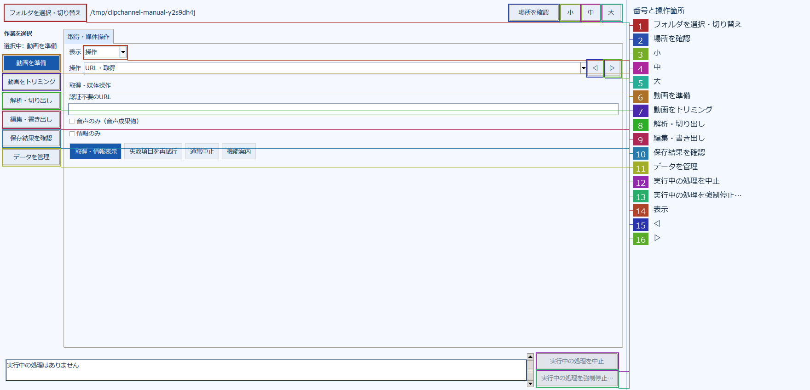

| 画像の番号 | 画面の項目 | 説明・操作 |
|---|---|---|
| 1 | フォルダを選択・切り替え | 解析結果・人物・動画などを保存するデータ用フォルダを選択します。処理中は切り替えできません。 |
| 2 | 場所を確認 | 省略されているデータ用フォルダの絶対パスを確認します。 |
| 3 | 小 | ウィンドウを小サイズにします。実際の大きさは表示可能な画面領域に合わせて調整します。 |
| 4 | 中 | ウィンドウを中サイズにします。 |
| 5 | 大 | ウィンドウを大サイズにします。 |
| 6 | 動画を準備 | 取得・媒体操作タブを表示します。URL取得やローカル動画登録を行います。 |
| 7 | 動画をトリミング | 動画をトリミングタブを表示します。連続した一範囲を新しい登録動画に書き出します。 |
| 8 | 解析・切り出し | 人物・参照音声、頻出語、切り出し区間のタブを表示します。 |
| 9 | 編集・書き出し | 画面・字幕、補助素材、保存・書き出しのタブを表示します。 |
| 10 | 保存結果を確認 | 保存済み情報タブを表示します。結果CSVと使用する版を選択します。 |
| 11 | データを管理 | 管理・保管タブを表示します。登録情報の整理・動画の保管・ログの整理を行います。 |
| 12 | 実行中の処理を中止 | 共通の管理対象処理に通常中止を要求します。実際の終了を確認するまで処理中の状態を維持します。 |
| 13 | 実行中の処理を強制停止… | 通常中止要求から3秒後も終了しない場合に、対象処理とその子プロセスを確認して強制停止します。 |
| 14 | 表示 | 自動・操作・結果・詳細設定を切り替えます。自動では幅に応じて操作と結果を配置します。 |
| 15 | ◁ | 現在の表示区分の前の項目へ移動します。 |
| 16 | ▷ | 現在の表示区分の次の項目へ移動します。 |

この画像の番号は **16個**、説明表は **16件**です。

撮影条件：一時データの本番UI。ネット取得・解析モデル・AviUtl2送信は未実行。

<a id="download-url"></a>

### 取得・媒体操作：URL・取得

移動：**動画を準備 → 取得・媒体操作 → 表示「操作」→ 項目「URL・取得」**。

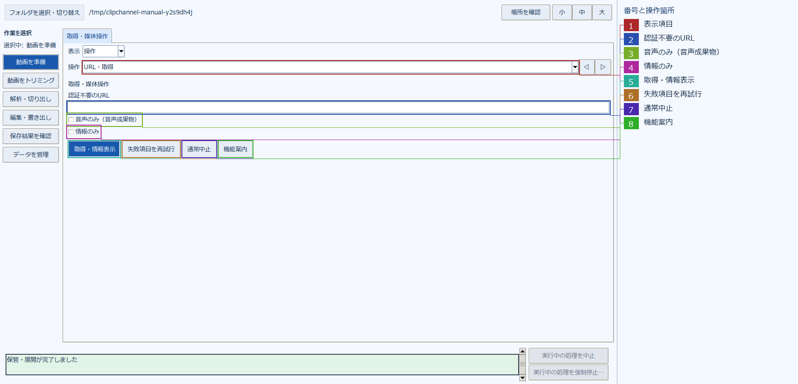

| 画像の番号 | 画面の項目 | 説明・操作 |
|---|---|---|
| 1 | 表示項目 | 表示「操作」内の項目を選びます。この画像は「URL・取得」を選択した状態です。 |
| 2 | 認証不要のURL | ログイン・Cookieを使わず取得できる動画URLを入力します。 |
| 3 | 音声のみ（音声成果物） | 動画の代わりに音声成果物を取得します。音声成果物は登録済み動画として扱いません。 |
| 4 | 情報のみ | メディアを取得せず、URLの情報を表示します。 |
| 5 | 取得・情報表示 | 現在のURLと設定で取得または情報表示を開始します。完了した項目を結果一覧で確認してください。 |
| 6 | 失敗項目を再試行 | 直前の取得で失敗した項目だけを再試行します。 |
| 7 | 通常中止 | 管理対象の取得処理に中止を要求します。実際の終了を確認するまでは操作を再開しません。 |
| 8 | 機能案内 | 取得機能で対応する範囲と、認証などの対象外の機能を表示します。 |

この画像の番号は **8個**、説明表は **8件**です。

撮影条件：一時データ。ネット取得・人物照合・Whisper・AviUtl2送信は未実行。

<a id="download-local"></a>

### 取得・媒体操作：ローカル動画

移動：**動画を準備 → 取得・媒体操作 → 表示「操作」→ 項目「ローカル動画」**。

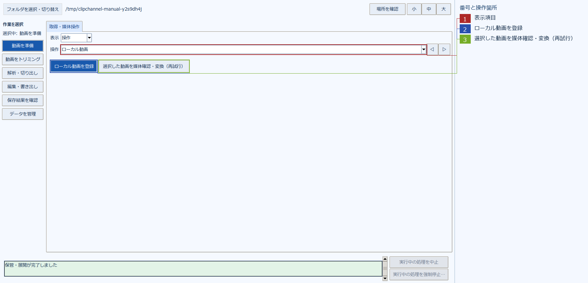

| 画像の番号 | 画面の項目 | 説明・操作 |
|---|---|---|
| 1 | 表示項目 | 表示「操作」内の項目を選びます。この画像は「ローカル動画」を選択した状態です。 |
| 2 | ローカル動画を登録 | 動画ファイルを選び、媒体を確認してデータ用フォルダへ取り込みます。元ファイルは保持します。 |
| 3 | 選択した動画を媒体確認・変換（再試行） | 登録済み動画一覧で選択した動画を再確認し、必要な媒体変換を再試行します。 |

この画像の番号は **3個**、説明表は **3件**です。

撮影条件：一時データ。ネット取得・人物照合・Whisper・AviUtl2送信は未実行。

<a id="download-results"></a>

### 取得・媒体操作：取得結果

移動：**動画を準備 → 取得・媒体操作 → 表示「結果」→ 項目「取得結果」**。

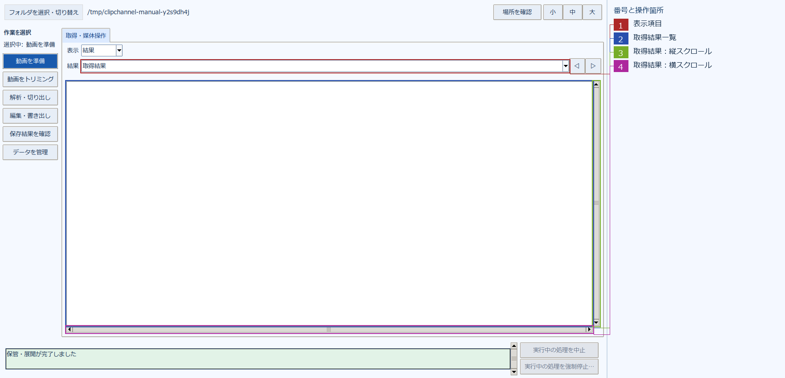

| 画像の番号 | 画面の項目 | 説明・操作 |
|---|---|---|
| 1 | 表示項目 | 表示「結果」内の項目を選びます。この画像は「取得結果」を選択した状態です。 |
| 2 | 取得結果一覧 | 取得項目ごとの状態・保存先・失敗理由などを確認します。失敗項目は再試行できます。 |
| 3 | 取得結果：縦スクロール | この一覧または詳細設定の内部を縦にスクロールします。 |
| 4 | 取得結果：横スクロール | 一覧の内部を横にスクロールし、長い行の続きを確認します。 |

この画像の番号は **4個**、説明表は **4件**です。

撮影条件：一時データ。ネット取得・人物照合・Whisper・AviUtl2送信は未実行。

<a id="registered-videos"></a>

### 取得・媒体操作：登録済み動画

移動：**動画を準備 → 取得・媒体操作 → 表示「結果」→ 項目「登録済み動画」**。

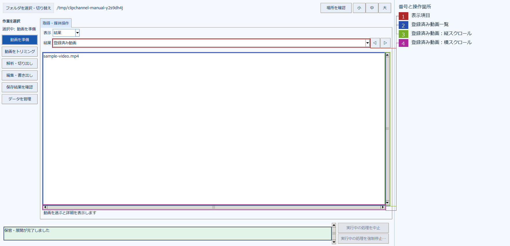

| 画像の番号 | 画面の項目 | 説明・操作 |
|---|---|---|
| 1 | 表示項目 | 表示「結果」内の項目を選びます。この画像は「登録済み動画」を選択した状態です。 |
| 2 | 登録済み動画一覧 | 制作に使う登録動画を選び、媒体の詳細を確認します。動画からの参照音声登録も、ここで選んだ動画を使います。 |
| 3 | 登録済み動画：縦スクロール | この一覧または詳細設定の内部を縦にスクロールします。 |
| 4 | 登録済み動画：横スクロール | 一覧の内部を横にスクロールし、長い行の続きを確認します。 |

この画像の番号は **4個**、説明表は **4件**です。

撮影条件：一時データ。ネット取得・人物照合・Whisper・AviUtl2送信は未実行。

<a id="download-settings"></a>

### 取得・媒体操作：形式・品質と取得設定

移動：**動画を準備 → 取得・媒体操作 → 表示「詳細設定」→ 項目「形式・品質と取得設定」**。

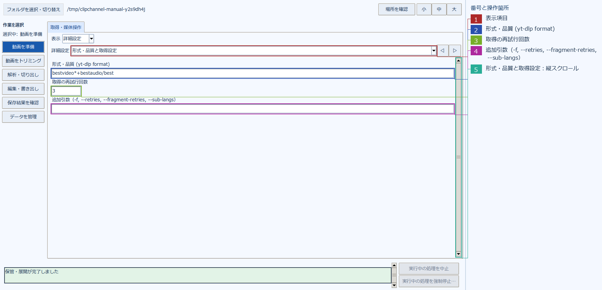

| 画像の番号 | 画面の項目 | 説明・操作 |
|---|---|---|
| 1 | 表示項目 | 表示「詳細設定」内の項目を選びます。この画像は「形式・品質と取得設定」を選択した状態です。 |
| 2 | 形式・品質 (yt-dlp format) | yt-dlpの形式指定を入力します。初期値は bestvideo*+bestaudio/best です。 |
| 3 | 取得の再試行回数 | 取得処理の再試行回数を整数で指定します。 |
| 4 | 追加引数（-f, --retries, --fragment-retries, --sub-langs） | 対応するyt-dlp追加引数を指定します。認証用や任意の引数を渡す欄ではありません。 |
| 5 | 形式・品質と取得設定：縦スクロール | この一覧または詳細設定の内部を縦にスクロールします。 |

この画像の番号は **5個**、説明表は **5件**です。

撮影条件：一時データ。ネット取得・人物照合・Whisper・AviUtl2送信は未実行。

<a id="trimming-range"></a>

### 動画をトリミング：範囲を指定して書き出す

移動：**動画をトリミング → 動画をトリミング → 表示「操作」→ 項目「範囲を指定して書き出す」**。

登録済み動画の一範囲を別の登録動画にします。元動画は保持します。未書き出しの開始・終了・保存名は、フォルダ切り替えと終了時の未保存確認の対象に含まれません。

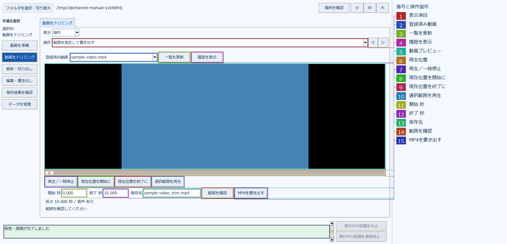

| 画像の番号 | 画面の項目 | 説明・操作 |
|---|---|---|
| 1 | 表示項目 | 表示「操作」内の項目を選びます。この画像は「範囲を指定して書き出す」を選択した状態です。 |
| 2 | 登録済み動画 | トリミングする登録済み動画を選びます。切り替えると範囲と保存名が選択動画の初期値になります。 |
| 3 | 一覧を更新 | 登録済み動画の候補を読み直します。 |
| 4 | 履歴を表示 | 選択動画のトリミング元と範囲を表示します。元動画にはトリミング履歴がありません。 |
| 5 | 動画プレビュー | 選択動画の映像を表示します。原寸の出力確認ではありません。範囲を決めるためのプレビューです。 |
| 6 | 再生位置 | つまみを動かし、離してその位置の映像を表示します。ここから開始・終了位置を設定できます。 |
| 7 | 再生／一時停止 | 現在位置から動画を再生、または一時停止します。音声の試聴にはffplayが必要です。 |
| 8 | 現在位置を開始に | 現在の再生位置を「開始 秒」へ設定します。 |
| 9 | 現在位置を終了に | 現在の再生位置を「終了 秒」へ設定します。 |
| 10 | 選択範囲を再生 | 入力した開始秒から終了秒まで再生し、残す範囲を確認します。 |
| 11 | 開始 秒 | 残す範囲の開始位置を秒で入力します。0以上、終了より前にしてください。 |
| 12 | 終了 秒 | 残す範囲の終了位置を秒で入力します。開始より後、動画の長さ以内にしてください。 |
| 13 | 保存名 | 新しいMP4ファイル名を.mp4付きで入力します（例：scene_trim.mp4）。既存ファイルと同名・同じ保存名は使えません。 |
| 14 | 範囲を確認 | 開始・終了と保存名を検査して書き出し範囲を確定します。入力を変えると確定は解除されます。 |
| 15 | MP4を書き出す | 確定した範囲を新しい登録済みMP4にします。未確定なら先に範囲を確認します。元動画は保持します。 |

この画像の番号は **15個**、説明表は **15件**です。

撮影条件：一時データ。ネット取得・人物照合・Whisper・AviUtl2送信は未実行。

<a id="speaker-target"></a>

### 人物・参照音声：人物と対象動画

移動：**解析・切り出し → 人物・参照音声 → 表示「操作」→ 項目「人物と対象動画」**。

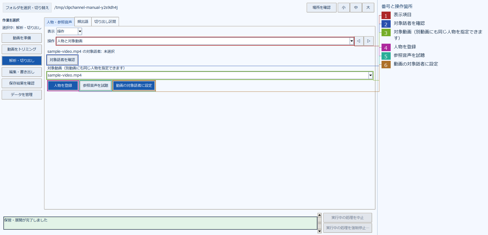

| 画像の番号 | 画面の項目 | 説明・操作 |
|---|---|---|
| 1 | 表示項目 | 表示「操作」内の項目を選びます。この画像は「人物と対象動画」を選択した状態です。 |
| 2 | 対象話者を確認 | 選択中の人物・閾値・分割方法を確認します。 |
| 3 | 対象動画（別動画にも同じ人物を指定できます） | 照合・文字起こし・頻出語・切り出しに使う登録済み動画を選びます。参照音声の切り出し元は取得タブの動画一覧で選びます。 |
| 4 | 人物を登録 | 詳細設定の名前・参照音声・ECAPAモデル・閾値・分割方法で人物を登録します。この処理は共通の強制停止の対象ではありません。 |
| 5 | 参照音声を試聴 | 人物一覧で選んだ人物のreference.wavをffplayで試聴します。 |
| 6 | 動画の対象話者に設定 | 人物一覧で選んだ人物を、対象動画の対象話者として保存します。 |

この画像の番号は **6個**、説明表は **6件**です。

撮影条件：一時データ。ネット取得・人物照合・Whisper・AviUtl2送信は未実行。

<a id="review-actions"></a>

### 人物・参照音声：試聴・判定・再表示

移動：**解析・切り出し → 人物・参照音声 → 表示「操作」→ 項目「試聴・判定・再表示」**。

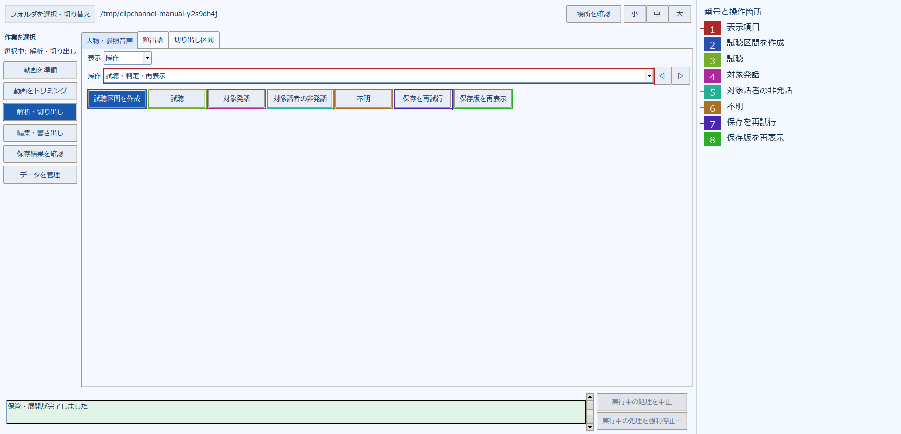

| 画像の番号 | 画面の項目 | 説明・操作 |
|---|---|---|
| 1 | 表示項目 | 表示「操作」内の項目を選びます。この画像は「試聴・判定・再表示」を選択した状態です。 |
| 2 | 試聴区間を作成 | 対象動画を5秒ごとの確認区間に分け、参照人物との類似度を計算します。判定はすべてunknownで始まります。 |
| 3 | 試聴 | 試聴区間一覧で選択した区間の音声をffplayで再生します。 |
| 4 | 対象発話 | 選択区間をtargetにして保存します。文字起こしの対象になります。 |
| 5 | 対象話者の非発話 | 選択区間をnon-targetにして保存します。その区間の本文は空にします。 |
| 6 | 不明 | 選択区間をunknownにして保存します。その区間の本文は空にします。 |
| 7 | 保存を再試行 | 未保存の試聴区間・判定・修正内容を再度保存します。 |
| 8 | 保存版を再表示 | 保存済み情報で選択したtranscripts版を試聴区間一覧に読み込みます。 |

この画像の番号は **8個**、説明表は **8件**です。

撮影条件：一時データ。ネット取得・人物照合・Whisper・AviUtl2送信は未実行。

<a id="speaker-transcribe"></a>

### 人物・参照音声：対象話者の文字起こし

移動：**解析・切り出し → 人物・参照音声 → 表示「操作」→ 項目「対象話者の文字起こし」**。

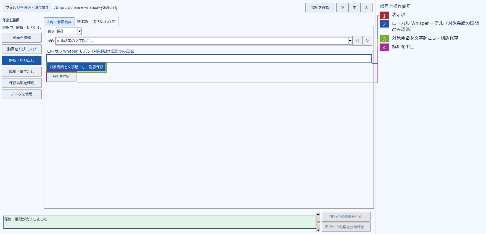

| 画像の番号 | 画面の項目 | 説明・操作 |
|---|---|---|
| 1 | 表示項目 | 表示「操作」内の項目を選びます。この画像は「対象話者の文字起こし」を選択した状態です。 |
| 2 | ローカル Whisper モデル（対象発話の区間のみ認識） | config.jsonを含むfaster-whisper用ローカルモデルフォルダを指定します。Whisperの単独.ptファイルは使えません。 |
| 3 | 対象発話を文字起こし・別版保存 | targetと確認済みの区間だけを認識し、全区間を新しいtranscripts版に保存します。旧版は残ります。 |
| 4 | 解析を中止 | 共通の管理対象処理に中止を要求します。中止の完了は画面下部で確認します。 |

この画像の番号は **4個**、説明表は **4件**です。

撮影条件：一時データ。ネット取得・人物照合・Whisper・AviUtl2送信は未実行。

<a id="registered-people"></a>

### 人物・参照音声：人物一覧

移動：**解析・切り出し → 人物・参照音声 → 表示「結果」→ 項目「人物一覧」**。

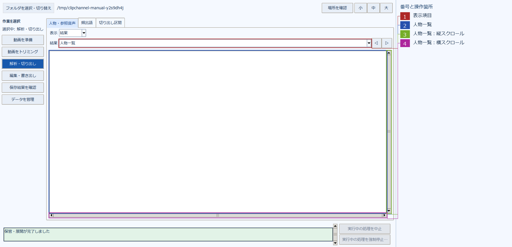

| 画像の番号 | 画面の項目 | 説明・操作 |
|---|---|---|
| 1 | 表示項目 | 表示「結果」内の項目を選びます。この画像は「人物一覧」を選択した状態です。 |
| 2 | 人物一覧 | 人物を選択します。参照音声の試聴、対象話者の設定は操作表示から実行します。 |
| 3 | 人物一覧：縦スクロール | この一覧または詳細設定の内部を縦にスクロールします。 |
| 4 | 人物一覧：横スクロール | 一覧の内部を横にスクロールし、長い行の続きを確認します。 |

この画像の番号は **4個**、説明表は **4件**です。

撮影条件：一時データ。ネット取得・人物照合・Whisper・AviUtl2送信は未実行。

<a id="review-results"></a>

### 人物・参照音声：試聴区間・文字起こし

移動：**解析・切り出し → 人物・参照音声 → 表示「結果」→ 項目「試聴区間・文字起こし」**。

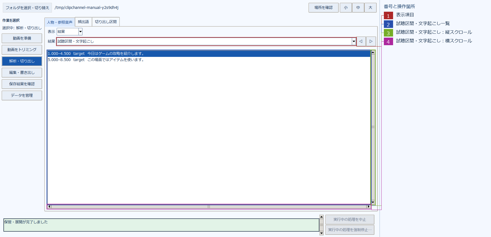

| 画像の番号 | 画面の項目 | 説明・操作 |
|---|---|---|
| 1 | 表示項目 | 表示「結果」内の項目を選びます。この画像は「試聴区間・文字起こし」を選択した状態です。 |
| 2 | 試聴区間・文字起こし一覧 | 時刻・判定・類似度・本文を確認し、判定や修正の対象行を選択します。保存CSVからの再表示では類似度は保存されていません。 |
| 3 | 試聴区間・文字起こし：縦スクロール | この一覧または詳細設定の内部を縦にスクロールします。 |
| 4 | 試聴区間・文字起こし：横スクロール | 一覧の内部を横にスクロールし、長い行の続きを確認します。 |

この画像の番号は **4個**、説明表は **4件**です。

撮影条件：一時データ。ネット取得・人物照合・Whisper・AviUtl2送信は未実行。

<a id="speaker-registration"></a>

### 人物・参照音声：人物・参照音声の登録

移動：**解析・切り出し → 人物・参照音声 → 表示「詳細設定」→ 項目「人物・参照音声の登録」**。

動画から参照音声を作る場合、抽出元は「取得・媒体操作」の登録済み動画一覧で選びます。ここにある開始・終了秒だけでは抽出元を選べません。

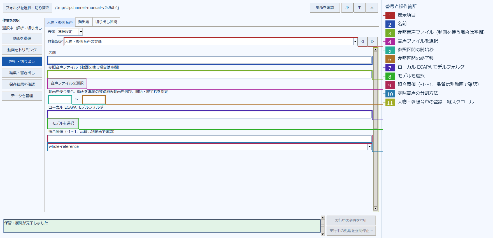

| 画像の番号 | 画面の項目 | 説明・操作 |
|---|---|---|
| 1 | 表示項目 | 表示「詳細設定」内の項目を選びます。この画像は「人物・参照音声の登録」を選択した状態です。 |
| 2 | 名前 | 人物を識別する表示名を入力します。同じ名前で再登録しても別の人物IDになります。 |
| 3 | 参照音声ファイル（動画を使う場合は空欄） | 外部の音声ファイルのパスを入力します。登録済み動画から切り出す場合は空欄にします。 |
| 4 | 音声ファイルを選択 | 参照音声にする音声ファイルを選びます。動画を使う場合はこの欄を空にしてください。 |
| 5 | 参照区間の開始秒 | 取得・媒体操作の登録済み動画一覧で選んだ動画から、参照音声にする区間の開始秒を指定します。外部音声ファイルを使うときは使用しません。 |
| 6 | 参照区間の終了秒 | 動画から参照音声にする区間の終了秒を指定します。開始より後にしてください。参照音声は1秒以上必要です。 |
| 7 | ローカル ECAPA モデルフォルダ | hyperparams.yamlを含むECAPAモデル一式のフォルダを指定します。話者照合でも登録時と同じモデルが必要です。 |
| 8 | モデルを選択 | ローカルのECAPAモデルフォルダを選びます。モデルをネット取得する操作ではありません。 |
| 9 | 照合閾値（-1〜1、品質は別動画で確認） | -1から1の閾値を登録情報として保存します。現行の試聴区間生成はこの値による自動分類を行いません。 |
| 10 | 参照音声の分割方法 | whole-referenceは全音声を1区間として特徴化し、five-second-windowsは5秒窓の特徴を平均します。末尾の1秒未満は除きます。 |
| 11 | 人物・参照音声の登録：縦スクロール | この一覧または詳細設定の内部を縦にスクロールします。 |

この画像の番号は **11個**、説明表は **11件**です。

撮影条件：一時データ。ネット取得・人物照合・Whisper・AviUtl2送信は未実行。

<a id="review-edit"></a>

### 人物・参照音声：発言の修正

移動：**解析・切り出し → 人物・参照音声 → 表示「詳細設定」→ 項目「発言の修正」**。

発言の分割後は両行がunknown・本文空欄になります。判定と本文を再設定してください。

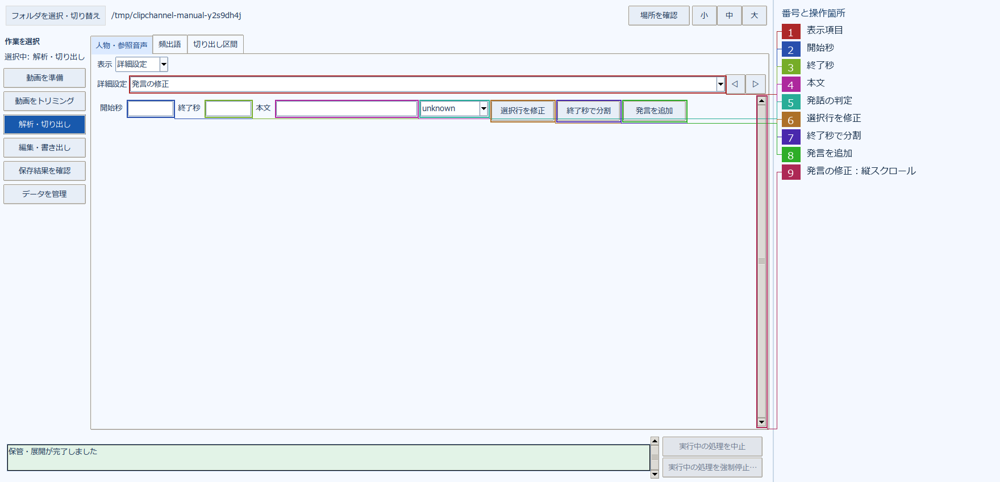

| 画像の番号 | 画面の項目 | 説明・操作 |
|---|---|---|
| 1 | 表示項目 | 表示「詳細設定」内の項目を選びます。この画像は「発言の修正」を選択した状態です。 |
| 2 | 開始秒 | 発言の開始位置を秒で入力します。保存時はミリ秒へ変換します。 |
| 3 | 終了秒 | 発言の終了位置を秒で入力します。「終了秒で分割」ではこの時刻を分割点にします。 |
| 4 | 本文 | 対象発話の文字起こし本文を入力します。non-target・unknownには本文を保存できません。 |
| 5 | 発話の判定 | target（対象発話）、non-target（対象話者の非発話）、unknown（不明）を選び、修正または追加します。 |
| 6 | 選択行を修正 | 選択した発言の開始・終了・判定・本文を修正し、別版に保存します。 |
| 7 | 終了秒で分割 | 選択発言を入力した終了秒で分割して別版に保存します。分割後の2行はunknown・本文空欄になるため、判定と本文を再設定してください。 |
| 8 | 発言を追加 | 入力した時刻・判定・本文で発言を追加します。既存区間との重複は保存できません。 |
| 9 | 発言の修正：縦スクロール | この一覧または詳細設定の内部を縦にスクロールします。 |

この画像の番号は **9個**、説明表は **9件**です。

撮影条件：一時データ。ネット取得・人物照合・Whisper・AviUtl2送信は未実行。

<a id="word-settings"></a>

### 頻出語：集計条件

移動：**解析・切り出し → 頻出語 → 表示「操作」→ 項目「集計条件」**。

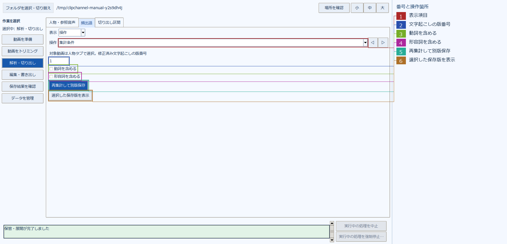

| 画像の番号 | 画面の項目 | 説明・操作 |
|---|---|---|
| 1 | 表示項目 | 表示「操作」内の項目を選びます。この画像は「集計条件」を選択した状態です。 |
| 2 | 文字起こしの版番号 | 集計する対象動画のtranscripts版番号を指定します。最新版本を自動選択する欄ではありません。 |
| 3 | 動詞を含める | 名詞に加えて動詞を頻出語の集計対象にします。 |
| 4 | 形容詞を含める | 名詞に加えて形容詞を頻出語の集計対象にします。 |
| 5 | 再集計して別版保存 | 指定transcripts版と現在の辞書・品詞設定で集計し、新しいword-counts版に保存します。 |
| 6 | 選択した保存版を表示 | 保存済み情報で選択したword-counts版の頻出語と該当発言を表示します。 |

この画像の番号は **6個**、説明表は **6件**です。

撮影条件：一時データ。ネット取得・人物照合・Whisper・AviUtl2送信は未実行。

<a id="word-dictionary"></a>

### 頻出語：登録語・除外語

移動：**解析・切り出し → 頻出語 → 表示「操作」→ 項目「登録語・除外語」**。

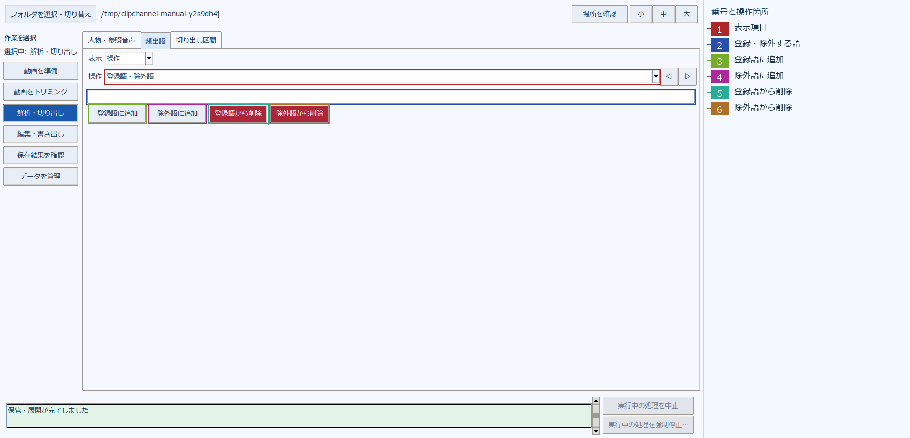

| 画像の番号 | 画面の項目 | 説明・操作 |
|---|---|---|
| 1 | 表示項目 | 表示「操作」内の項目を選びます。この画像は「登録語・除外語」を選択した状態です。 |
| 2 | 登録・除外する語 | 辞書へ追加、または辞書から削除する語を入力します。辞書を変更した後は再集計してください。 |
| 3 | 登録語に追加 | 入力語を登録語辞書へ追加します。複合語を一語として数えるために使います。 |
| 4 | 除外語に追加 | 入力語を除外語辞書へ追加します。再集計で対象語を除きます。 |
| 5 | 登録語から削除 | 入力語の登録を登録語辞書から外します。保存済み集計は変わりません。 |
| 6 | 除外語から削除 | 入力語の登録を除外語辞書から外します。保存済み集計は変わりません。 |

この画像の番号は **6個**、説明表は **6件**です。

撮影条件：一時データ。ネット取得・人物照合・Whisper・AviUtl2送信は未実行。

<a id="word-totals"></a>

### 頻出語：頻出語一覧

移動：**解析・切り出し → 頻出語 → 表示「結果」→ 項目「頻出語一覧」**。


| 画像の番号 | 画面の項目 | 説明・操作 |
|---|---|---|
| 1 | 表示項目 | 表示「結果」内の項目を選びます。この画像は「頻出語一覧」を選択した状態です。 |
| 2 | 頻出語一覧 | 語ごとの出現回数・発話数を確認し、語を選択します。該当発話は「発話一覧」に表示されます。 |
| 3 | 頻出語一覧：縦スクロール | この一覧または詳細設定の内部を縦にスクロールします。 |
| 4 | 頻出語一覧：横スクロール | 一覧の内部を横にスクロールし、長い行の続きを確認します。 |

この画像の番号は **4個**、説明表は **4件**です。

撮影条件：一時データ。ネット取得・人物照合・Whisper・AviUtl2送信は未実行。

<a id="word-utterances"></a>

### 頻出語：発話一覧

移動：**解析・切り出し → 頻出語 → 表示「結果」→ 項目「発話一覧」**。

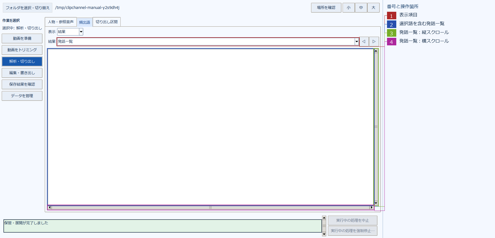

| 画像の番号 | 画面の項目 | 説明・操作 |
|---|---|---|
| 1 | 表示項目 | 表示「結果」内の項目を選びます。この画像は「発話一覧」を選択した状態です。 |
| 2 | 選択語を含む発話一覧 | 頻出語一覧で選んだ語を含む発話の時刻と本文を確認します。 |
| 3 | 発話一覧：縦スクロール | この一覧または詳細設定の内部を縦にスクロールします。 |
| 4 | 発話一覧：横スクロール | 一覧の内部を横にスクロールし、長い行の続きを確認します。 |

この画像の番号は **4個**、説明表は **4件**です。

撮影条件：一時データ。ネット取得・人物照合・Whisper・AviUtl2送信は未実行。

<a id="segment-candidates"></a>

### 切り出し区間：候補と保存版

移動：**解析・切り出し → 切り出し区間 → 表示「操作」→ 項目「候補と保存版」**。

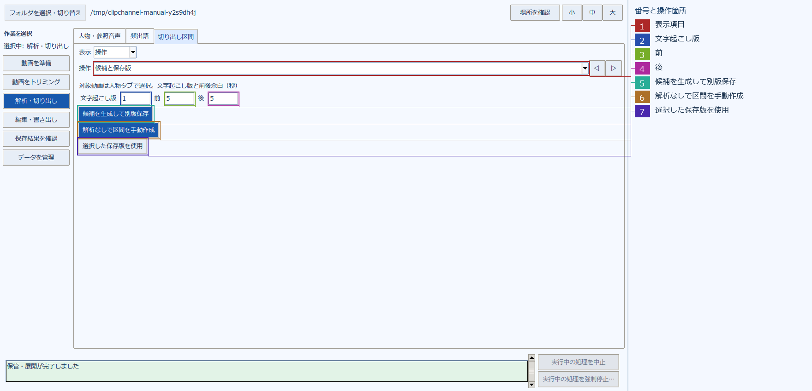

| 画像の番号 | 画面の項目 | 説明・操作 |
|---|---|---|
| 1 | 表示項目 | 表示「操作」内の項目を選びます。この画像は「候補と保存版」を選択した状態です。 |
| 2 | 文字起こし版 | 切り出し候補の元にするtranscriptsの版番号を指定します。 |
| 3 | 前 | 候補の開始に付ける余白を秒で入力します。動画の先頭より前には広げません。 |
| 4 | 後 | 候補の終了に付ける余白を秒で入力します。動画の末尾より後には広げません。 |
| 5 | 候補を生成して別版保存 | 指定した文字起こし版のtarget区間に前後余白を付け、切り出し候補をsegments別版に保存します。 |
| 6 | 解析なしで区間を手動作成 | 対象動画から文字起こしを使わずに手動で切り出し区間を作ります。 |
| 7 | 選択した保存版を使用 | 保存済み情報で選択したsegments版を切り出し一覧に読み込みます。 |

この画像の番号は **7個**、説明表は **7件**です。

撮影条件：一時データ。ネット取得・人物照合・Whisper・AviUtl2送信は未実行。

<a id="segment-actions"></a>

### 切り出し区間：区間を修正・試聴

移動：**解析・切り出し → 切り出し区間 → 表示「操作」→ 項目「区間を修正・試聴」**。

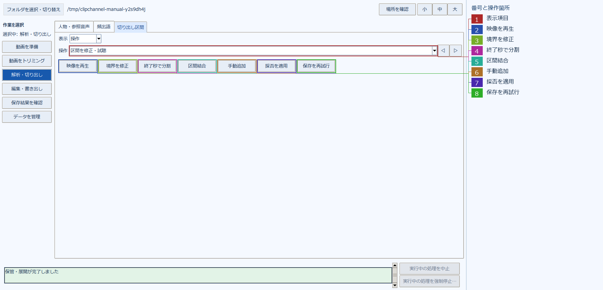

| 画像の番号 | 画面の項目 | 説明・操作 |
|---|---|---|
| 1 | 表示項目 | 表示「操作」内の項目を選びます。この画像は「区間を修正・試聴」を選択した状態です。 |
| 2 | 映像を再生 | 選択した切り出し区間の映像と音声をffplayで再生します。 |
| 3 | 境界を修正 | 開始秒・終了秒で選択区間の境界を修正し、別版に保存します。 |
| 4 | 終了秒で分割 | 選択区間を入力した終了秒で2つに分割して別版に保存します。開始と元の終了の間の時刻を指定してください。 |
| 5 | 区間結合 | 2件以上の選択行を結合して別版に保存します。最初と最後の選択行の間の未選択区間も結合に含まれます。 |
| 6 | 手動追加 | 開始秒・終了秒の区間を手動で追加し、別版に保存します。 |
| 7 | 採否を適用 | 「採用」のチェックを選択区間へ適用して別版に保存します。 |
| 8 | 保存を再試行 | 未保存の切り出し区間の修正内容を再度別版へ保存します。 |

この画像の番号は **8個**、説明表は **8件**です。

撮影条件：一時データ。ネット取得・人物照合・Whisper・AviUtl2送信は未実行。

<a id="compose-actions"></a>

### 切り出し区間：編集用動画を作成

移動：**解析・切り出し → 切り出し区間 → 表示「操作」→ 項目「編集用動画を作成」**。

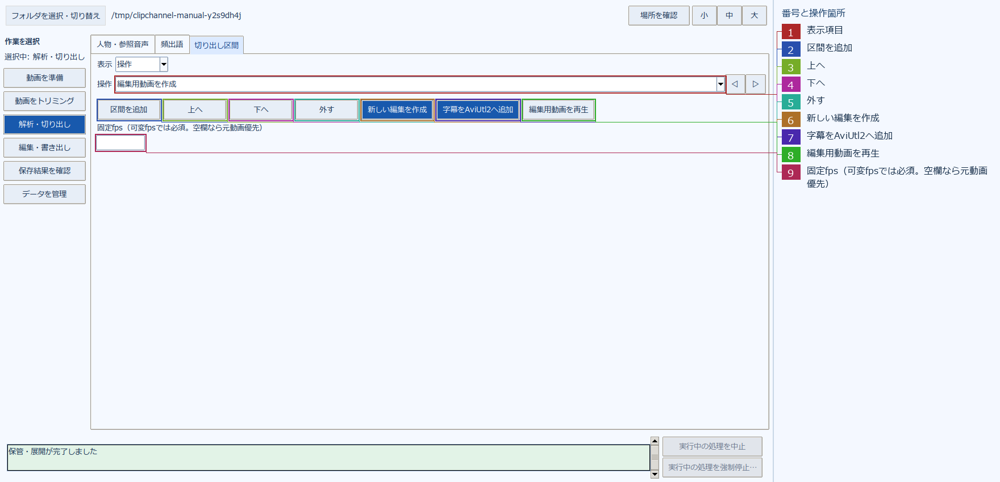

| 画像の番号 | 画面の項目 | 説明・操作 |
|---|---|---|
| 1 | 表示項目 | 表示「操作」内の項目を選びます。この画像は「編集用動画を作成」を選択した状態です。 |
| 2 | 区間を追加 | 選択した採用区間を編集順に追加します。同じ区間を複数回追加できます。 |
| 3 | 上へ | 編集順で選択した区間を一つ上へ移動します。 |
| 4 | 下へ | 編集順で選択した区間を一つ下へ移動します。 |
| 5 | 外す | 編集順で選択した区間を順番一覧から外します。元の切り出し区間は削除しません。 |
| 6 | 新しい編集を作成 | 現在の編集順と固定fpsで区間を連結し、新しい編集用MP4とAviUtl2プロジェクトを作成します。 |
| 7 | 字幕をAviUtl2へ追加 | 保存済み情報で選択した元動画のtranscripts版から編集用字幕を生成し、対応するAviUtl2へ追加します。再実行すると全字幕を追加し、既存字幕は置換しません。 |
| 8 | 編集用動画を再生 | 直前に作成した編集用MP4をffplayで再生します。AviUtl2で追加した字幕や補助素材はこのMP4には反映されません。 |
| 9 | 固定fps（可変fpsでは必須。空欄なら元動画優先） | 編集用動画の固定fpsを指定します。可変fpsの元動画では指定が必要です。 |

この画像の番号は **9個**、説明表は **9件**です。

撮影条件：一時データ。ネット取得・人物照合・Whisper・AviUtl2送信は未実行。

<a id="frame-boundaries"></a>

### 切り出し区間：フレーム境界を確認

移動：**解析・切り出し → 切り出し区間 → 表示「操作」→ 項目「フレーム境界を確認」**。

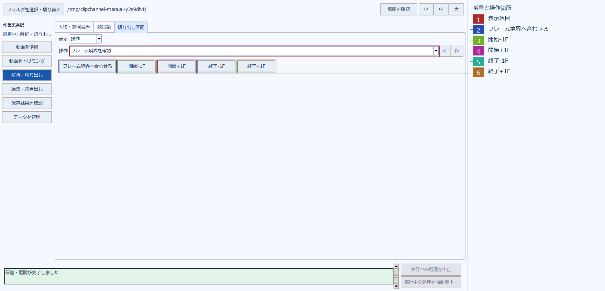

| 画像の番号 | 画面の項目 | 説明・操作 |
|---|---|---|
| 1 | 表示項目 | 表示「操作」内の項目を選びます。この画像は「フレーム境界を確認」を選択した状態です。 |
| 2 | フレーム境界へ合わせる | 入力した開始秒・終了秒を近い実フレーム境界へ更新します。変更を保存するには「境界を修正」を押します。 |
| 3 | 開始-1F | 開始位置を元動画の実際のフレーム境界で1フレーム前へ移動します。 |
| 4 | 開始+1F | 開始位置を元動画の実際のフレーム境界で1フレーム後へ移動します。 |
| 5 | 終了-1F | 終了位置を元動画の実際のフレーム境界で1フレーム前へ移動します。 |
| 6 | 終了+1F | 終了位置を元動画の実際のフレーム境界で1フレーム後へ移動します。 |

この画像の番号は **6個**、説明表は **6件**です。

撮影条件：一時データ。ネット取得・人物照合・Whisper・AviUtl2送信は未実行。

<a id="segment-results"></a>

### 切り出し区間：切り出し区間

移動：**解析・切り出し → 切り出し区間 → 表示「結果」→ 項目「切り出し区間」**。

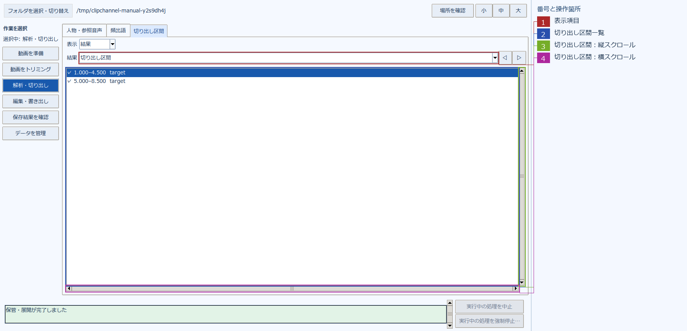

| 画像の番号 | 画面の項目 | 説明・操作 |
|---|---|---|
| 1 | 表示項目 | 表示「結果」内の項目を選びます。この画像は「切り出し区間」を選択した状態です。 |
| 2 | 切り出し区間一覧 | 開始・終了・種類・採否を確認して操作対象を選びます。複数選択して区間結合もできます。 |
| 3 | 切り出し区間：縦スクロール | この一覧または詳細設定の内部を縦にスクロールします。 |
| 4 | 切り出し区間：横スクロール | 一覧の内部を横にスクロールし、長い行の続きを確認します。 |

この画像の番号は **4個**、説明表は **4件**です。

撮影条件：一時データ。ネット取得・人物照合・Whisper・AviUtl2送信は未実行。

<a id="compose-order"></a>

### 切り出し区間：編集用動画の順番

移動：**解析・切り出し → 切り出し区間 → 表示「結果」→ 項目「編集用動画の順番」**。

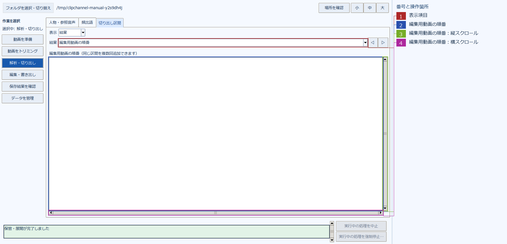

| 画像の番号 | 画面の項目 | 説明・操作 |
|---|---|---|
| 1 | 表示項目 | 表示「結果」内の項目を選びます。この画像は「編集用動画の順番」を選択した状態です。 |
| 2 | 編集用動画の順番 | 連結する順番を確認し、並べ替え・除外の対象行を選びます。元の切り出し区間は保持します。 |
| 3 | 編集用動画の順番：縦スクロール | この一覧または詳細設定の内部を縦にスクロールします。 |
| 4 | 編集用動画の順番：横スクロール | 一覧の内部を横にスクロールし、長い行の続きを確認します。 |

この画像の番号は **4個**、説明表は **4件**です。

撮影条件：一時データ。ネット取得・人物照合・Whisper・AviUtl2送信は未実行。

<a id="segment-settings"></a>

### 切り出し区間：区間の境界・採否

移動：**解析・切り出し → 切り出し区間 → 表示「詳細設定」→ 項目「区間の境界・採否」**。

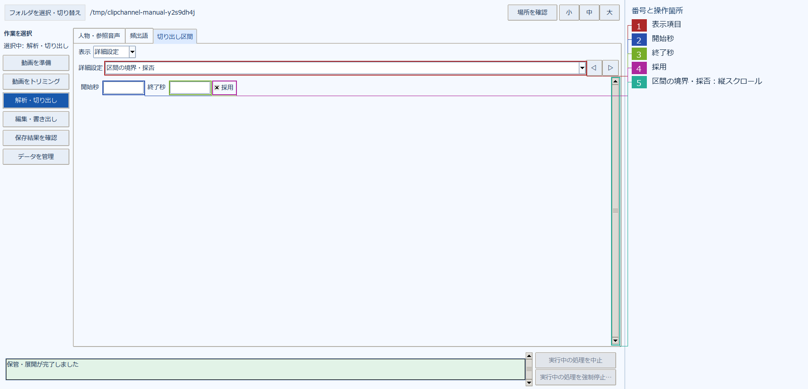

| 画像の番号 | 画面の項目 | 説明・操作 |
|---|---|---|
| 1 | 表示項目 | 表示「詳細設定」内の項目を選びます。この画像は「区間の境界・採否」を選択した状態です。 |
| 2 | 開始秒 | 切り出し区間の開始位置を秒で入力します。フレーム調整後も「境界を修正」で保存してください。 |
| 3 | 終了秒 | 切り出し区間の終了位置を秒で入力します。「終了秒で分割」ではこの時刻を分割点にします。 |
| 4 | 採用 | 選択区間を編集用動画の候補として採用するかを指定します。 |
| 5 | 区間の境界・採否：縦スクロール | この一覧または詳細設定の内部を縦にスクロールします。 |

この画像の番号は **5個**、説明表は **5件**です。

撮影条件：一時データ。ネット取得・人物照合・Whisper・AviUtl2送信は未実行。

<a id="layout-actions"></a>

### 画面・字幕：画面設定とプレビュー

移動：**編集・書き出し → 画面・字幕 → 表示「操作」→ 項目「画面設定とプレビュー」**。

「横」は元の幅・高さ、「ショート」は元の高さ・幅を使います。縦向き元動画はショートで横長になるため、詳細設定の幅・高さも確認してください。

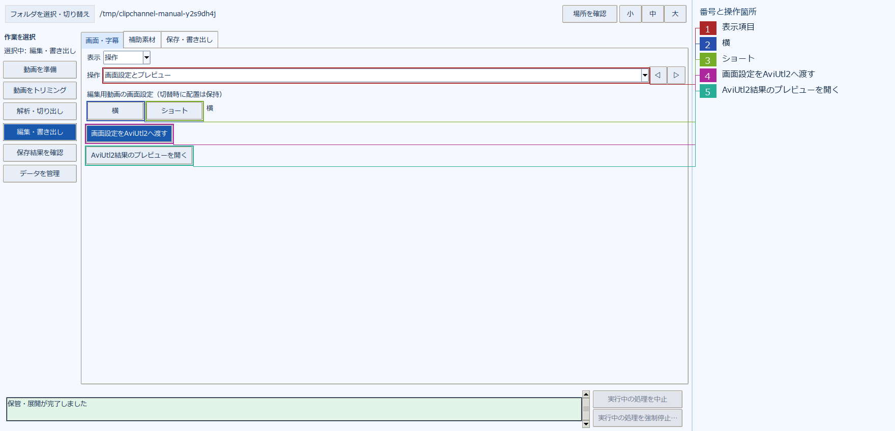

| 画像の番号 | 画面の項目 | 説明・操作 |
|---|---|---|
| 1 | 表示項目 | 表示「操作」内の項目を選びます。この画像は「画面設定とプレビュー」を選択した状態です。 |
| 2 | 横 | キャンバスを元動画の幅・高さに設定します。縦長元動画では横長になりません。配置の値は保持します。 |
| 3 | ショート | キャンバスを元動画の高さ・幅に設定します。縦長元動画では横長になるため、必要なら幅・高さを直接入力してください。 |
| 4 | 画面設定をAviUtl2へ渡す | 設定を保存して、対応する編集用動画があるAviUtl2へ適用します。字幕は保存された開始・終了・本文と一致するものが対象です。 |
| 5 | AviUtl2結果のプレビューを開く | 直前にAviUtl2で生成したプレビュー画像を開きます。 |

この画像の番号は **5個**、説明表は **5件**です。

撮影条件：一時データ。ネット取得・人物照合・Whisper・AviUtl2送信は未実行。

<a id="subtitle-actions"></a>

### 画面・字幕：字幕を修正

移動：**編集・書き出し → 画面・字幕 → 表示「操作」→ 項目「字幕を修正」**。

終了Fは表示範囲に含まれます。別版保存後は「保存・書き出し」の「保存」で未適用字幕を追加します。字幕全体が追加されるため、AviUtl2側の既存字幕との重複を確認してください。

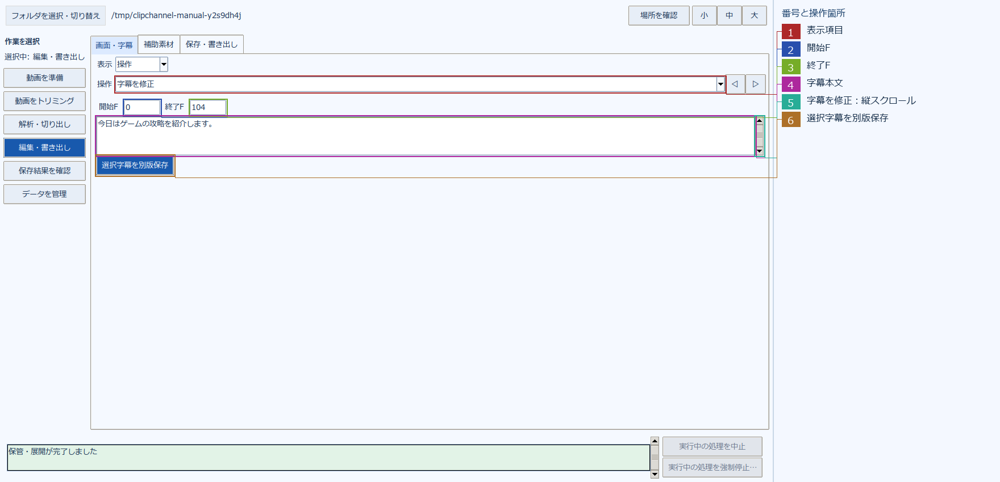

| 画像の番号 | 画面の項目 | 説明・操作 |
|---|---|---|
| 1 | 表示項目 | 表示「操作」内の項目を選びます。この画像は「字幕を修正」を選択した状態です。 |
| 2 | 開始F | 字幕の開始フレームを0始まりで入力します。 |
| 3 | 終了F | 字幕の最後に表示するフレームを0始まりで入力します。このフレームも表示範囲に含み、開始Fと同じ値なら1フレームの字幕です。 |
| 4 | 字幕本文 | 選択した編集用字幕の本文を修正します。元の文字起こしCSVは変更しません。 |
| 5 | 字幕を修正：縦スクロール | この一覧または詳細設定の内部を縦にスクロールします。 |
| 6 | 選択字幕を別版保存 | 選択字幕の開始F・終了F・本文を新しい編集用字幕版へ保存します。AviUtl2への適用は別操作です。 |

この画像の番号は **6個**、説明表は **6件**です。

撮影条件：一時データ。ネット取得・人物照合・Whisper・AviUtl2送信は未実行。

<a id="subtitle-results"></a>

### 画面・字幕：編集用字幕

移動：**編集・書き出し → 画面・字幕 → 表示「結果」→ 項目「編集用字幕」**。

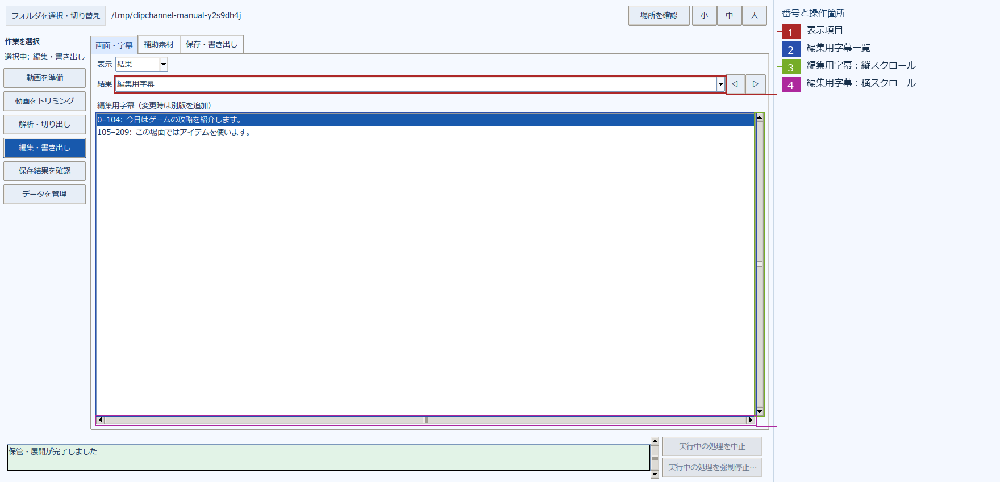

| 画像の番号 | 画面の項目 | 説明・操作 |
|---|---|---|
| 1 | 表示項目 | 表示「結果」内の項目を選びます。この画像は「編集用字幕」を選択した状態です。 |
| 2 | 編集用字幕一覧 | 編集用動画のフレーム時刻と字幕本文を確認し、修正する字幕を選びます。 |
| 3 | 編集用字幕：縦スクロール | この一覧または詳細設定の内部を縦にスクロールします。 |
| 4 | 編集用字幕：横スクロール | 一覧の内部を横にスクロールし、長い行の続きを確認します。 |

この画像の番号は **4個**、説明表は **4件**です。

撮影条件：一時データ。ネット取得・人物照合・Whisper・AviUtl2送信は未実行。

<a id="layout-settings"></a>

### 画面・字幕：画面・字幕の配置

移動：**編集・書き出し → 画面・字幕 → 表示「詳細設定」→ 項目「画面・字幕の配置」**。

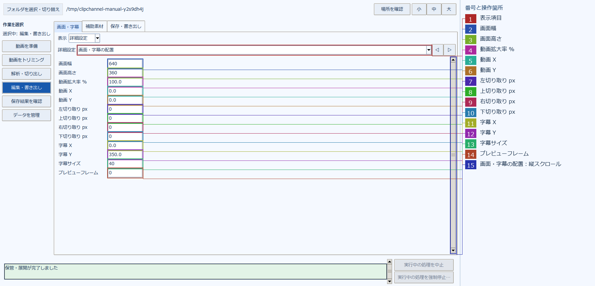

| 画像の番号 | 画面の項目 | 説明・操作 |
|---|---|---|
| 1 | 表示項目 | 表示「詳細設定」内の項目を選びます。この画像は「画面・字幕の配置」を選択した状態です。 |
| 2 | 画面幅 | 編集キャンバスの幅をピクセルで入力します。完成動画の出力幅とは別の設定です。 |
| 3 | 画面高さ | 編集キャンバスの高さをピクセルで入力します。完成動画の出力高さとは別の設定です。 |
| 4 | 動画拡大率 % | 動画の表示倍率を百分率で指定します。 |
| 5 | 動画 X | 動画の横方向の配置座標を指定します。 |
| 6 | 動画 Y | 動画の縦方向の配置座標を指定します。 |
| 7 | 左切り取り px | 元動画の左端から切り取るピクセル数を指定します。 |
| 8 | 上切り取り px | 元動画の上端から切り取るピクセル数を指定します。 |
| 9 | 右切り取り px | 元動画の右端から切り取るピクセル数を指定します。 |
| 10 | 下切り取り px | 元動画の下端から切り取るピクセル数を指定します。 |
| 11 | 字幕 X | アプリから追加した対応字幕の横方向の配置座標を指定します。 |
| 12 | 字幕 Y | アプリから追加した対応字幕の縦方向の配置座標を指定します。 |
| 13 | 字幕サイズ | アプリから追加した対応字幕の文字サイズを指定します。 |
| 14 | プレビューフレーム | 画面設定の結果を確認するフレーム位置を指定します。 |
| 15 | 画面・字幕の配置：縦スクロール | この一覧または詳細設定の内部を縦にスクロールします。 |

この画像の番号は **15個**、説明表は **15件**です。

撮影条件：一時データ。ネット取得・人物照合・Whisper・AviUtl2送信は未実行。

<a id="supporting-actions"></a>

### 補助素材：追加・適用・プレビュー

移動：**編集・書き出し → 補助素材 → 表示「操作」→ 項目「追加・適用・プレビュー」**。

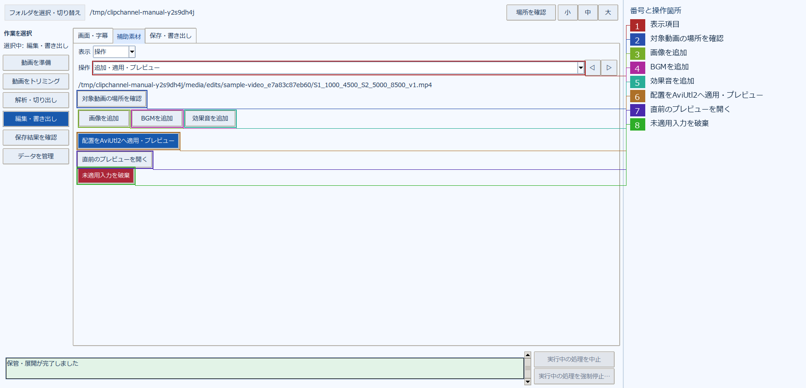

| 画像の番号 | 画面の項目 | 説明・操作 |
|---|---|---|
| 1 | 表示項目 | 表示「操作」内の項目を選びます。この画像は「追加・適用・プレビュー」を選択した状態です。 |
| 2 | 対象動画の場所を確認 | 補助素材を配置する編集用動画のパスを確認します。 |
| 3 | 画像を追加 | 画像ファイルをデータ用フォルダへコピーし、現在の編集用動画に配置を追加します。 |
| 4 | BGMを追加 | 音声ファイルをコピーしてBGM配置を追加します。初期長さは素材の長さで、映像末尾には自動短縮しません。 |
| 5 | 効果音を追加 | 音声ファイルをコピーして効果音配置を追加します。 |
| 6 | 配置をAviUtl2へ適用・プレビュー | 未適用の配置設定をAviUtl2へ反映し、指定フレームから最大5秒の画像・ミックス音声を用意します。 |
| 7 | 直前のプレビューを開く | 直前に生成した補助素材のプレビューを開きます。 |
| 8 | 未適用入力を破棄 | 選択配置の未適用入力を、最後に確定した配置設定へ戻します。 |

この画像の番号は **8個**、説明表は **8件**です。

撮影条件：一時データ。ネット取得・人物照合・Whisper・AviUtl2送信は未実行。

<a id="supporting-results"></a>

### 補助素材：補助素材一覧

移動：**編集・書き出し → 補助素材 → 表示「結果」→ 項目「補助素材一覧」**。

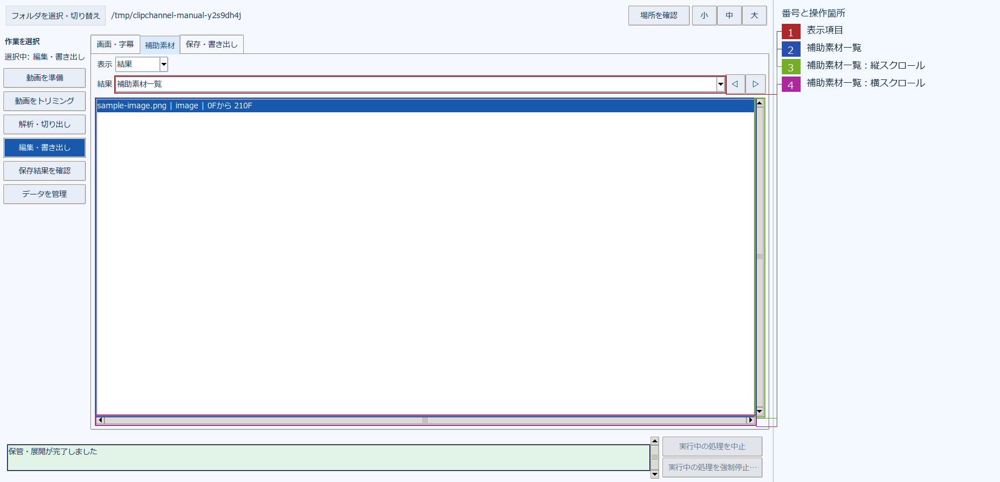

| 画像の番号 | 画面の項目 | 説明・操作 |
|---|---|---|
| 1 | 表示項目 | 表示「結果」内の項目を選びます。この画像は「補助素材一覧」を選択した状態です。 |
| 2 | 補助素材一覧 | 現在の編集用動画に追加した画像・BGM・効果音の配置を選びます。 |
| 3 | 補助素材一覧：縦スクロール | この一覧または詳細設定の内部を縦にスクロールします。 |
| 4 | 補助素材一覧：横スクロール | 一覧の内部を横にスクロールし、長い行の続きを確認します。 |

この画像の番号は **4個**、説明表は **4件**です。

撮影条件：一時データ。ネット取得・人物照合・Whisper・AviUtl2送信は未実行。

<a id="supporting-settings"></a>

### 補助素材：素材の配置・音声設定

移動：**編集・書き出し → 補助素材 → 表示「詳細設定」→ 項目「素材の配置・音声設定」**。

BGMは素材の元の長さで追加され、映像の末尾へ自動短縮しません。必要な長さFを手動で調整してください。

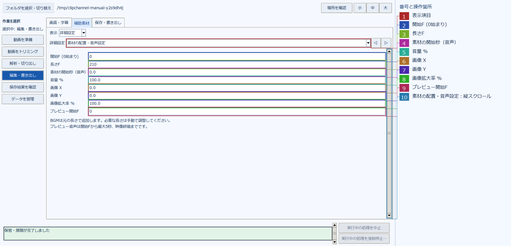

| 画像の番号 | 画面の項目 | 説明・操作 |
|---|---|---|
| 1 | 表示項目 | 表示「詳細設定」内の項目を選びます。この画像は「素材の配置・音声設定」を選択した状態です。 |
| 2 | 開始F (0始まり) | 補助素材を置き始めるフレームを0始まりで指定します。 |
| 3 | 長さF | 補助素材を表示・再生するフレーム数を指定します。 |
| 4 | 素材の開始秒（音声） | BGM・効果音で素材内の再生開始位置を秒で指定します。 |
| 5 | 音量 % | BGM・効果音の音量を百分率で指定します。 |
| 6 | 画像 X | 画像の横方向の配置座標を指定します。 |
| 7 | 画像 Y | 画像の縦方向の配置座標を指定します。 |
| 8 | 画像拡大率 % | 画像の表示倍率を百分率で指定します。 |
| 9 | プレビュー開始F | 補助素材のプレビューを始めるフレーム位置を指定します。 |
| 10 | 素材の配置・音声設定：縦スクロール | この一覧または詳細設定の内部を縦にスクロールします。 |

この画像の番号は **10個**、説明表は **10件**です。

撮影条件：一時データ。ネット取得・人物照合・Whisper・AviUtl2送信は未実行。

<a id="save-export-actions"></a>

### 保存・書き出し：保存・書き出し

移動：**編集・書き出し → 保存・書き出し → 表示「操作」→ 項目「保存・書き出し」**。

保存・書き出しは、Windows上のClipChannelAPPと対応するプラグインで操作してください。この撮影ではAviUtl2を操作していません。

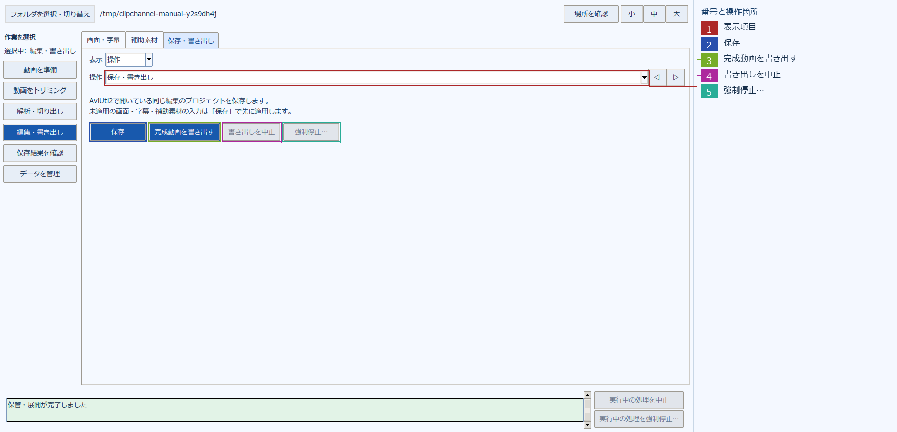

| 画像の番号 | 画面の項目 | 説明・操作 |
|---|---|---|
| 1 | 表示項目 | 表示「操作」内の項目を選びます。この画像は「保存・書き出し」を選択した状態です。 |
| 2 | 保存 | 未適用の画面・字幕・補助素材を適用し、AviUtl2で開いている対応プロジェクトを明示保存して確認します。 |
| 3 | 完成動画を書き出す | 保存を確認した対応プロジェクトを現在の出力設定でMP4に書き出し、完成条件を検査します。 |
| 4 | 書き出しを中止 | 書き出しに中止を要求します。実際の停止完了まで同じ編集の操作は待ちます。 |
| 5 | 強制停止… | 通常中止要求から3秒以上応答がない場合に使います。描画・エンコード中は担当AviUtl2も終了し、未保存編集が失われます。 |

この画像の番号は **5個**、説明表は **5件**です。

撮影条件：一時データ。ネット取得・人物照合・Whisper・AviUtl2送信は未実行。

<a id="project-target"></a>

### 保存・書き出し：対象プロジェクト

移動：**編集・書き出し → 保存・書き出し → 表示「操作」→ 項目「対象プロジェクト」**。

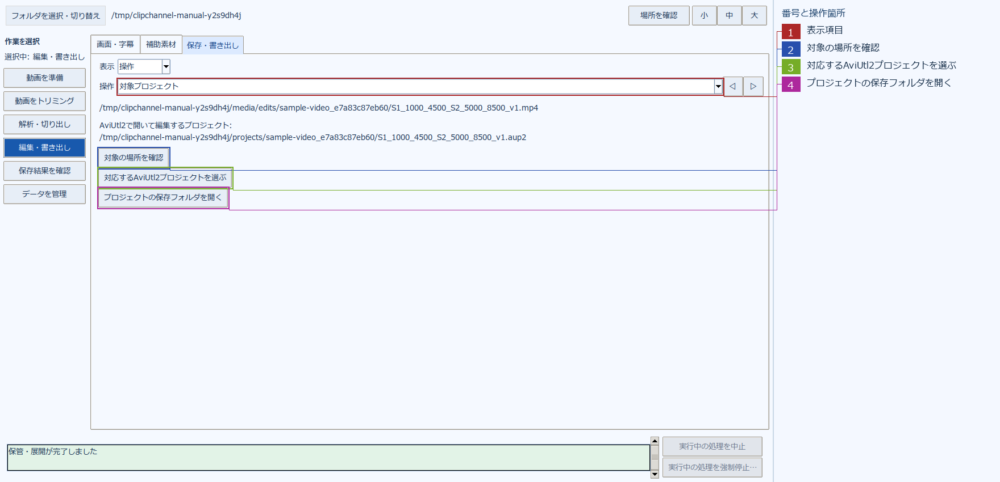

| 画像の番号 | 画面の項目 | 説明・操作 |
|---|---|---|
| 1 | 表示項目 | 表示「操作」内の項目を選びます。この画像は「対象プロジェクト」を選択した状態です。 |
| 2 | 対象の場所を確認 | 対象の編集用動画と保存するAviUtl2プロジェクトのパスを確認します。 |
| 3 | 対応するAviUtl2プロジェクトを選ぶ | projects内の同じ編集フォルダにある対応.aup2を選びます。AviUtl2で開いているものと一致させてください。 |
| 4 | プロジェクトの保存フォルダを開く | 現在の編集に対応するprojectsフォルダを開きます。過去の.aup2はAviUtl2で直接開きます。 |

この画像の番号は **4個**、説明表は **4件**です。

撮影条件：一時データ。ネット取得・人物照合・Whisper・AviUtl2送信は未実行。

<a id="save-export-results"></a>

### 保存・書き出し：処理結果

移動：**編集・書き出し → 保存・書き出し → 表示「結果」→ 項目「処理結果」**。

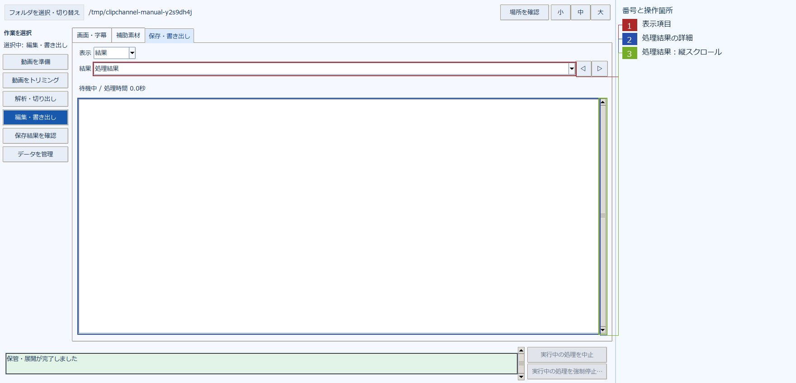

| 画像の番号 | 画面の項目 | 説明・操作 |
|---|---|---|
| 1 | 表示項目 | 表示「結果」内の項目を選びます。この画像は「処理結果」を選択した状態です。 |
| 2 | 処理結果の詳細 | 保存・書き出しの対象、進行、完了または失敗の内容を確認します。完成確認済みの表示を確認してください。 |
| 3 | 処理結果：縦スクロール | この一覧または詳細設定の内部を縦にスクロールします。 |

この画像の番号は **3個**、説明表は **3件**です。

撮影条件：一時データ。ネット取得・人物照合・Whisper・AviUtl2送信は未実行。

<a id="export-settings"></a>

### 保存・書き出し：書き出し設定

移動：**編集・書き出し → 保存・書き出し → 表示「詳細設定」→ 項目「書き出し設定」**。

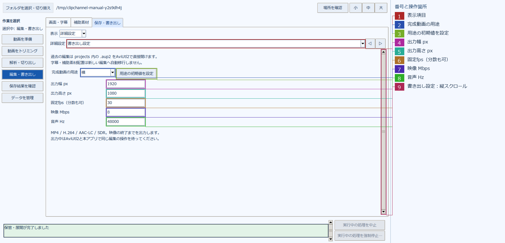

| 画像の番号 | 画面の項目 | 説明・操作 |
|---|---|---|
| 1 | 表示項目 | 表示「詳細設定」内の項目を選びます。この画像は「書き出し設定」を選択した状態です。 |
| 2 | 完成動画の用途 | 横またはショートを選びます。初期値を適用するには隣のボタンを押します。 |
| 3 | 用途の初期値を設定 | 横1920×1080またはショート1080×1920、編集のfpsなどの初期値を入力欄に設定します。 |
| 4 | 出力幅 px | 完成MP4の幅をピクセルで指定します。キャンバスの画面幅とは別です。 |
| 5 | 出力高さ px | 完成MP4の高さをピクセルで指定します。キャンバスの画面高さとは別です。 |
| 6 | 固定fps（分数も可） | 完成MP4のfpsを指定します。30000/1001のような分数も入力できます。 |
| 7 | 映像 Mbps | H.264映像のビットレートをMbpsで指定します。 |
| 8 | 音声 Hz | AAC音声のサンプルレートをHzで指定します。初期値は48000です。 |
| 9 | 書き出し設定：縦スクロール | この一覧または詳細設定の内部を縦にスクロールします。 |

この画像の番号は **9個**、説明表は **9件**です。

撮影条件：一時データ。ネット取得・人物照合・Whisper・AviUtl2送信は未実行。

<a id="saved-results"></a>

### 保存済み情報：保存済み一覧

移動：**保存結果を確認 → 保存済み情報 → 表示「結果」→ 項目「保存済み一覧」**。

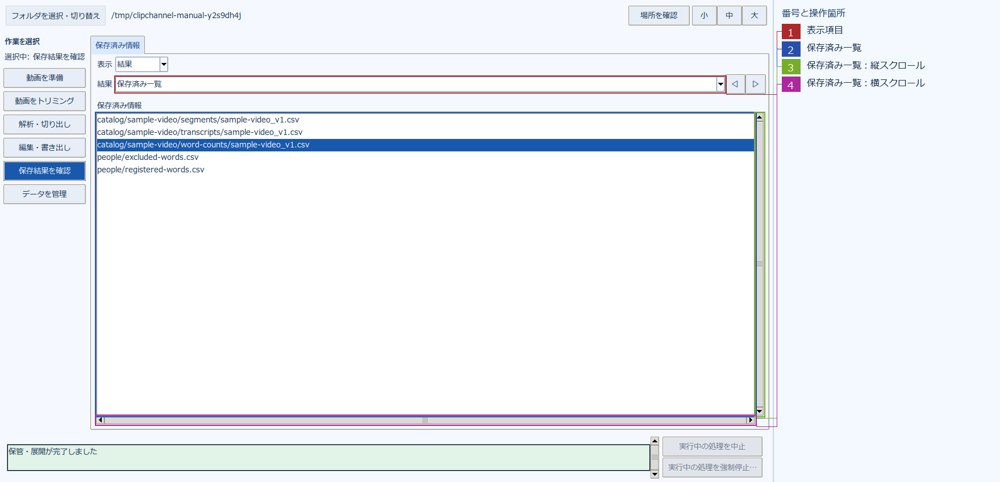

| 画像の番号 | 画面の項目 | 説明・操作 |
|---|---|---|
| 1 | 表示項目 | 表示「結果」内の項目を選びます。この画像は「保存済み一覧」を選択した状態です。 |
| 2 | 保存済み一覧 | 結果CSVを選択して内容を表示します。各タブで過去版を使用する前に、ここで対象の版を選びます。 |
| 3 | 保存済み一覧：縦スクロール | この一覧または詳細設定の内部を縦にスクロールします。 |
| 4 | 保存済み一覧：横スクロール | 一覧の内部を横にスクロールし、長い行の続きを確認します。 |

この画像の番号は **4個**、説明表は **4件**です。

撮影条件：一時データ。ネット取得・人物照合・Whisper・AviUtl2送信は未実行。

<a id="saved-csv"></a>

### 保存済み情報：CSV本文

移動：**保存結果を確認 → 保存済み情報 → 表示「結果」→ 項目「CSV本文」**。

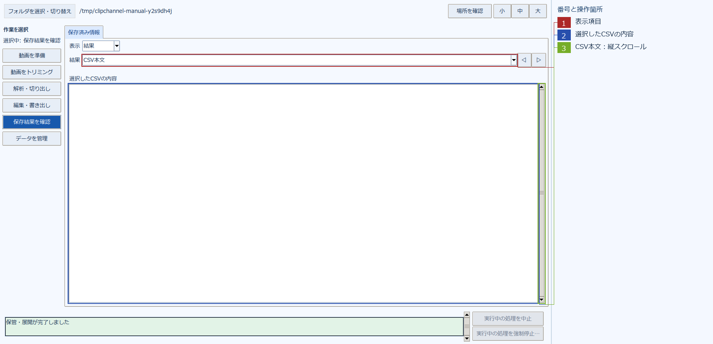

| 画像の番号 | 画面の項目 | 説明・操作 |
|---|---|---|
| 1 | 表示項目 | 表示「結果」内の項目を選びます。この画像は「CSV本文」を選択した状態です。 |
| 2 | 選択したCSVの内容 | 保存済み一覧で選んだCSVを読み取り専用で表示します。ここで直接修正・保存はできません。 |
| 3 | CSV本文：縦スクロール | この一覧または詳細設定の内部を縦にスクロールします。 |

この画像の番号は **3個**、説明表は **3件**です。

撮影条件：一時データ。ネット取得・人物照合・Whisper・AviUtl2送信は未実行。

<a id="management-actions"></a>

### 管理・保管：登録情報を管理

移動：**データを管理 → 管理・保管 → 表示「操作」→ 項目「登録情報を管理」**。

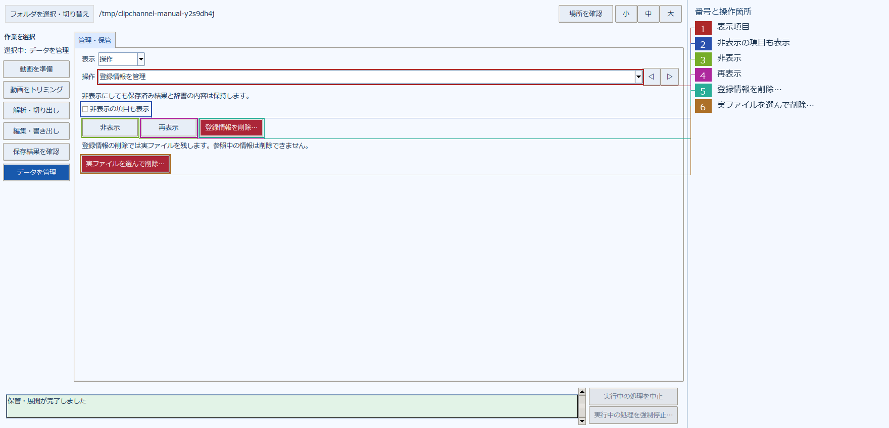

| 画像の番号 | 画面の項目 | 説明・操作 |
|---|---|---|
| 1 | 表示項目 | 表示「操作」内の項目を選びます。この画像は「登録情報を管理」を選択した状態です。 |
| 2 | 非表示の項目も表示 | 管理一覧に非表示の項目も含め、再表示操作の対象にします。 |
| 3 | 非表示 | 管理一覧で選んだ項目を通常一覧から隠します。実ファイル・辞書の働き・保存結果は保持します。 |
| 4 | 再表示 | 管理一覧で選んだ非表示項目を通常一覧に戻します。 |
| 5 | 登録情報を削除… | 選択項目の登録情報を確認後に削除します。実ファイルは残り、参照中の情報は削除できません。 |
| 6 | 実ファイルを選んで削除… | 削除可能な範囲内のファイルを選び、パスを確認して完全に削除します。操作は取り消せません。 |

この画像の番号は **6個**、説明表は **6件**です。

撮影条件：一時データ。ネット取得・人物照合・Whisper・AviUtl2送信は未実行。

<a id="archive-actions"></a>

### 管理・保管：動画を保管・展開

移動：**データを管理 → 管理・保管 → 表示「操作」→ 項目「動画を保管・展開」**。

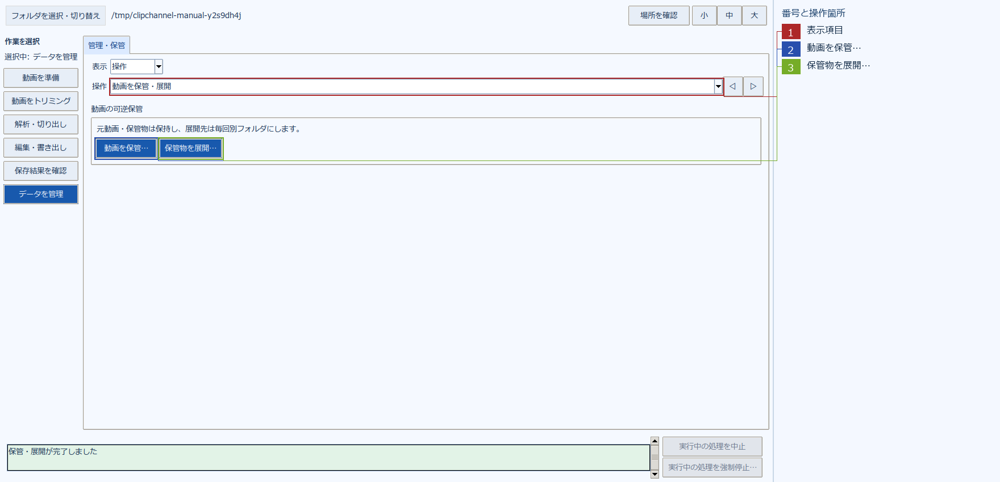

| 画像の番号 | 画面の項目 | 説明・操作 |
|---|---|---|
| 1 | 表示項目 | 表示「操作」内の項目を選びます。この画像は「動画を保管・展開」を選択した状態です。 |
| 2 | 動画を保管… | 登録動画を選び、動画とmanifestをZIP64でarchivesへ保管します。元動画は残ります。 |
| 3 | 保管物を展開… | 保管ZIPを選び、SHA256を検証してmedia/restoredの新しいフォルダへ展開します。 |

この画像の番号は **3個**、説明表は **3件**です。

撮影条件：一時データ。ネット取得・人物照合・Whisper・AviUtl2送信は未実行。

<a id="log-actions"></a>

### 管理・保管：ログの整理

移動：**データを管理 → 管理・保管 → 表示「操作」→ 項目「ログの整理」**。

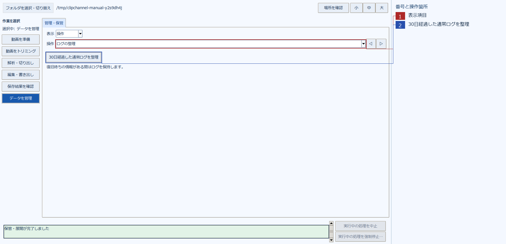

| 画像の番号 | 画面の項目 | 説明・操作 |
|---|---|---|
| 1 | 表示項目 | 表示「操作」内の項目を選びます。この画像は「ログの整理」を選択した状態です。 |
| 2 | 30日経過した通常ログを整理 | 30日以上経過した通常ログを整理します。復旧待ち・状態不明のログは保持します。 |

この画像の番号は **2個**、説明表は **2件**です。

撮影条件：一時データ。ネット取得・人物照合・Whisper・AviUtl2送信は未実行。

<a id="management-results"></a>

### 管理・保管：登録一覧

移動：**データを管理 → 管理・保管 → 表示「結果」→ 項目「登録一覧」**。

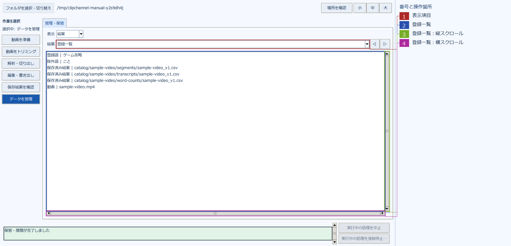

| 画像の番号 | 画面の項目 | 説明・操作 |
|---|---|---|
| 1 | 表示項目 | 表示「結果」内の項目を選びます。この画像は「登録一覧」を選択した状態です。 |
| 2 | 登録一覧 | 人物・語・結果・動画などを選び、非表示・再表示・登録情報の削除の対象にします。 |
| 3 | 登録一覧：縦スクロール | この一覧または詳細設定の内部を縦にスクロールします。 |
| 4 | 登録一覧：横スクロール | 一覧の内部を横にスクロールし、長い行の続きを確認します。 |

この画像の番号は **4個**、説明表は **4件**です。

撮影条件：一時データ。ネット取得・人物照合・Whisper・AviUtl2送信は未実行。

<a id="archive-results"></a>

### 管理・保管：保管・展開結果

移動：**データを管理 → 管理・保管 → 表示「詳細設定」→ 項目「保管・展開結果」**。

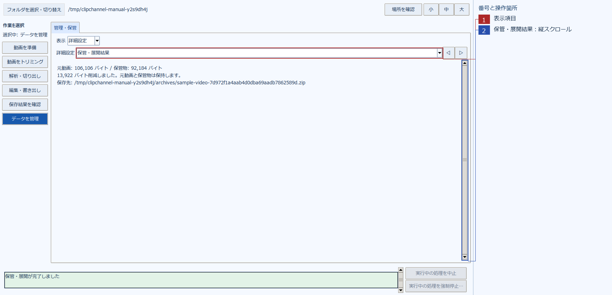

| 画像の番号 | 画面の項目 | 説明・操作 |
|---|---|---|
| 1 | 表示項目 | 表示「詳細設定」内の項目を選びます。この画像は「保管・展開結果」を選択した状態です。 |
| 2 | 保管・展開結果：縦スクロール | この一覧または詳細設定の内部を縦にスクロールします。 |

この画像の番号は **2個**、説明表は **2件**です。

撮影条件：一時データ。ネット取得・人物照合・Whisper・AviUtl2送信は未実行。

<a id="process-running"></a>

### 実行中

共通の管理対象処理の実行中表示です。説明用の待機処理を実際に起動して撮影しています。


| 画像の番号 | 画面の項目 | 説明・操作 |
|---|---|---|
| 1 | 実行中の処理を中止 | 共通の管理対象処理に通常中止を要求します。実際の終了を確認するまで処理中の状態を維持します。 |
| 2 | 実行中の処理を強制停止… | 通常中止要求から3秒後も終了しない場合に、対象処理とその子プロセスを確認して強制停止します。 |

この画像の番号は **2個**、説明表は **2件**です。

撮影条件：実際の管理対象処理の状態。一時的な待機処理のみ。

<a id="process-stopping"></a>

### 停止待ち・強制停止選択可能

通常中止を要求してから3秒後も終了していない状態です。3秒は強制停止の選択肢を有効にする待機時間で、自動停止の期限ではありません。


| 画像の番号 | 画面の項目 | 説明・操作 |
|---|---|---|
| 1 | 実行中の処理を中止 | 共通の管理対象処理に通常中止を要求します。実際の終了を確認するまで処理中の状態を維持します。 |
| 2 | 実行中の処理を強制停止… | 通常中止要求から3秒後も終了しない場合に、対象処理とその子プロセスを確認して強制停止します。 |

この画像の番号は **2個**、説明表は **2件**です。

撮影条件：実際の管理対象処理の状態。一時的な待機処理のみ。

<a id="process-stopped"></a>

### 停止完了

実際の処理終了を確認した状態です。処理時間の表示は終了時点で固定されます。


| 画像の番号 | 画面の項目 | 説明・操作 |
|---|---|---|
| 1 | 実行中の処理を中止 | 共通の管理対象処理に通常中止を要求します。実際の終了を確認するまで処理中の状態を維持します。 |
| 2 | 実行中の処理を強制停止… | 通常中止要求から3秒後も終了しない場合に、対象処理とその子プロセスを確認して強制停止します。 |

この画像の番号は **2個**、説明表は **2件**です。

撮影条件：実際の管理対象処理の状態。一時的な待機処理のみ。

<a id="dialog-location"></a>

### 場所を確認

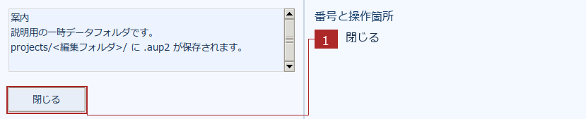

| 画像の番号 | 画面の項目 | 説明・操作 |
|---|---|---|
| 1 | 閉じる | 確認内容またはプレビューを閉じます。 |

この画像の番号は **1個**、説明表は **1件**です。

撮影条件：本番ダイアログに説明用メッセージを表示。処理は未実行。

<a id="dialog-error"></a>

### エラー表示

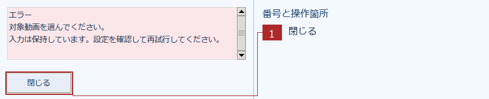

| 画像の番号 | 画面の項目 | 説明・操作 |
|---|---|---|
| 1 | 閉じる | 確認内容またはプレビューを閉じます。 |

この画像の番号は **1個**、説明表は **1件**です。

撮影条件：本番ダイアログに説明用メッセージを表示。処理は未実行。

<a id="dialog-warning"></a>

### 警告表示

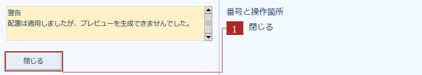

| 画像の番号 | 画面の項目 | 説明・操作 |
|---|---|---|
| 1 | 閉じる | 確認内容またはプレビューを閉じます。 |

この画像の番号は **1個**、説明表は **1件**です。

撮影条件：本番ダイアログに説明用メッセージを表示。処理は未実行。

<a id="dialog-short"></a>

### ショート条件外

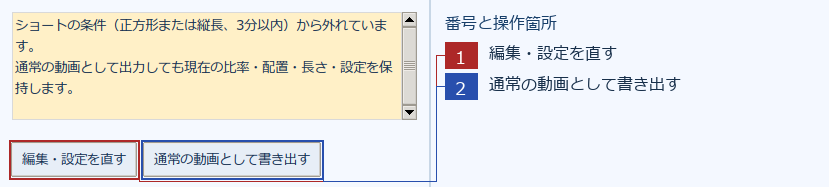

| 画像の番号 | 画面の項目 | 説明・操作 |
|---|---|---|
| 1 | 編集・設定を直す | 書き出しを開始せず、編集や出力設定を修正するために戻ります。 |
| 2 | 通常の動画として書き出す | ショート判定の条件外でも、現在の比率・配置・長さ・設定を保って通常の動画として出力します。 |

この画像の番号は **2個**、説明表は **2件**です。

撮影条件：本番ダイアログに説明用メッセージを表示。処理は未実行。

<a id="dialog-unsaved-export"></a>

### 未保存の編集・書き出し前

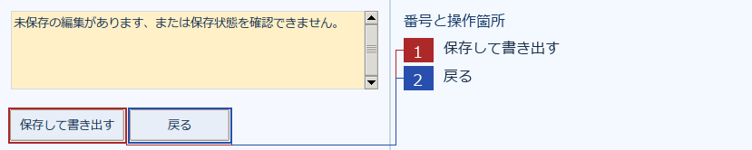

| 画像の番号 | 画面の項目 | 説明・操作 |
|---|---|---|
| 1 | 保存して書き出す | 対応プロジェクトを保存し、保存確認が揃ってから書き出しを開始します。 |
| 2 | 戻る | 操作を開始せず、元の編集画面に戻ります。 |

この画像の番号は **2個**、説明表は **2件**です。

撮影条件：本番ダイアログに説明用メッセージを表示。処理は未実行。

<a id="dialog-unsaved-close"></a>

### 未保存の編集・終了時

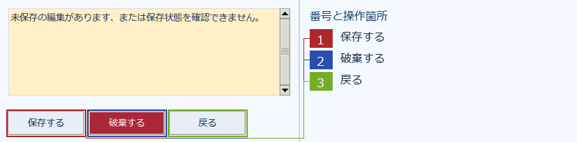

| 画像の番号 | 画面の項目 | 説明・操作 |
|---|---|---|
| 1 | 保存する | 対応プロジェクトを保存し、保存確認後にアプリを終了します。 |
| 2 | 破棄する | 未保存の変更を保存せずにアプリを終了します。AviUtl2の未保存変更も失われる場合があります。 |
| 3 | 戻る | 操作を開始せず、元の編集画面に戻ります。 |

この画像の番号は **3個**、説明表は **3件**です。

撮影条件：本番ダイアログに説明用メッセージを表示。処理は未実行。

<a id="dialog-screen"></a>

### 画面を選択

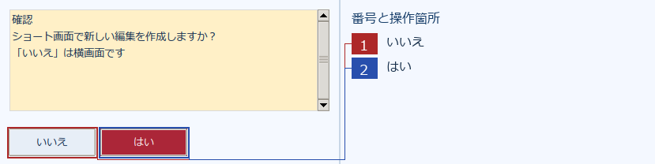

| 画像の番号 | 画面の項目 | 説明・操作 |
|---|---|---|
| 1 | いいえ | この確認で提案された操作を実行せず、元の画面に戻ります。 |
| 2 | はい | この確認の内容を了承して操作を実行します。削除・強制停止では対象と影響を先に確認してください。 |

この画像の番号は **2個**、説明表は **2件**です。

撮影条件：本番ダイアログに説明用メッセージを表示。処理は未実行。

<a id="dialog-registration-delete"></a>

### 登録情報を削除

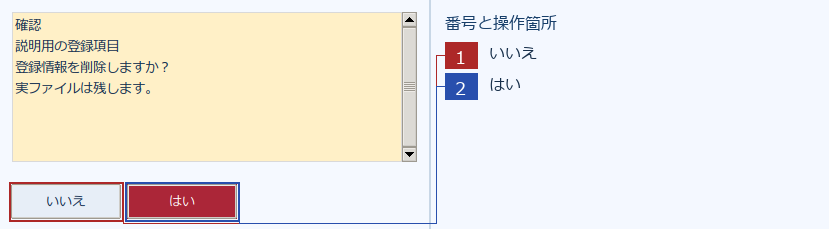

| 画像の番号 | 画面の項目 | 説明・操作 |
|---|---|---|
| 1 | いいえ | この確認で提案された操作を実行せず、元の画面に戻ります。 |
| 2 | はい | この確認の内容を了承して操作を実行します。削除・強制停止では対象と影響を先に確認してください。 |

この画像の番号は **2個**、説明表は **2件**です。

撮影条件：本番ダイアログに説明用メッセージを表示。処理は未実行。

<a id="dialog-file-delete"></a>

### 実ファイルを削除

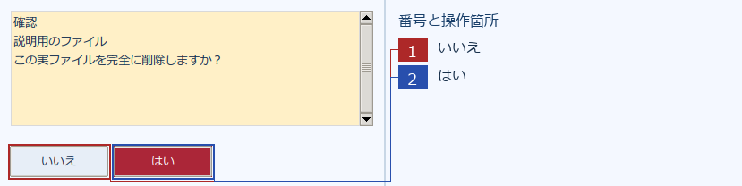

| 画像の番号 | 画面の項目 | 説明・操作 |
|---|---|---|
| 1 | いいえ | この確認で提案された操作を実行せず、元の画面に戻ります。 |
| 2 | はい | この確認の内容を了承して操作を実行します。削除・強制停止では対象と影響を先に確認してください。 |

この画像の番号は **2個**、説明表は **2件**です。

撮影条件：本番ダイアログに説明用メッセージを表示。処理は未実行。

<a id="dialog-process-force"></a>

### 管理対象処理の強制停止

対象はこの管理対象処理と、それが起動した子プロセスです。同名の別プロセスは対象にしません。

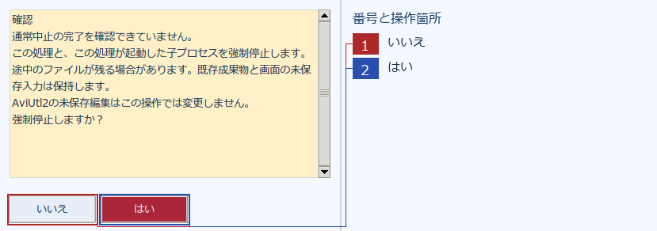

| 画像の番号 | 画面の項目 | 説明・操作 |
|---|---|---|
| 1 | いいえ | この確認で提案された操作を実行せず、元の画面に戻ります。 |
| 2 | はい | この確認の内容を了承して操作を実行します。削除・強制停止では対象と影響を先に確認してください。 |

この画像の番号は **2個**、説明表は **2件**です。

撮影条件：本番ダイアログに説明用メッセージを表示。処理は未実行。

<a id="dialog-export-force"></a>

### 書き出しの強制停止

描画・エンコード中の強制停止では、担当AviUtl2とエンコーダーを終了します。AviUtl2内の未保存編集は失われます。

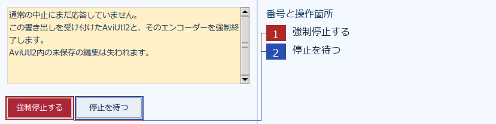

| 画像の番号 | 画面の項目 | 説明・操作 |
|---|---|---|
| 1 | 強制停止する | 確認で示された対象だけを強制終了します。描画・エンコード中はAviUtl2内の未保存編集が失われます。 |
| 2 | 停止を待つ | 強制停止を実行せず、通常中止の完了を待ちます。 |

この画像の番号は **2個**、説明表は **2件**です。

撮影条件：本番ダイアログに説明用メッセージを表示。処理は未実行。

<a id="dialog-verification-force"></a>

### 完成動画の検査を強制停止

出力検査中は検査プロセスとffprobeを止めます。AviUtl2の編集は保持し、出力ファイルは完成確認済みとしません。

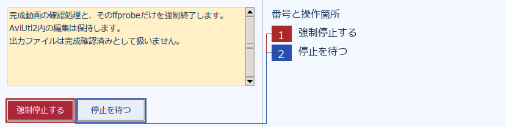

| 画像の番号 | 画面の項目 | 説明・操作 |
|---|---|---|
| 1 | 強制停止する | 確認で示された対象だけを強制終了します。描画・エンコード中はAviUtl2内の未保存編集が失われます。 |
| 2 | 停止を待つ | 強制停止を実行せず、通常中止の完了を待ちます。 |

この画像の番号は **2個**、説明表は **2件**です。

撮影条件：本番ダイアログに説明用メッセージを表示。処理は未実行。

<a id="preview"></a>

### 画像・音声プレビュー

ダイアログの操作方法を示す説明用の図形です。AviUtl2の描画・ミックス音声の検証結果ではありません。


| 画像の番号 | 画面の項目 | 説明・操作 |
|---|---|---|
| 1 | この位置から音声を試聴（最大5秒） | 指定したプレビュー位置から、最大5秒・映像末尾までのミックス音声を試聴します。この撮影では音声処理を実行していません。 |
| 2 | 試聴を停止 | プレビュー音声の試聴を停止します。プレビューを閉じるときも試聴を停止します。 |
| 3 | 閉じる | 確認内容またはプレビューを閉じます。 |

この画像の番号は **3個**、説明表は **3件**です。

撮影条件：説明用の図形画像。AviUtl2の描画結果ではなく、試聴ボタンも未実行です。
