# ClipChannelAPP 使い方マニュアル

更新日：2026年9月28日。本番Tkinter UIの操作を説明します。[HTML版](index.html)では目次から移動でき、画像をクリックすると拡大できます。

## 1. このマニュアルの読み方

画像は本番アプリを実際に表示して撮影しています。赤枠と番号は操作箇所を示します。番号は画像ごとの位置の識別用で、手順の番号とは別です。各画面の上にある「移動」の順に、左の作業、タブ、「表示」、項目を選んでください。画像内のパス・動画・CSVは説明用の一時データです。自分のデータでは名前や件数が変わります。

一連の制作は **動画を準備 → 解析・切り出し → 編集用動画を作成 → AviUtl2でプロジェクトを開く → 画面・字幕・補助素材を反映 → 保存 → 完成動画を書き出す** の順です。解析を使わず手動で区間を作成する経路もあります。

撮影では一時動画から編集用動画と `.aup2` を作成し、説明用CSVを表示しました。補助画像のコピー、動画の保管、一時処理の中止も一時データで実行しています。ネット取得、人物照合・Whisper解析、AviUtl2への反映・保存・書き出しは撮影時には実行していません。確認ダイアログは本番の表示処理に説明用メッセージを渡した例です。プレビュー画像も説明用です。これらを未実行の処理の成功証拠として扱わないでください。

Windows標準ファイル選択、エクスプローラー、外部プレイヤー、AviUtl2本体の画面は今回未収録です。アプリ内の全9タブ・41表示項目を収録し、共通ダイアログを種類別に説明しています。エラー文や完了文は状況ごとに変わるため、すべての文面の組み合わせを収録するものではありません。

## 2. 起動と共通操作

### 2.1 起動前の準備

開発環境で起動する場合は、プロジェクトフォルダで次を実行します。

```sh
python -m pip install -r requirements.txt
python -m clipchannel.app
```

媒体確認・変換・編集用動画作成には `ffmpeg` と `ffprobe`、試聴・動画再生には `ffplay` が必要です。人物登録にはローカルECAPAモデル、文字起こしにはローカルWhisperモデルと関連ライブラリが必要です。AviUtl2連携には専用プラグインを導入してください。ビルド手順は [README](../../README.md) にあります。

### 2.2 データ用フォルダを選ぶ

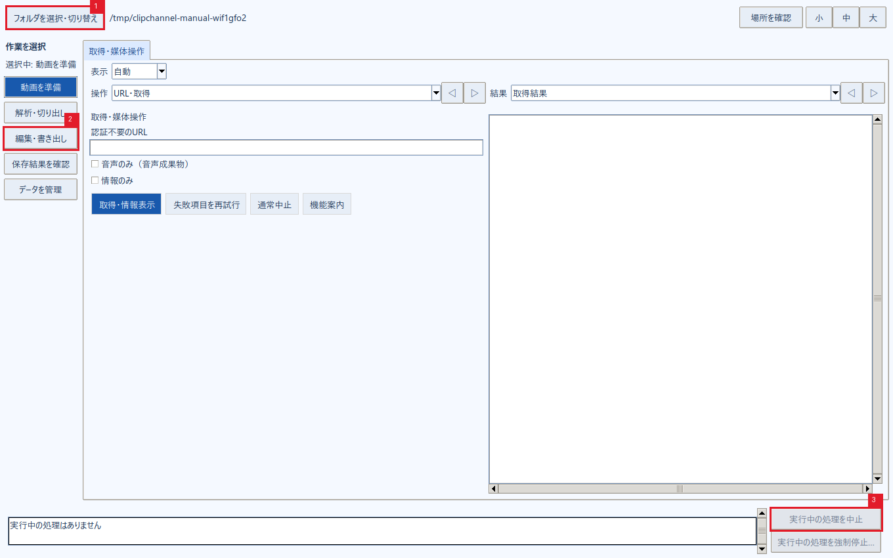

1. 上部の「フォルダを選択・切り替え」を押し、既存のデータ用フォルダを選びます。初めて使う場合は空のフォルダを用意します。
2. 左側で作業を選びます。必要なタブだけが表示されます。
3. 下部で処理状態を確認します。実行中は「実行中の処理を中止」が有効になります。

フォルダ内には保存用のサブフォルダが作られます。Windowsでは直接接続されたドライブを選んでください。処理中、または未保存入力がある間はデータ用フォルダを切り替えられません。起動時にフォルダ未選択なら毎回選択してください。

### 2.3 画面を切り替える

| 操作 | 働き |
|---|---|
| 左の作業 | 動画準備、解析、編集、結果確認、管理を切り替える |
| 上部のタブ | 選択中の作業の機能を切り替える |
| 表示「操作」 | 入力・実行ボタンを表示する |
| 表示「結果」 | 一覧や結果を表示する |
| 表示「詳細設定」 | 設定を表示する。内部スクロールできる |
| 表示「自動」 | 幅が十分なら操作と結果を並べ、狭い場合は操作を表示する |
| 項目のプルダウン／◁▷ | 同じ表示種別の別項目へ切り替える |
| 小／中／大 | 使用可能画面の約70%／約85%／最大化にする |
| 場所を確認 | 省略されたパスの全文を確認する |

メイン画面全体はスクロールしません。目的のボタンが見えない場合は「表示」と項目を切り替えます。一覧や詳細設定の内部はスクロールできます。作業・タブ・サイズ・表示を切り替えても、そのセッションの入力・選択・実行中処理を保持します。処理完了後は次の作業への案内に従って手動で移動してください。

前回のサイズと作業・タブは復元しますが、編集中の入力やプロジェクトを再起動後に自動復元する機能ではありません。青は主要操作、赤は削除などの注意操作です。無効なボタンは処理状態や前提条件を確認してください。

## 3. 動画を準備する

### 3.1 URLから取得する

移動：**動画を準備 → 取得・媒体操作 → 操作 → URL・取得**。

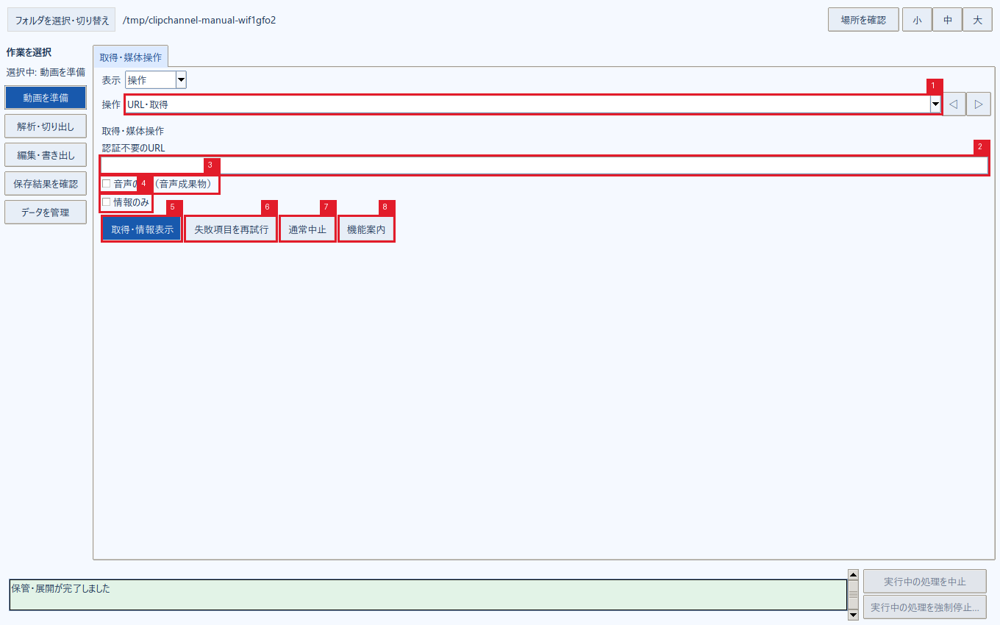

1. 認証不要のURLを入力します。
2. 動画を取得するならチェックを外したままにします。「音声のみ」は音声成果物、「情報のみ」はファイルを保存せず情報を取得します。
3. 必要なら次の詳細設定を変更します。
4. 「取得・情報表示」を押し、下部の状態を確認します。

移動：**動画を準備 → 取得・媒体操作 → 詳細設定 → 形式・品質と取得設定**。

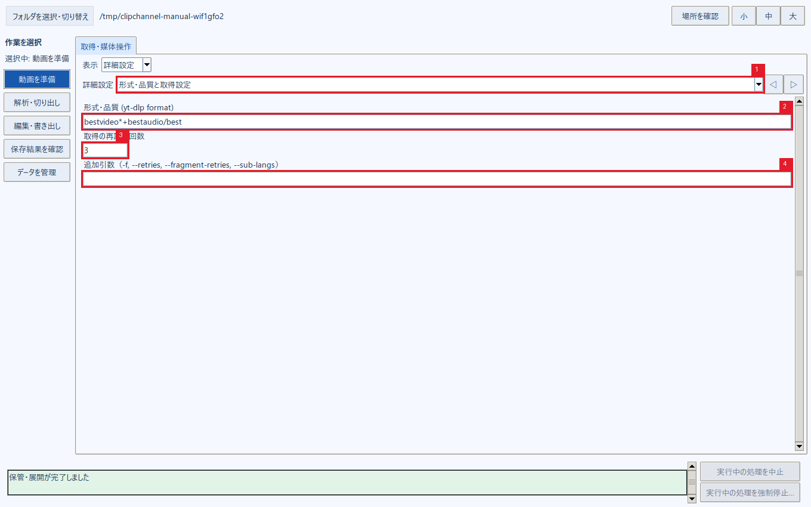

形式・品質はyt-dlpの形式指定です。初期値は `bestvideo*+bestaudio/best`、再試行回数は3です。追加引数欄が受け付ける指定は画面にある `-f`、`--retries`、`--fragment-retries`、`--sub-langs` です。認証、保存先変更、上書き、外部コマンドなどの指定は保護条件で拒否されます。「機能案内」で範囲を確認できます。

移動：**動画を準備 → 取得・媒体操作 → 結果 → 取得結果**。

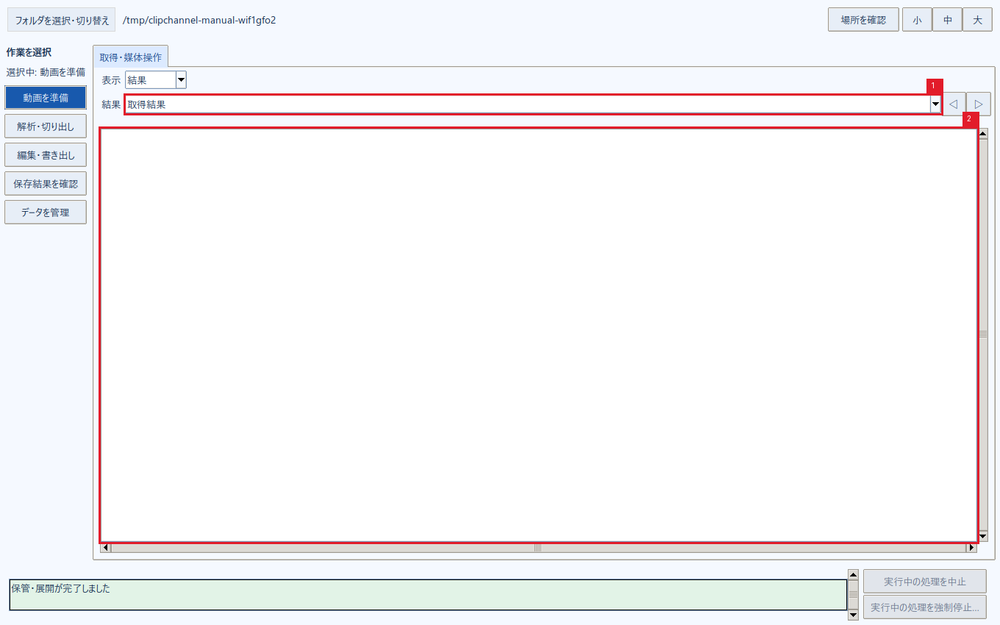

状態・経過時間・タイトル・保存先またはエラーを確認します。失敗項目を選び、詳細設定を修正して「URL・取得」の「失敗項目を再試行」を押します。取得済みの項目は保持します。

### 3.2 手元の動画を登録する／変換を再試行する

移動：**動画を準備 → 取得・媒体操作 → 操作 → ローカル動画**。

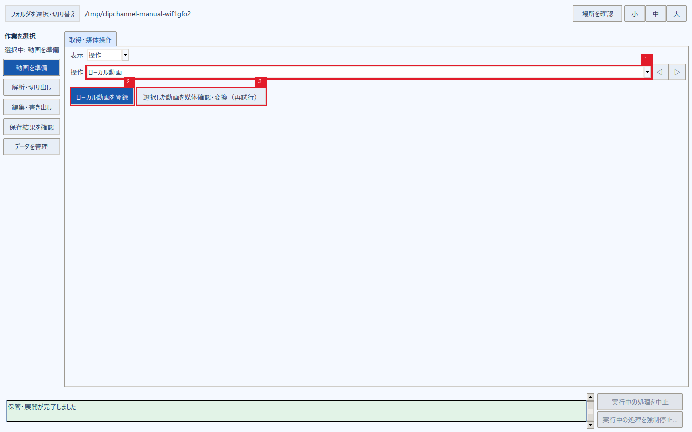

「ローカル動画を登録」でファイルを選びます。アプリ側のデータ用フォルダへ登録し、必要な媒体確認・互換変換を行います。外部の原本は変更しません。別動画が既存動画と同名なら、名前を変更してから登録してください。

移動：**動画を準備 → 取得・媒体操作 → 結果 → 登録済み動画**。

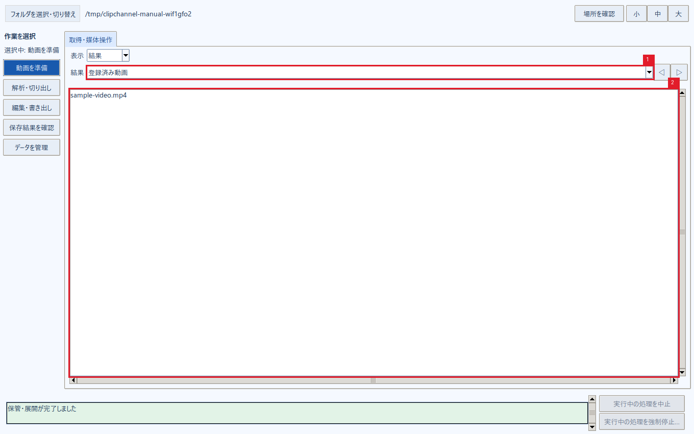

登録済み動画を選びます。媒体確認・変換に失敗した場合は「ローカル動画」に戻り「選択した動画を媒体確認・変換（再試行）」を押します。取得原本、登録原本、変換結果は別の保存場所で保持されます。

## 4. 人物登録から文字起こしまで

### 4.1 人物と参照音声を登録する

移動：**解析・切り出し → 人物・参照音声 → 詳細設定 → 人物・参照音声の登録**。

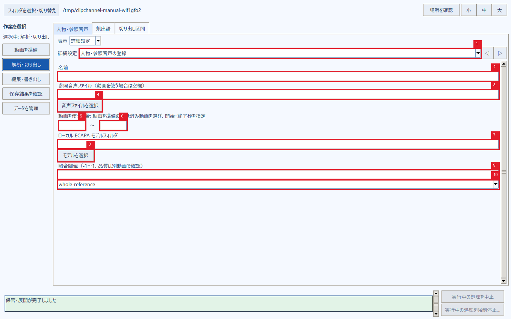

1. 名前を入力します。
2. 「音声ファイルを選択」で参照音声を指定します。登録済み動画から参照音声を作る場合は音声欄を空にし、対象動画と開始・終了秒を指定します。
3. ローカルECAPAモデルのフォルダを選びます。
4. 照合閾値を指定します。閾値は別動画で品質を確認して調整してください。最下部の分割方法は `whole-reference`（参照音声全体）または `five-second-windows`（5秒窓）から選びます。
5. 「表示：操作 → 人物と対象動画」に切り替え、「人物を登録」を押します。設定の入力値は保持されます。

移動：**解析・切り出し → 人物・参照音声 → 結果 → 人物一覧**。


人物を選んだ後、「表示：操作 → 人物と対象動画」の「参照音声を試聴」で確認できます。同じ画面の「動画の対象話者に設定」で、その人物を選択中の動画の対象話者として設定します。

### 4.2 対象動画を選び、試聴区間を判定する

移動：**解析・切り出し → 人物・参照音声 → 操作 → 人物と対象動画**。

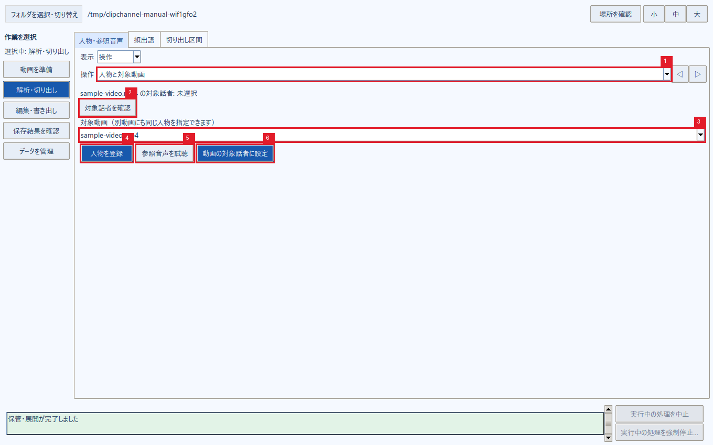

対象動画をプルダウンから選びます。対象話者の表示を確認してください。同じ人物を別動画にも指定できます。

移動：**解析・切り出し → 人物・参照音声 → 操作 → 試聴・判定・再表示**。

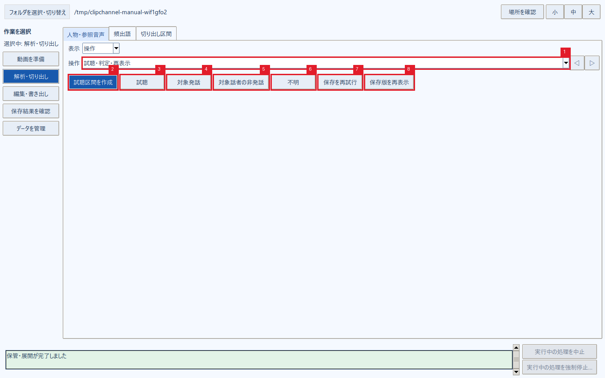

「試聴区間を作成」で対象話者の照合を行います。結果一覧で区間を選んで「試聴」し、「対象発話」「対象話者の非発話」「不明」を指定します。非発話は他者の声がある区間も含みます。保存に失敗した場合は入力を保持し「保存を再試行」できます。

移動：**解析・切り出し → 人物・参照音声 → 結果 → 試聴区間・文字起こし**。

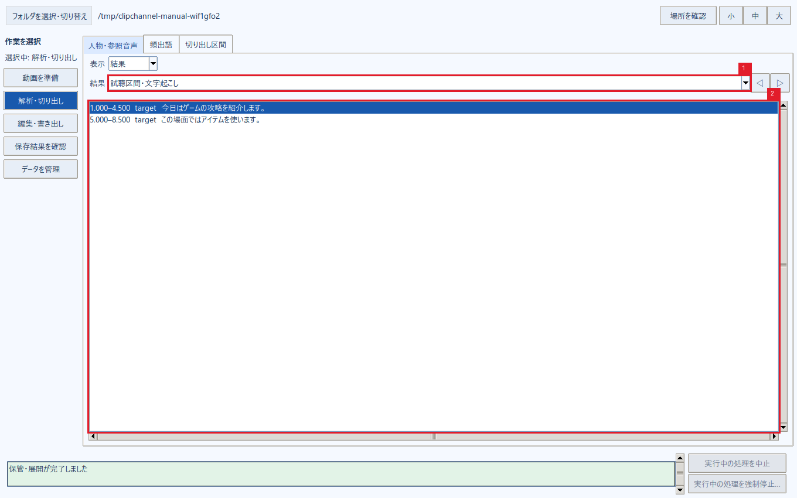

### 4.3 対象発話を文字起こしする

移動：**解析・切り出し → 人物・参照音声 → 操作 → 対象話者の文字起こし**。

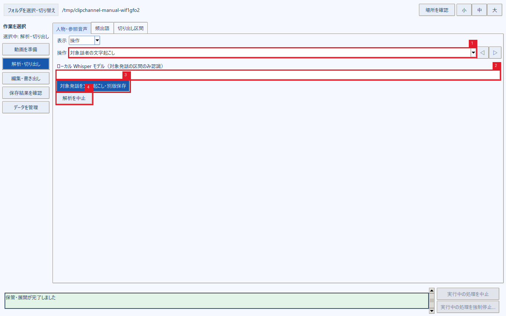

ローカルWhisperモデルの場所を指定し、「対象発話を文字起こし・別版保存」を押します。対象発話と判定した区間だけが認識対象です。停止する場合は「解析を中止」または下部の共通中止を使います。

### 4.4 発言を修正する／保存版を開き直す

移動：**解析・切り出し → 人物・参照音声 → 詳細設定 → 発言の修正**。

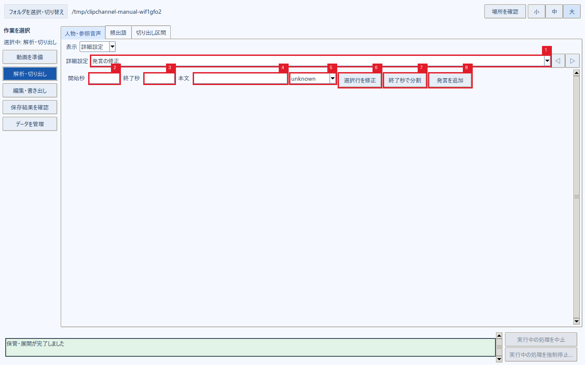

結果一覧で行を選び、開始秒・終了秒・本文・判定を入力します。「選択行を修正」で更新、「終了秒で分割」で区間を分割、「発言を追加」で新しい発言を追加します。判定は `target`＝対象発話、`non-target`＝対象話者の非発話、`unknown`＝不明です。修正結果は別版保存され、旧CSVを上書きしません。

保存版を再表示する場合は「保存結果を確認」で同じ動画の文字起こしCSVを選び、このタブの「試聴・判定・再表示」に戻って「保存版を再表示」を押します。未保存の入力がある場合は先に保存します。

## 5. 頻出語を集計し、発話を確認する

移動：**解析・切り出し → 頻出語 → 操作 → 集計条件**。

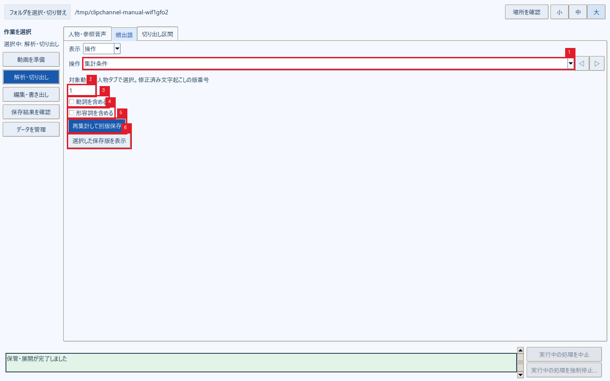

対象動画は人物タブで選びます。修正済み文字起こしの版番号を指定します。初期の集計対象は名詞です。必要なら動詞・形容詞も含め、「再集計して別版保存」を押します。

移動：**解析・切り出し → 頻出語 → 操作 → 登録語・除外語**。

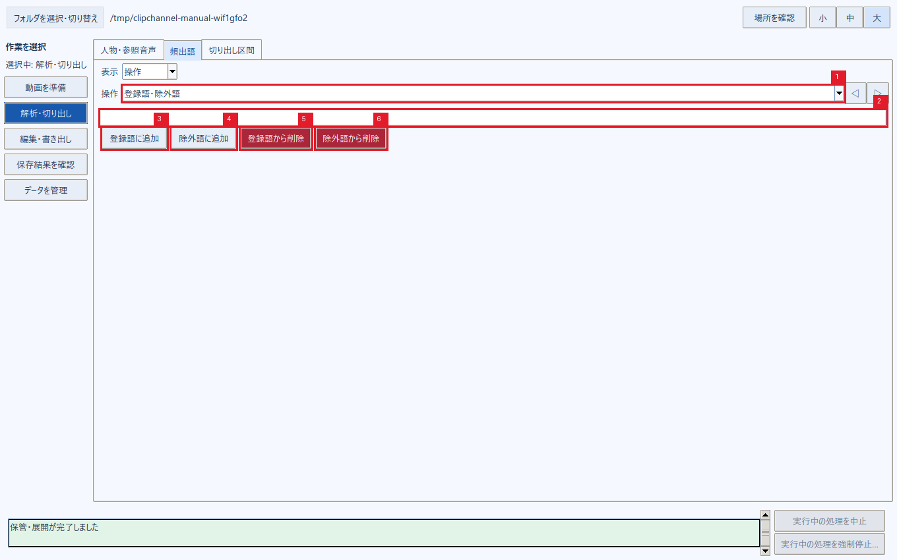

固有名詞などを一語として集計したい場合は欄に入力し「登録語に追加」。数えたくない語は「除外語に追加」を押します。削除はそれぞれ「〜から削除」です。辞書を変更した後は再集計してください。以前の集計CSVは変わりません。

移動：**解析・切り出し → 頻出語 → 結果 → 頻出語一覧**。

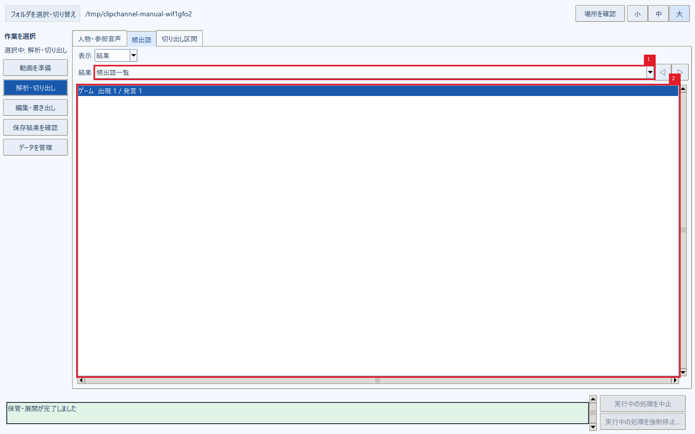

「出現」は語の出現回数、「発言」はその語を含む発言数です。語を選びます。

移動：**解析・切り出し → 頻出語 → 結果 → 発話一覧**。

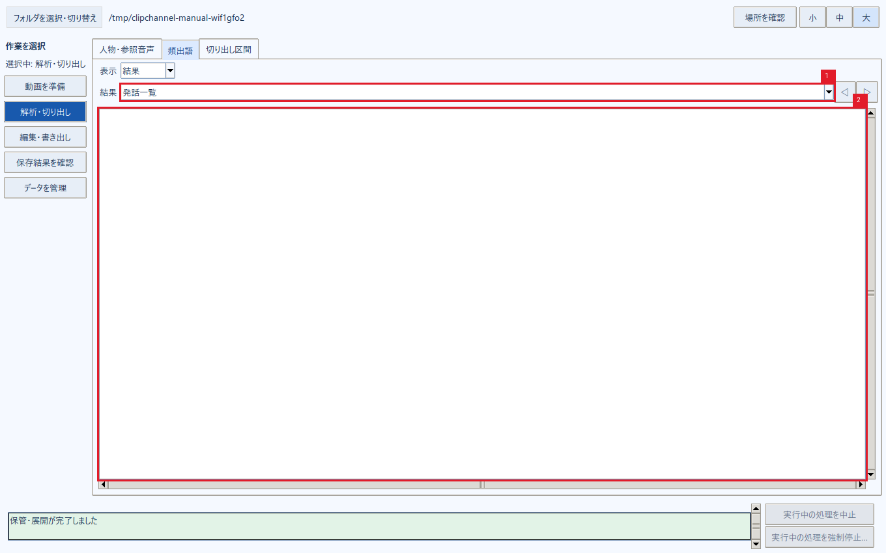

発話をダブルクリックすると元動画の該当部分を外部プレイヤーで確認します。保存版を使う場合は「保存結果を確認」で `word-counts` のCSVを選び、集計条件の「選択した保存版を表示」を押します。

## 6. 切り出し区間を作り、編集用動画にする

### 6.1 候補を作成する／手動で開始する／保存版を使用する

移動：**解析・切り出し → 切り出し区間 → 操作 → 候補と保存版**。

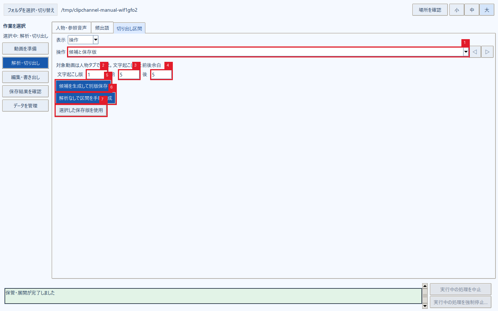

対象動画を人物タブで選びます。文字起こし版と前後余白（秒）を指定し、「候補を生成して別版保存」を押します。解析を使わない場合は「解析なしで区間を手動作成」で開始します。

保存済み区間を使う場合は「保存結果を確認」で同じ動画の `segments` CSVを選び、「選択した保存版を使用」を押します。

### 6.2 区間を選択し、境界・採否を調整する

移動：**解析・切り出し → 切り出し区間 → 結果 → 切り出し区間**。

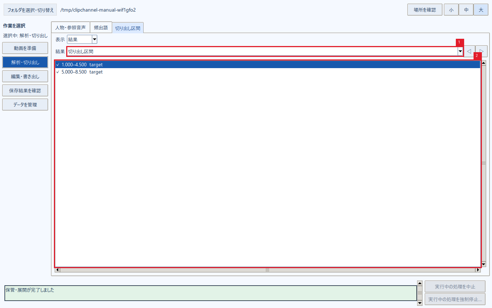

区間を選択します。複数選択を使う操作ではCtrl／Shiftなどで対象を選びます。

移動：**解析・切り出し → 切り出し区間 → 詳細設定 → 区間の境界・採否**。

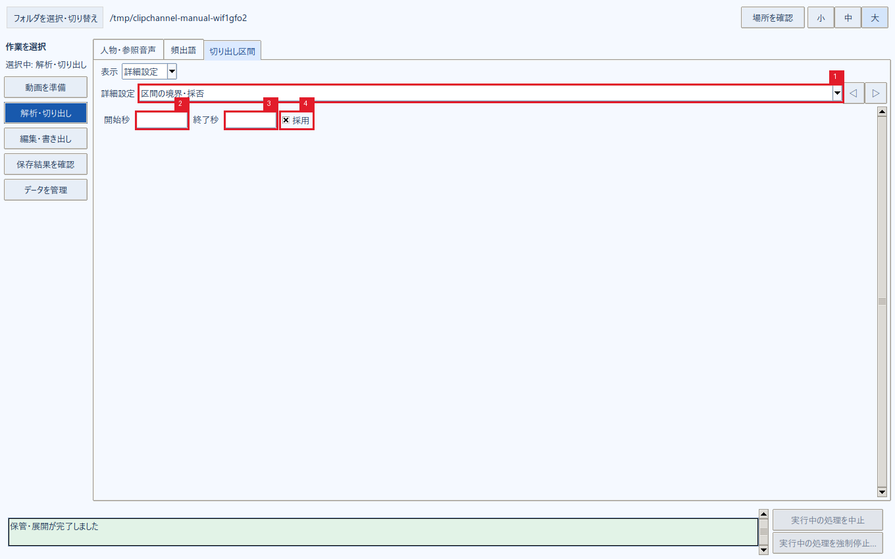

開始秒・終了秒と「採用」を設定します。

移動：**解析・切り出し → 切り出し区間 → 操作 → 区間を修正・試聴**。

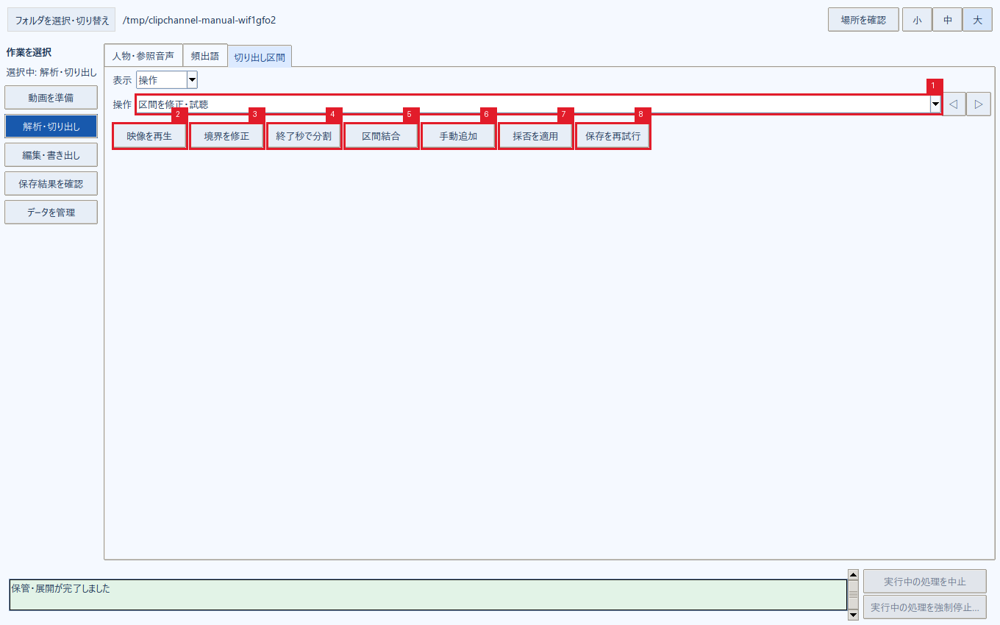

| ボタン | 操作 |
|---|---|
| 試聴・映像確認 | 選択区間を再生する |
| 境界を修正 | 入力した開始・終了で選択区間を更新する |
| 終了秒で分割 | 入力した終了秒を境に選択区間を分割する |
| 区間結合 | 複数選択した区間を最初の開始から最後の終了まで連続させる。間の映像も含む |
| 手動追加 | 入力した開始・終了で区間を追加する |
| 採否を適用 | 採用チェックを選択区間へ適用する |
| 保存を再試行 | 失敗後に保持している区間を保存する |

区間の操作は別版保存します。前後余白が重なっただけでは自動結合しません。

### 6.3 フレーム境界を確認する

移動：**解析・切り出し → 切り出し区間 → 操作 → フレーム境界を確認**。

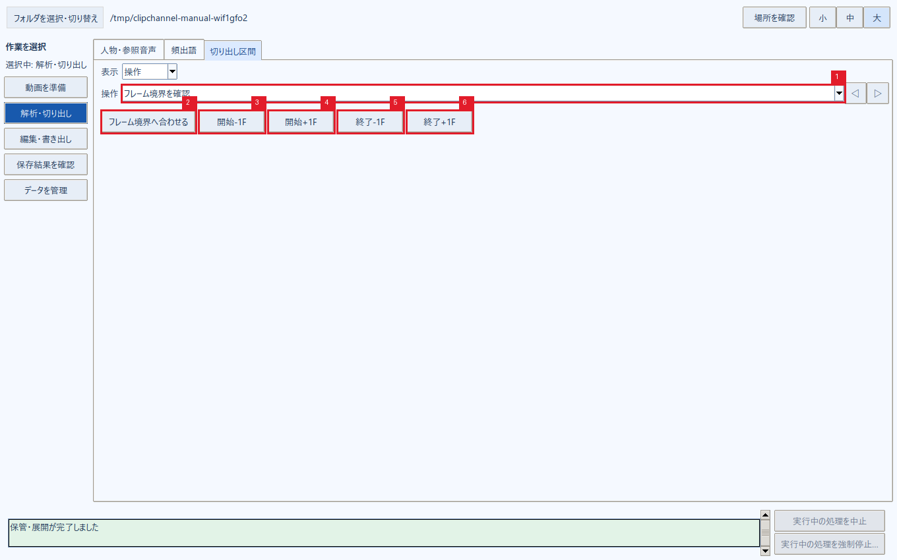

「フレーム境界へ合わせる」で近い実フレームの時刻と差を確認します。「開始-1F／+1F」「終了-1F／+1F」で調整できます。値を確認した後、「区間を修正・試聴」の「境界を修正」で区間に保存します。

### 6.4 使用順を決め、編集用動画を作る

移動：**解析・切り出し → 切り出し区間 → 操作 → 編集用動画を作成**。

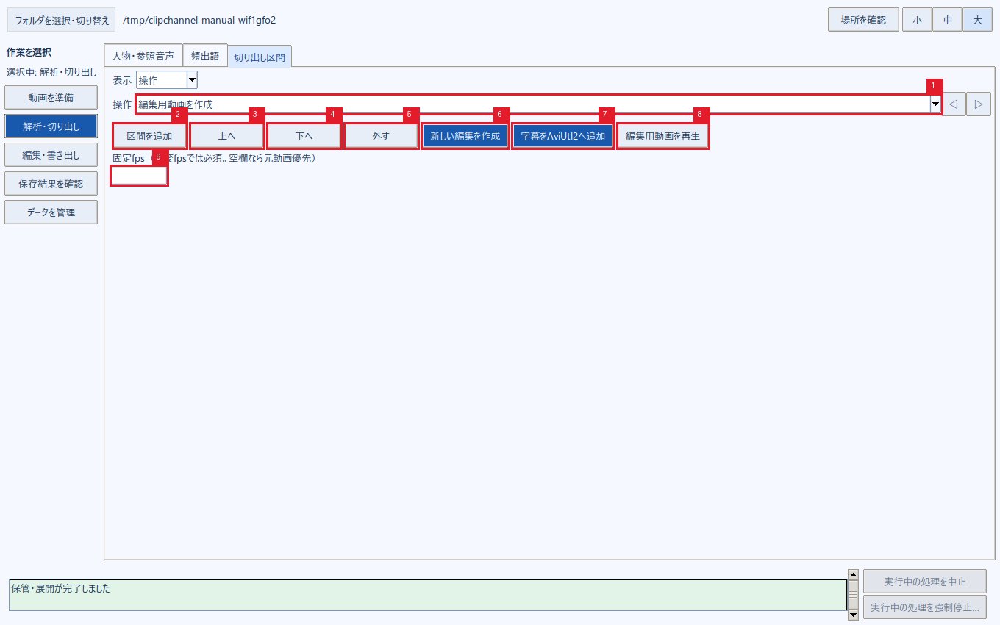

区間一覧で選び、「区間を追加」で使用順へ追加します。同じ区間を複数回追加できます。

移動：**解析・切り出し → 切り出し区間 → 結果 → 編集用動画の順番**。

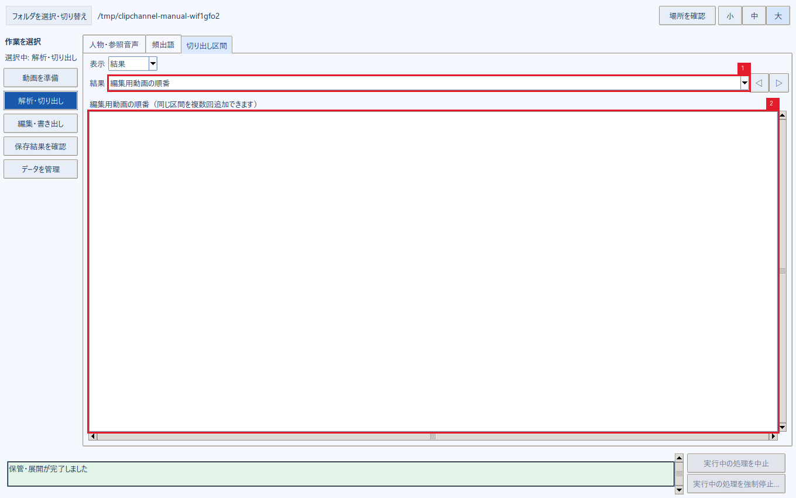

使用順の行を選び、「編集用動画を作成」の「上へ」「下へ」で並べ替え、「外す」で除外します。使用順が空の場合は採用された区間を元の順番で使用します。

必要なら固定fpsを入力します。可変fpsの動画では必須です。「新しい編集を作成」を押し、確認でショートなら「はい」、横画面なら「いいえ」を選びます。編集用MP4と対応する `.aup2` が別フォルダへ作成されます。同じ内容を再生成しても別の編集フォルダになります。

「編集用動画を再生」で確認できます。現在の編集に未保存変更がある場合は、保存してから新しい編集を作ってください。旧編集の字幕・補助素材配置は新しい編集へ自動移行しません。

## 7. AviUtl2で開き、画面と字幕を編集する

### 7.1 対応するプロジェクトを開く

移動：**編集・書き出し → 保存・書き出し → 操作 → 対象プロジェクト**。

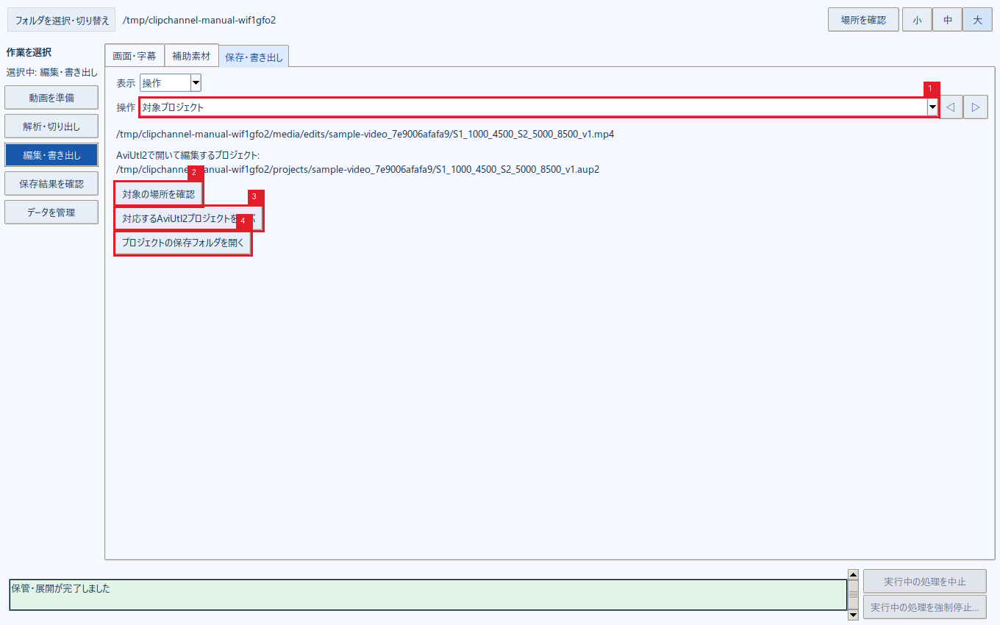

1. 「プロジェクトの保存フォルダを開く」を押します。エクスプローラーが開きます。
2. フォルダ内の `.aup2` をAviUtl2側の「開く」で開きます。
3. アプリで「対応するAviUtl2プロジェクトを選ぶ」を押し、同じ `.aup2` を指定します。

フォルダを開くボタンはAviUtl2を起動したりプロジェクトを読み込んだりしません。プロジェクト選択も保存・書き出し対象の指定です。現在の編集用動画と同じ編集フォルダ内の `.aup2` を選んでください。

再起動後に編集用動画が未選択なら、フォルダボタンはデータ用フォルダ内の `projects` を開きます。そこから過去の `.aup2` をAviUtl2で直接開けます。ただし、アプリには過去の `.aup2` を読み込んで編集を再開する機能はありません。

### 7.2 画面サイズ・配置を設定する

移動：**編集・書き出し → 画面・字幕 → 操作 → 画面設定とプレビュー**。

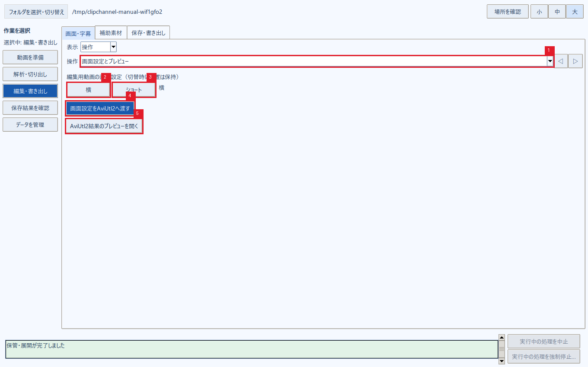

横／ショートを選びます。配置調整は詳細設定で行います。「画面設定をAviUtl2へ渡す」を押すと、開いている対応プロジェクトへ適用を試みます。「AviUtl2結果のプレビューを開く」で確認します。

移動：**編集・書き出し → 画面・字幕 → 詳細設定 → 画面・字幕の配置**。

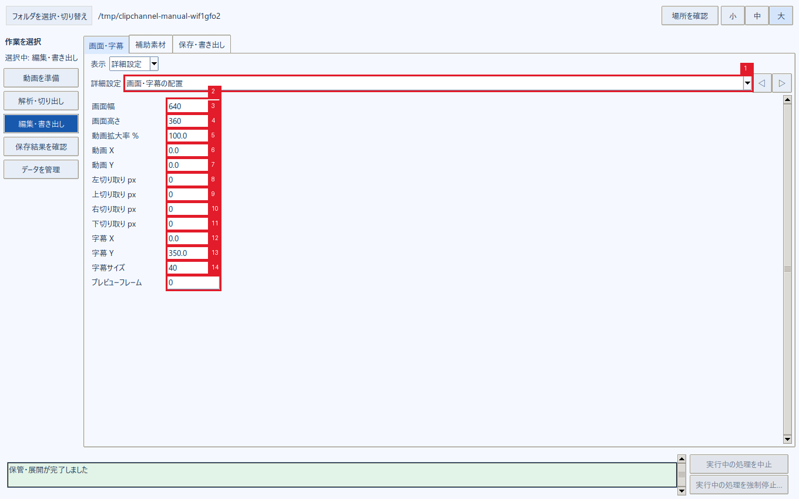

画面幅・高さ、映像の拡大率・X／Y、上下左右の切り取り、字幕X／Y・サイズ、プレビュー位置Fを設定します。切り取り量は元動画の大きさを超えられません。Fはフレーム位置です。詳細設定は必要に応じて内部スクロールしてください。

直接適用できない場合は、表示された指示ファイルをAviUtl2の「ClipChannel → 画面設定を適用」で選びます。プラグインと対応する動画・プロジェクトを確認してください。

### 7.3 初めて字幕を追加する

1. 「保存結果を確認」で同じ元動画の文字起こしCSVを選びます。
2. 「解析・切り出し → 切り出し区間 → 操作 → 編集用動画を作成」に戻ります。
3. 「字幕をAviUtl2へ追加」を押します。
4. 開いている対応プロジェクトへ追加された字幕を確認します。直接追加できなければAviUtl2の「ClipChannel → 字幕を追加」で、案内された `.ccsub` を選びます。

字幕は編集用動画の使用順とフレーム時刻に合わせて取り込まれます。元の文字起こしCSVは変更しません。

### 7.4 字幕を変更する際の注意

移動：**編集・書き出し → 画面・字幕 → 結果 → 編集用字幕**。

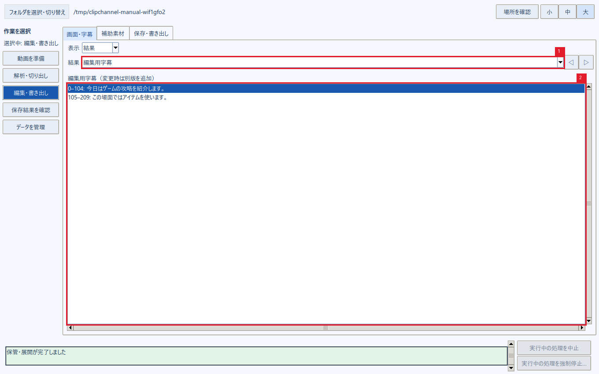

移動：**編集・書き出し → 画面・字幕 → 操作 → 字幕を修正**。

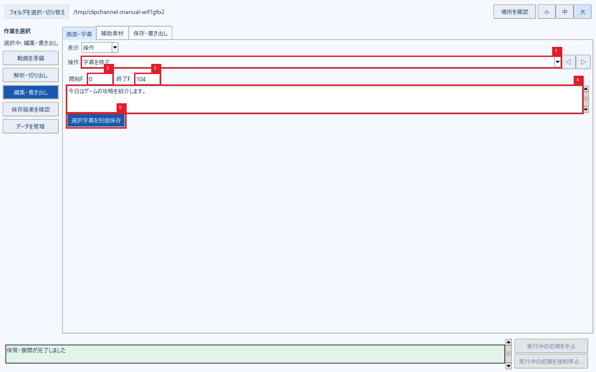

同じセッションなら一覧で字幕を選び、開始F・終了F・本文を変更して「選択字幕を別版保存」を押せます。

**この操作は既存字幕の置換ではありません。変更後の字幕一覧全体を新しいテキストオブジェクトとして追加します。旧字幕が残るため、そのままでは重なります。** AviUtl2側で旧字幕を削除・整理してから保存してください。未保存字幕を「保存」で反映する場合も、必要な再反映は追加動作になります。

既存字幕を少し修正する場合は、AviUtl2の該当テキストオブジェクトを直接編集して保存する方法が分かりやすいです。AviUtl2での手編集をアプリの字幕一覧へ読み戻す機能はありません。再起動後の既存プロジェクトはAviUtl2側で編集してください。

## 8. 画像・BGM・効果音を追加する

移動：**編集・書き出し → 補助素材 → 操作 → 追加・適用・プレビュー**。

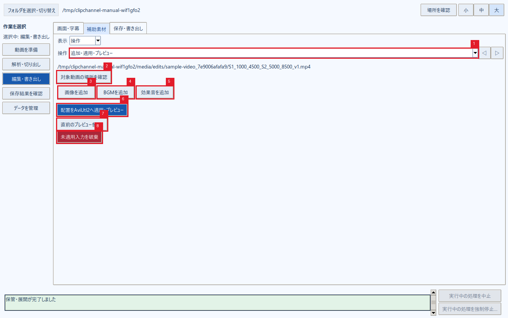

編集用動画を作成した後、「画像を追加」「BGMを追加」「効果音を追加」でファイルを選びます。画像はPNG／JPEG／BMPを使用します。外部の素材はアプリ側へコピーされ、原本は変更しません。

移動：**編集・書き出し → 補助素材 → 結果 → 補助素材一覧**。

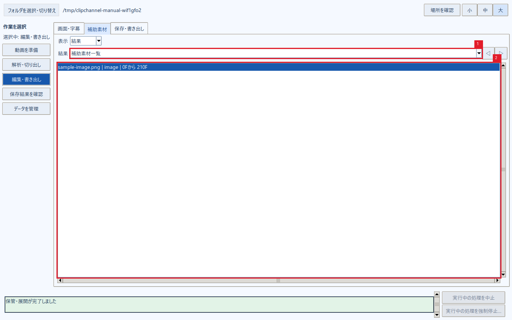

調整する素材を選びます。

移動：**編集・書き出し → 補助素材 → 詳細設定 → 素材の配置・音声設定**。

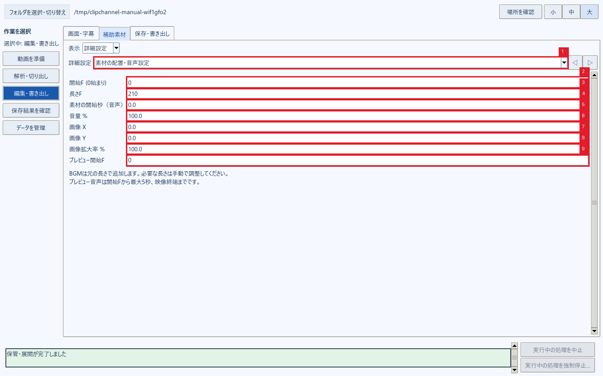

| 項目 | 入力する内容 |
|---|---|
| 開始F | 編集用動画のどのフレームから置くか。0始まり |
| 長さF | 素材を配置する長さ |
| 素材の開始秒 | 音声ファイルのどこから使うか |
| 音量% | 音声の音量 |
| 画像X／Y、拡大率% | 画像の位置と大きさ |
| プレビュー開始F | 確認するフレームと試聴の開始位置 |

「追加・適用・プレビュー」に戻り「配置をAviUtl2へ適用・プレビュー」を押します。同じ素材の配置を調整して再適用する場合は更新され、字幕のような重複追加にはなりません。

「直前のプレビューを開く」で画像を確認できます。ミックス音声の試聴は開始Fから最大5秒、映像終端までです。BGM自体は元の長さで追加し、継ぎ目・終端で自動的に短くしません。必要な長さは手動で調整します。入力を取り消す場合は「未適用入力を破棄」を押します。配置適用後もプロジェクトは明示的に保存してください。

## 9. 保存から完成動画の書き出しまで

### 9.1 プロジェクトを保存する

移動：**編集・書き出し → 保存・書き出し → 操作 → 保存・書き出し**。

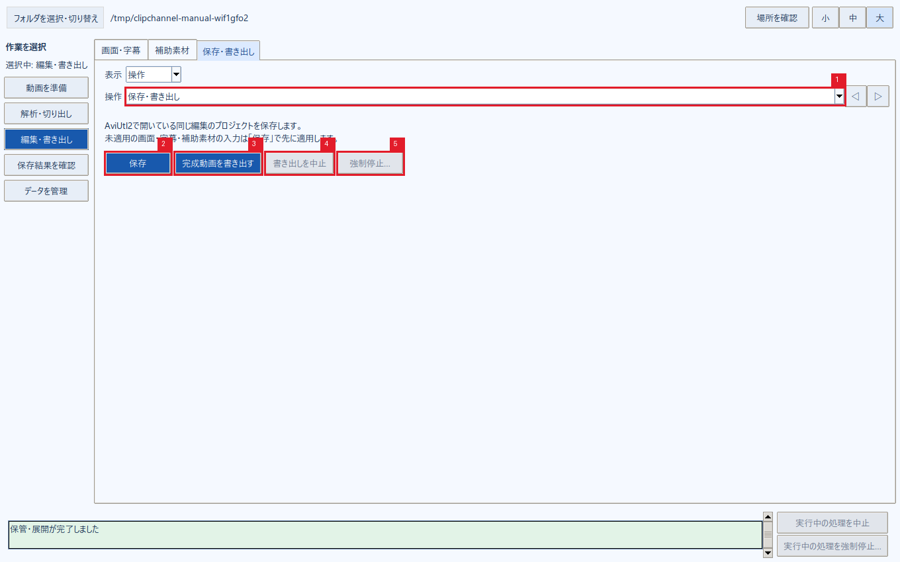

対応する `.aup2` をAviUtl2で開いた状態で「保存」を押します。アプリの未反映入力を適用し、AviUtl2の手編集も含めて現在の内容を保存します。保存対象が1件なら自動選択され、複数なら選択します。必要なら新しい `.aup2` の保存名を指定します。

移動：**編集・書き出し → 保存・書き出し → 結果 → 処理結果**。

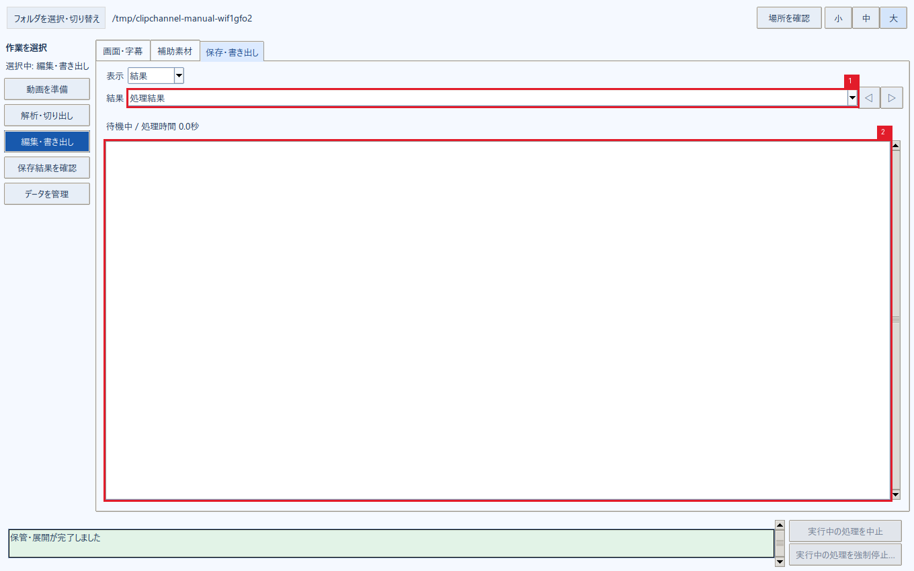

完了表示を確認します。保存を確認できなかった表示は成功として扱わず、プロジェクト・プラグイン・保存先を確認してください。保存完了のファイル確認は簡易判定であり、編集の自動復旧は行いません。

### 9.2 書き出し条件を設定する

移動：**編集・書き出し → 保存・書き出し → 詳細設定 → 書き出し設定**。

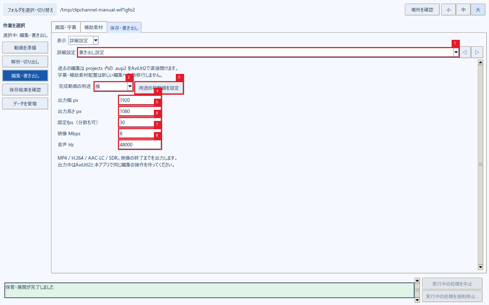

| 項目 | 初期値／範囲 |
|---|---|
| 横 | 1920×1080 |
| ショート | 1080×1920 |
| 幅・高さ | 2～8192の偶数 |
| fps | 編集と同じ固定fps。0より大きく120以下 |
| ビットレート | 30fps以下は8Mbps、30fps超は12Mbps。指定範囲0.1～200Mbps |
| 音声サンプルレート | 初期48kHz。32／44.1／48／96kHz |
| 形式 | MP4／H.264／AAC-LC／SDR |

「用途の初期値を設定」で選択用途の初期値に戻せます。書き出しにはWindows版 `ffmpeg.exe` が必要です。PATHに配置するか、起動前に `CLIPCHANNEL_FFMPEG` に絶対パスを設定します。WSLから起動する場合もエンコードはWindows版、検査はWSL側の `ffprobe` を使います。

### 9.3 完成動画を書き出す

1. 「保存・書き出し」の「完成動画を書き出す」を押します。
2. 未保存なら「保存して書き出す」を選びます。戻る場合は「戻る」です。
3. 新しいMP4の保存名を指定します。既存動画は上書きしません。
4. 状態表示で書き出しと検査の終了を待ちます。
5. 完成が確認された表示と保存先の動画を確認します。

出力範囲は最後の映像までです。フレーム数・長さ・解像度・fps・音声・形式の確認が揃ってから完成表示になります。中止・失敗で残った出力は完成扱いしません。

ショート用途で正方形または縦長・3分以内の条件を外れた場合、「編集・設定を直す」か「通常の動画として書き出す」を選びます。通常を選んでも現在の配置・長さ・書き出し設定は保持します。投稿サイトでの分類を保証する機能ではありません。

## 10. 保存結果を確認し、作業を再開する

移動：**保存結果を確認 → 保存済み情報 → 結果 → 保存済み一覧**。

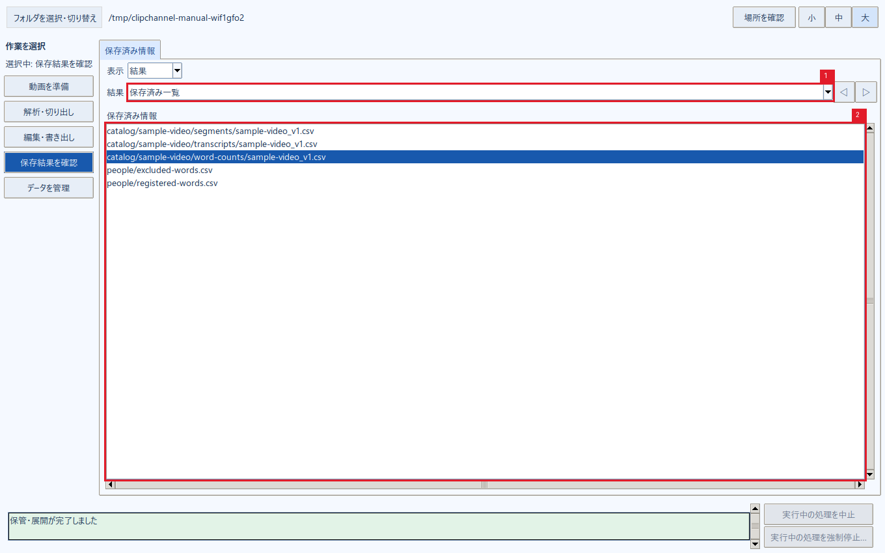

一覧からCSVを選びます。

移動：**保存結果を確認 → 保存済み情報 → 結果 → CSV本文**。

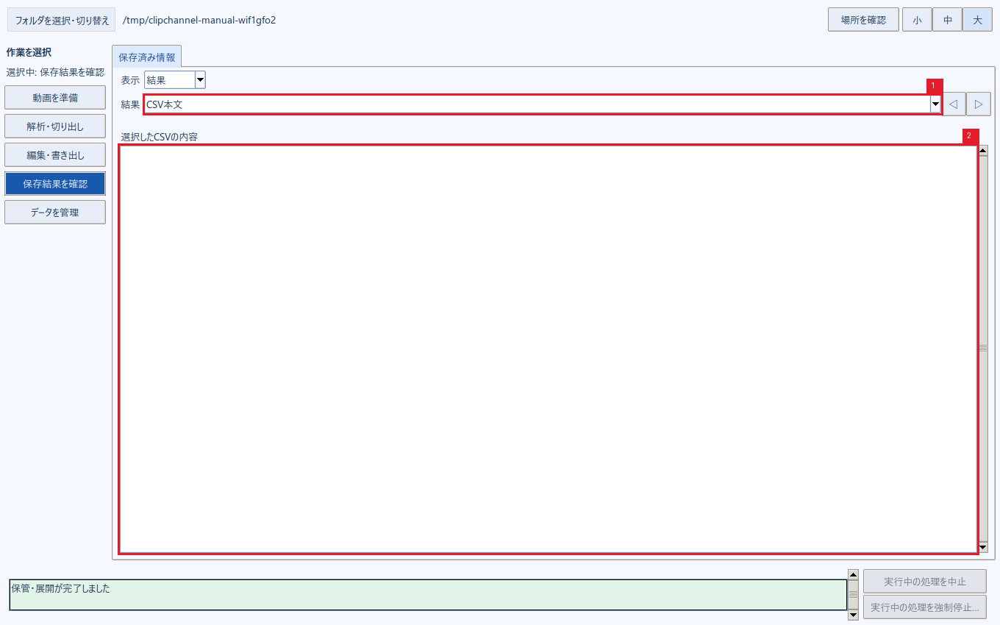

CSVの内容を内部スクロールで確認できます。文字起こし、区間、頻出語を再利用する場合は、選択後それぞれのタブに戻って「保存版を再表示」「選択した保存版を使用」「選択した保存版を表示」を押します。

| 再開するもの | 再開方法 |
|---|---|
| 文字起こし・切り出し区間・頻出語 | 上記の保存CSVを選んで各タブで再表示する |
| 過去の編集済み `.aup2` | AviUtl2で直接開き、編集・保存する |
| アプリ内の未保存入力 | 再起動後の復元には対応していない。終了前に保存する |

## 11. 登録情報・動画・ログを管理する

### 11.1 非表示と再表示

移動：**データを管理 → 管理・保管 → 結果 → 登録一覧**。

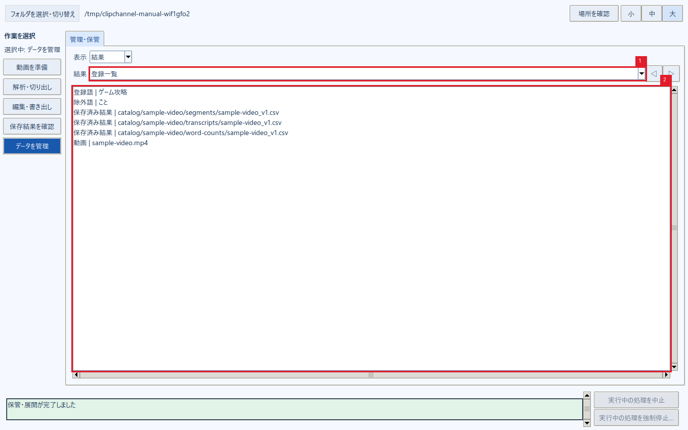

移動：**データを管理 → 管理・保管 → 操作 → 登録情報を管理**。

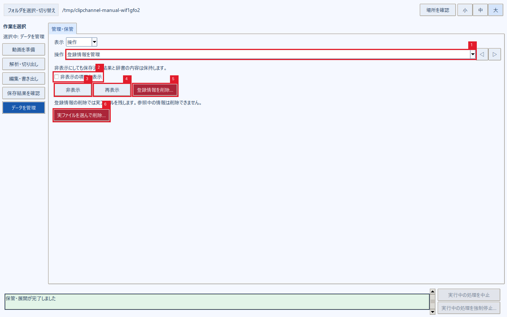

一覧で項目を選び「非表示」を押します。人物、登録語、除外語、結果、動画を一覧から隠せます。非表示はファイルや辞書の働きを変更しません。「非表示の項目も表示」を有効にして対象を選び、「再表示」で戻します。

「登録情報を削除…」は一覧の登録を削除し、実ファイルを残します。「実ファイルを選んで削除…」は確認したファイルを完全に削除します。二つは別操作です。参照中の情報や選択中の対象話者などは削除が止められます。削除できない場合は非表示を使ってください。データ用フォルダ外の元ファイルは削除対象にしません。処理中や未保存入力がある場合は、完了・保存後に管理します。

### 11.2 動画を保管・展開する

移動：**データを管理 → 管理・保管 → 操作 → 動画を保管・展開**。

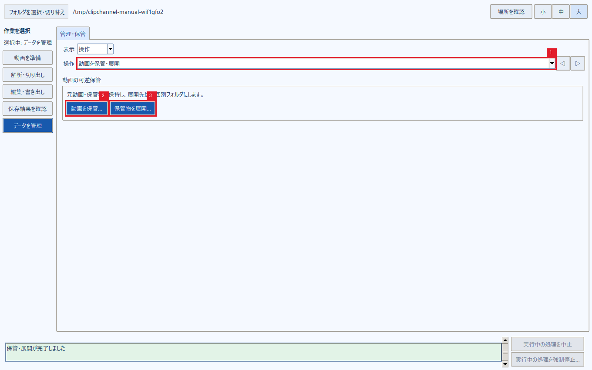

「動画を保管…」で動画を選び、ZIP64の保管物を作成します。「保管物を展開…」でZIPを選び、新しい展開フォルダへ展開します。原本・保管物・過去の展開物は保持します。SHA256で内容を検証します。

移動：**データを管理 → 管理・保管 → 詳細設定 → 保管・展開結果**。

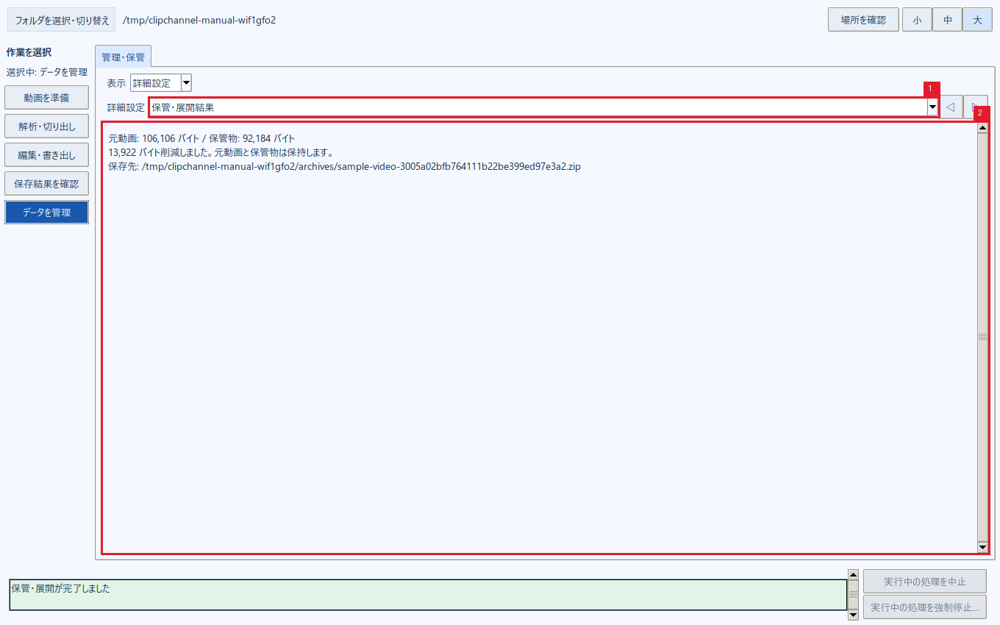

圧縮前後のバイト数、削減量、保存先を確認します。すでに圧縮された動画などは容量が減らない場合があります。その場合も結果を表示し、保管物を残します。展開した動画を制作に使うには「ローカル動画を登録」から選びます。

### 11.3 古いログを整理する

移動：**データを管理 → 管理・保管 → 操作 → ログの整理**。

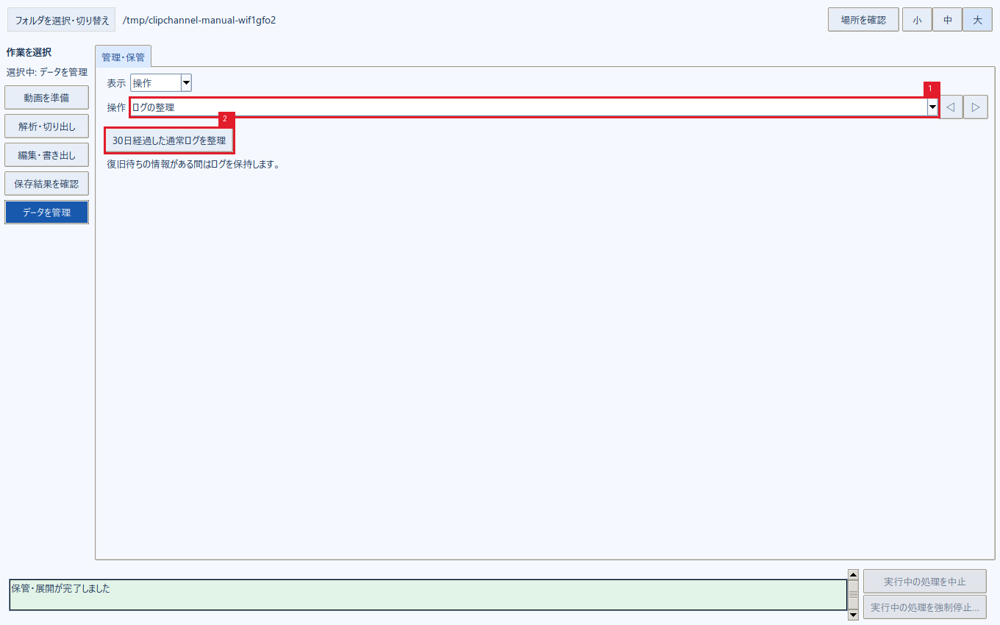

「30日経過した通常ログを整理」を押します。終了を確認できない処理のログや、復旧待ち情報がある場合のログは保持します。処理終了時のログには処理名・状態・経過秒・UTC時刻を記録します。

## 12. 中止・強制停止・終了確認

通常の処理は下部の「実行中の処理を中止」で中止要求を送ります。要求後も停止が確認されるまで編集を待ちます。入力と既存の成果物は保持されます。中止要求から3秒経っても止まらない管理対象処理では強制停止を選べます。3秒で自動的に終了する設定ではありません。

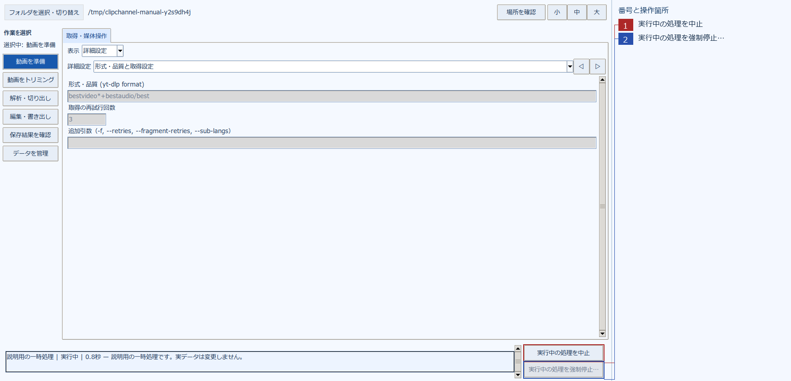

実行中の例です。入力欄が無効でも作業の切替はできます。

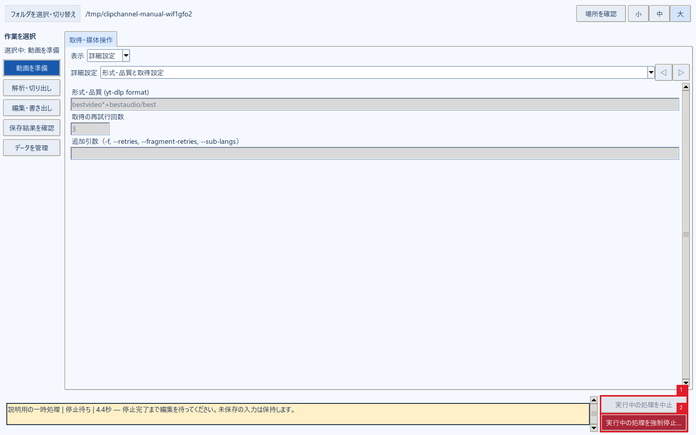

通常中止の要求後、停止待ちが続いている例です。赤枠2の強制停止は、自動で実行されるものではありません。

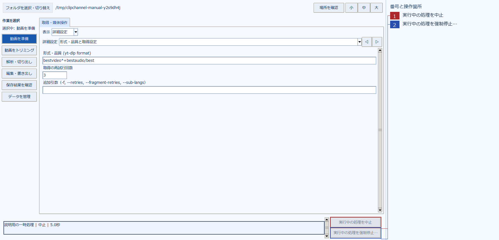

停止完了を確認すると入力操作が再開できます。これらの画像は実データを処理しない説明用の待機処理で撮影しました。

書き出し中は「書き出しを中止」または共通中止を使います。強制停止では対象が異なるため、確認文を読んでください。

| 対象 | 強制停止の影響 |
|---|---|
| アプリの管理対象処理 | その管理プロセスと子プロセスを終了。AviUtl2の未保存編集は変更しない |
| AviUtl2で描画・エンコード中 | 対象AviUtl2とエンコーダーを終了。AviUtl2の未保存編集は失われる |
| 書き出し後の動画検査 | 検査とそのffprobeのみ終了。AviUtl2の編集は保持 |

途中ファイルが残る場合があります。停止が確認されてから操作を再開してください。自動復旧はありません。

### 12.1 共通の案内・エラー・警告

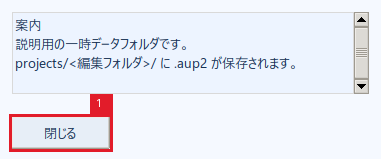

案内を読み「閉じる」で戻ります。

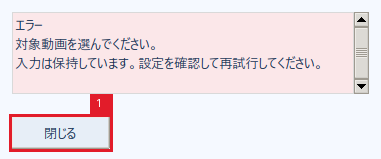

エラーの場合は原因と入力条件を確認し、関連する詳細設定を直して再試行します。

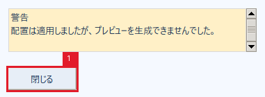

警告では「適用したがプレビュー未生成」など、完了した範囲を確認します。

### 12.2 ショート条件と未保存の確認

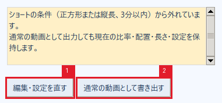

編集へ戻るか、現在の設定で通常動画として書き出すか選びます。

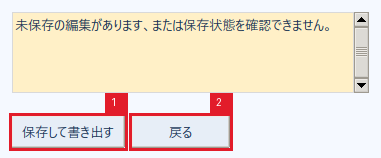

保存が確認されるまで書き出しに進みません。

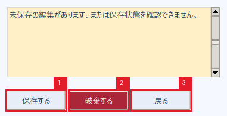

「保存する」は保存後に終了、「破棄する」は未保存入力を保存せず終了、「戻る」はアプリへ戻ります。アプリを閉じても外部AviUtl2の終了を意味しません。

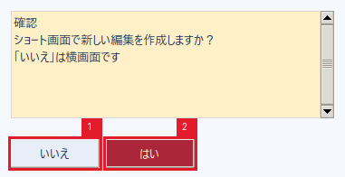

「はい」でショート、「いいえ」で横画面の新しい編集を作成します。

### 12.3 削除確認

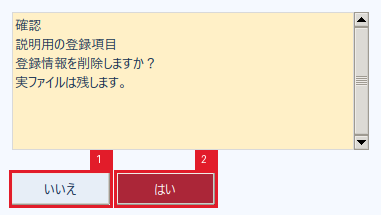

登録情報の削除では実ファイルを残します。

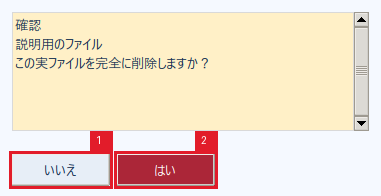

実ファイルの削除は取り消せません。ファイル選択後に対象の全文パスを確認します。

### 12.4 強制停止の確認

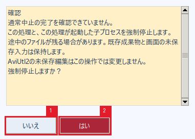

管理対象処理だけを止める確認です。

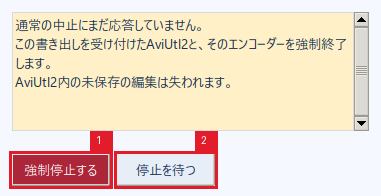

AviUtl2の未保存編集を失う場合があります。「停止を待つ」で戻れます。

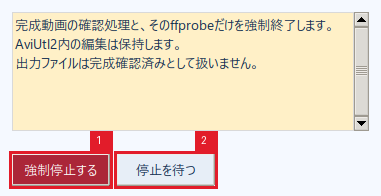

こちらは検査プロセスのみを止める確認です。

### 12.5 プレビュー画面

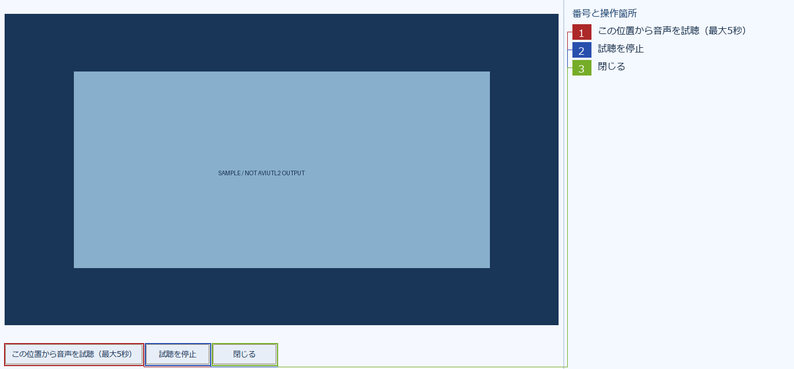

画像全体が収まるよう縮小表示されます。「閉じる」で戻ります。補助素材のプレビューには音声試聴の操作があります。図は説明用画像で、実際のAviUtl2出力ではありません。

## 13. 保存場所と困ったときの確認

| データ用フォルダ内 | 内容 |
|---|---|
| `media/downloaded/` | URLから取得した元ファイル |
| `media/originals/` | 登録した元動画 |
| `media/prepared/` | 編集互換変換した動画と時刻対応JSON |
| `media/audio/` | 音声のみの成果物 |
| `media/edits/<編集フォルダ>/` | 編集用MP4と区間・fps情報 |
| `media/supporting/<編集フォルダ>/` | コピーした補助素材 |
| `projects/<編集フォルダ>/` | `.aup2`、字幕・画面・素材の指示ファイル |
| `catalog/<元動画名>/transcripts/` | 文字起こしCSV |
| `catalog/<元動画名>/segments/` | 切り出し区間CSV |
| `catalog/<元動画名>/word-counts/` | 頻出語CSV |
| `people/` | 人物・参照音声・共通辞書 |
| `exports/` | 完成動画の初期保存先 |
| `archives/` | 動画の保管ZIP |
| `media/restored/` | 保管物から展開した動画 |
| `logs/` | 処理ログ |

解析結果は `_v1`、`_v2` のように版を進め、旧版を保持します。字幕・画面・補助素材の指示ファイルも別版で保存します。ただしAviUtl2プロジェクトの「保存」は選択した `.aup2` の現在の内容を保存する操作です。指示ファイルの版とプロジェクト保存は別です。

| 症状 | 確認すること |
|---|---|
| ボタンが見つからない | 作業・タブ・表示・項目を確認する。詳細設定内部をスクロールする |
| 保存フォルダが開かない | データ用フォルダを選ぶ。開くエラーが出たら全文パスと環境を確認する |
| `.aup2` がアプリに読み込まれない | 過去の編集の再読込機能はない。AviUtl2で直接開く |
| 字幕が重なった | 再反映は一覧全体の追加。AviUtl2で旧字幕を整理する |
| AviUtl2へ反映できない | プラグイン、対応プロジェクト、先頭の編集用動画、同じ編集フォルダを確認する |
| 保存できない | 処理中でないか、保存先・対応プロジェクトを確認する。入力を保持したまま再試行する |
| 動画が再生できない | `ffplay` と対象ファイルを確認する |
| 完成表示が出ない | 保存・描画・エンコード・検査のどこで失敗したか状態を確認する。残ったMP4を完成扱いしない |
| フォルダを切り替えられない | 実行中処理の停止完了と未保存入力の保存を待つ |
| 削除できない | 結果からの参照などがある。必要なら非表示を使う |

## 14. 撮影範囲と更新方法

スクリーンショットはWSLのTkinter表示で撮影しています。Windows標準ダイアログやWindows表示倍率ごとの差異、AviUtl2本体の実画面は未収録です。UIの変更時は画像も撮り直してください。[画面一覧](screens.json)に全表示項目と撮影条件を記録しています。

このMarkdownと画像フォルダが原本です。HTMLはオフライン閲覧でき、外部サービスやCDNを使いません。共有するときは `docs/manual/` フォルダ全体を渡し、`index.html` をブラウザーで開いてください。

再撮影・HTML再生成の例（開発者向け）：

```sh
python -m pip install Pillow Markdown
python scripts/manual_capture.py   # WSLのX11環境、ffmpeg/ffprobeが必要。一時データのみ使用
python scripts/render_manual.py
```
